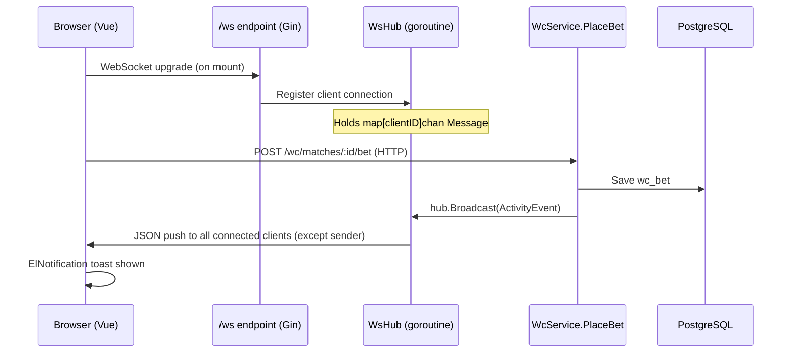

# System Design & Architecture — WC Betting Activity Feed

## Architecture Overview



**Key components:**
- `WsHub` — in-process goroutine managing all open connections and broadcasting messages
- `WsHandler` — Gin handler that upgrades HTTP → WS and registers/deregisters clients
- `WcService` (extended) — calls `hub.Broadcast()` after successful `PlaceBet()`
- `useActivityFeed` — Vue composable that owns the WS connection lifecycle + toast display

## Data Models

No new database tables. The activity feed is ephemeral — events are pushed live and not persisted.

### Go: ActivityEvent (JSON over WebSocket)

```go
type ActivityEvent struct {
    Type      string `json:"type"`       // "bet_placed"
    UserID    string `json:"user_id"`    // sender's ID (for self-suppression on client)
    UserName  string `json:"user_name"`
    BetType   string `json:"bet_type"`   // "handicap" | "exact_score" | "ou"
    Selection string `json:"selection"`  // e.g. "Bồ Đào Nha", "1-0", "Tài"
    Stake     int    `json:"stake"`
    MatchID   string `json:"match_id"`
    TeamHome  string `json:"team_home"`
    TeamAway  string `json:"team_away"`
}
```

### TypeScript: ActivityEvent

```ts
interface ActivityEvent {
  type: 'bet_placed'
  user_id: string
  user_name: string
  bet_type: 'handicap' | 'exact_score' | 'ou'
  selection: string
  stake: number
  match_id: string
  team_home: string
  team_away: string
}
```

## API Design

### New WebSocket endpoint

```
GET /ws
Upgrade: websocket
```

- No auth required (public activity stream — bet details are non-sensitive in friend group)
- Client sends no messages in this scope (receive-only for activity feed)
- Server sends `ActivityEvent` JSON frames

### Nginx config addition (VPS)

```nginx
location /ws {
    proxy_pass http://localhost:8080;
    proxy_http_version 1.1;
    proxy_set_header Upgrade $http_upgrade;
    proxy_set_header Connection "upgrade";
    proxy_read_timeout 86400;
}
```

### Existing endpoint touched

`POST /wc/matches/:id/bet` — no change to HTTP contract. `PlaceBet()` service method gains one extra call to `hub.Broadcast()` after DB write.

## Component Breakdown

### Backend — new files

| File | Responsibility |
|------|---------------|
| `backend/internal/ws/hub.go` | `WsHub` struct + `Run()` goroutine + `Broadcast()` + `Register()`/`Unregister()` |
| `backend/internal/ws/handler.go` | `WsHandler` — Gin handler, upgrades HTTP→WS, owns client goroutines |
| `backend/internal/ws/types.go` | `ActivityEvent`, `Message`, `Client` structs |

### Backend — modified files

| File | Change |
|------|--------|
| `backend/internal/service/wc_service.go` | Add `hub HubBroadcaster` interface field to `WcService`; call `hub.Broadcast()` in `PlaceBet()` |
| `backend/internal/api/router.go` | Create `WsHub`, start `hub.Run()`, inject into `WcService`, register `GET /ws` route |

### Frontend — new files

| File | Responsibility |
|------|---------------|
| `frontend/src/composables/useActivityFeed.ts` | WS connection lifecycle, message parsing, toast trigger |
| `frontend/src/types/activity.ts` | `ActivityEvent` TypeScript interface |

### Frontend — modified files

| File | Change |
|------|--------|
| `frontend/src/layouts/MainLayout.vue` | Mount `useActivityFeed()` once — covers all WC pages |

## Design Decisions

### D1 — WebSocket over SSE

SSE would suffice for a one-directional feed, but live chat is explicitly on the roadmap. Building the WS hub now means live chat is a message-type addition rather than a full infrastructure rewrite. Extra upfront cost: ~2–3 hours.

### D2 — In-process hub, no Redis

With < 50 concurrent users and a single-server VPS deployment, an in-process Go hub (goroutine + channels) is sufficient. Adding Redis pub/sub would be over-engineering. If the app scales to multiple processes, migrate hub to Redis pub/sub at that point.

### D3 — No auth on /ws

Activity events contain non-sensitive social data (name, bet type, stake). Requiring a JWT on the WS upgrade adds complexity for minimal security gain in a friend group context. Revisit if the app opens to the public.

### D4 — Self-suppression on client

The server broadcasts to all clients. The client suppresses the toast for its own `user_id` (received from `wcAuthStore`). This avoids "you just placed a bet" noise for the bettor themselves.

### D5 — HubBroadcaster interface

`WcService` depends on a `HubBroadcaster` interface (not concrete `*WsHub`) so unit tests can inject a no-op mock without spinning up a real WebSocket hub.

```go
type HubBroadcaster interface {
    Broadcast(event ActivityEvent)
}
```

### D6 — Selection label formatting

`selection` is a human-readable string built in `PlaceBet()`:
- Handicap: home/away team name
- Over/Under: `"Tài"` or `"Xỉu"` (Vietnamese labels)
- Exact score: `"1 - 0"` format

## Non-Functional Requirements

- **Latency:** Bet broadcast delivered to all clients within 2 seconds of DB write
- **Reconnection:** Client auto-reconnects within 3 seconds on disconnect (browser EventSource → `setTimeout(connect, 3000)`)
- **Graceful degradation:** If WS is unavailable, betting still works normally — no error surfaced to user
- **Concurrency:** Hub uses `sync.RWMutex` for safe concurrent access to client map
- **Memory:** Each connection uses one goroutine (~4KB stack) + one channel. Negligible for < 50 users.
