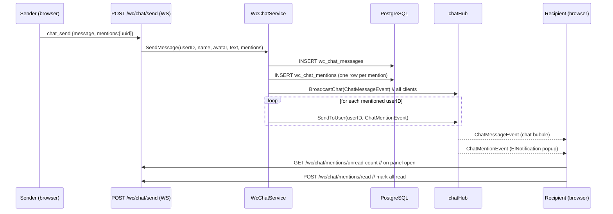

# Design: WC Chat @Mention

## Architecture Overview



## Data Models

### New table: `wc_chat_mentions`

```sql
CREATE TABLE wc_chat_mentions (
  id              UUID PRIMARY KEY DEFAULT gen_random_uuid(),
  message_id      UUID NOT NULL REFERENCES wc_chat_messages(id) ON DELETE CASCADE,
  mentioned_user_id UUID NOT NULL REFERENCES wc_users(id) ON DELETE CASCADE,
  read_at         TIMESTAMPTZ,
  created_at      TIMESTAMPTZ NOT NULL DEFAULT NOW()
);
CREATE INDEX idx_chat_mentions_user ON wc_chat_mentions(mentioned_user_id, read_at);
```

### Updated `WcChatMessage` model (Go)

No schema change — `message` text already stores `@username` as plain text.

### New WS frames

```go
// Client → Server (extend existing ChatSendFrame)
type ChatSendFrame struct {
    Type     string   `json:"type"`     // "chat_send"
    Message  string   `json:"message"`
    Mentions []string `json:"mentions"` // []uuid string — NEW, optional
}

// Server → mentioned client only
type ChatMentionEvent struct {
    Type      string `json:"type"`       // "chat_mention"
    MessageID string `json:"message_id"`
    SenderID  string `json:"sender_id"`
    SenderName string `json:"sender_name"`
    Message   string `json:"message"`    // full text for notification preview
    MatchID   string `json:"match_id,omitempty"` // not applicable for chat
}
```

## API Design

| Method | Path | Auth | Description |
|--------|------|------|-------------|
| WS frame | `chat_send` | JWT | Extend to include `mentions[]` |
| `GET` | `/api/v1/wc/users` | JWT | Autocomplete source (existing or new) |
| `GET` | `/api/v1/wc/chat/mentions/unread-count` | JWT | Returns `{count: N}` |
| `POST` | `/api/v1/wc/chat/mentions/read` | JWT | Marks all user's mentions as read |

### GET /wc/users response
```json
{ "users": [{"id": "uuid", "name": "Alice", "avatar_url": "..."}] }
```

### GET /wc/chat/mentions/unread-count response
```json
{ "count": 3 }
```

## Component Breakdown

### Backend

1. **`ws/hub.go`** — Add `SendToUser(userID uuid.UUID, data []byte)`:
   - Iterate clients under `mu.RLock`; match `c.userID == userID`; non-blocking send.

2. **`ws/types.go`** — Add `ChatMentionEvent` struct; extend `ChatSendFrame` with `Mentions []string`.

3. **`model/wc_chat_message.go`** — No change to message model. New `WcChatMention` model.

4. **`repository/wc_chat_repository.go`** — New methods:
   - `SaveMentions(messageID uuid.UUID, userIDs []uuid.UUID) error`
   - `UnreadMentionCount(userID uuid.UUID) (int64, error)`
   - `MarkMentionsRead(userID uuid.UUID) error`

5. **`service/wc_chat_service.go`** — Update `SendMessage` signature:
   ```go
   SendMessage(userID uuid.UUID, userName, avatarURL, text string, mentions []uuid.UUID) error
   ```
   - Validate mention UUIDs (skip invalid).
   - Save mention rows after message save.
   - Call `hub.SendToUser` for each mentioned user.

6. **`api/wc_chat_handler.go`** — Add handlers:
   - `GetUnreadMentionCount` → `GET /wc/chat/mentions/unread-count`
   - `MarkMentionsRead` → `POST /wc/chat/mentions/read`

7. **`api/router.go`** — Wire new routes (both require JWT middleware).

8. **`database/database.go`** — Add `&model.WcChatMention{}` to AutoMigrate.

### Frontend

1. **`types/chat.ts`** — Add `ChatMentionEvent` interface; extend `ChatSendFrame` with `mentions?: string[]`.

2. **`stores/chatStore.ts`** — Add `unreadMentionCount: ref(0)`, `fetchUnreadMentions()`, `markMentionsRead()`.

3. **`composables/useChatWs.ts`** — Handle `chat_mention` frame → `ElNotification` popup + increment `chatStore.unreadMentionCount`.

4. **`components/wc/WcChatPanel.vue`**:
   - On panel open: call `chatStore.markMentionsRead()`.
   - Fetch WC users on panel open (once, cached).
   - Autocomplete: `@` triggers dropdown, filtered by typed chars.
   - Message rendering: regex replace `@username` → `<span class="mention">@username</span>`.

5. **`components/wc/WcChatButton.vue`** — Badge count = `unreadCount + unreadMentionCount`.

6. **`services/wcService.ts`** — Add `getUnreadMentionCount()`, `markMentionsRead()`, `getWcUsers()`.

## Design Decisions

| Decision | Choice | Rationale |
|----------|--------|-----------|
| Mention data in client payload | `mentions: [uuid]` alongside text | Avoids name-ambiguity parsing on backend; autocomplete resolves to ID |
| WS delivery | `chatHub.SendToUser` (new method) | Reuses existing hub; targeted, no new endpoint |
| Mark-read trigger | Panel open | Simplest UX; matches existing unread message behavior |
| `@username` in message text | Plain text with highlight on render | No schema change; frontend regex highlight handles it |
| Autocomplete fetch timing | On first `@` keystroke (lazy, cached) | Avoids upfront fetch for non-senders |

## Non-Functional Requirements

- `SendToUser` must not block the hub goroutine on slow clients (drop with `default` case, same as `Broadcast`).
- Mention rows are soft-deleted via CASCADE when message is deleted (no orphaned mentions).
- `UnreadMentionCount` query uses indexed `(mentioned_user_id, read_at IS NULL)` for O(1) lookup.
