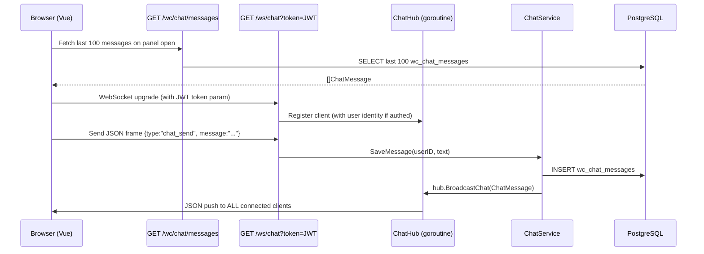

# System Design & Architecture — WC Live Chat

## Architecture Overview



**Key components:**
- `ChatHub` — second `Hub` instance dedicated to chat; reuses existing `ws.Hub` type
- `ChatHandler` — Gin handler for `GET /ws/chat`: upgrades HTTP → WS, parses JWT from query param, registers authenticated/guest clients
- `ChatService` — saves incoming messages to DB and calls `hub.BroadcastChat()`
- `WcChatMessageRepo` — thin repository for `wc_chat_messages` table
- `useChatStore` (Pinia) — chat state: message list, unread count, panel open/closed
- `useChatWs` (Vue composable) — owns WS lifecycle, sends/receives chat frames
- `WcChatPanel.vue` — message list + input; mounted in `WcLayout.vue`
- `WcChatButton.vue` — floating button with unread badge

## Data Models

### New DB table: `wc_chat_messages`

```sql
CREATE TABLE wc_chat_messages (
    id          UUID         PRIMARY KEY DEFAULT gen_random_uuid(),
    user_id     UUID         NOT NULL REFERENCES wc_users(id),
    user_name   VARCHAR(100) NOT NULL,
    avatar_url  TEXT,
    message     TEXT         NOT NULL CHECK (char_length(message) <= 500),
    created_at  TIMESTAMPTZ  NOT NULL DEFAULT now()
);
CREATE INDEX idx_wc_chat_messages_created_at ON wc_chat_messages (created_at DESC);
```

### Go model

```go
// backend/internal/model/wc_chat_message.go
type WcChatMessage struct {
    ID        uuid.UUID `gorm:"type:uuid;default:gen_random_uuid();primaryKey"`
    UserID    uuid.UUID `gorm:"not null"`
    UserName  string    `gorm:"size:100;not null"`
    AvatarURL string
    Message   string    `gorm:"not null"`
    CreatedAt time.Time
}
```

### WS message types (extend `backend/internal/ws/types.go`)

```go
// Inbound frame: client → server (authenticated clients only)
type ChatSendFrame struct {
    Type    string `json:"type"`    // "chat_send"
    Message string `json:"message"` // 1–500 chars
}

// Outbound frame: server → all clients
type ChatMessageEvent struct {
    Type      string `json:"type"`       // "chat_message"
    ID        string `json:"id"`
    UserID    string `json:"user_id"`
    UserName  string `json:"user_name"`
    AvatarURL string `json:"avatar_url"`
    Message   string `json:"message"`
    CreatedAt string `json:"created_at"` // RFC3339
}
```

### TypeScript types

```ts
// frontend/src/types/chat.ts
export interface ChatMessage {
  id: string
  user_id: string
  user_name: string
  avatar_url: string
  message: string
  created_at: string // ISO 8601
}

export interface ChatSendFrame {
  type: 'chat_send'
  message: string
}

export interface ChatMessageEvent {
  type: 'chat_message'
  id: string
  user_id: string
  user_name: string
  avatar_url: string
  message: string
  created_at: string
}
```

## API Design

### New WebSocket endpoint

```
GET /ws/chat?token=<JWT>
Upgrade: websocket
```

- `token` query param is optional — guests connect without it (read-only)
- On connect: server validates token if present; stores `userID`/`userName`/`avatarURL` on the client struct
- Inbound frames with `type: "chat_send"` are processed only if client is authenticated; otherwise server sends back `{"type":"error","message":"unauthenticated"}`
- Max inbound message size: 512 bytes (gorilla/websocket `SetReadLimit`)

### New REST endpoint

```
GET /wc/chat/messages
Response: 200 { messages: ChatMessage[] }  — last 100, ordered oldest → newest
```

- No auth required (same policy as activity feed: non-sensitive in friend group)
- Returns at most 100 rows; no pagination in this scope

### Nginx addition (VPS)

```nginx
location /ws/chat {
    proxy_pass http://localhost:8080;
    proxy_http_version 1.1;
    proxy_set_header Upgrade $http_upgrade;
    proxy_set_header Connection "upgrade";
    proxy_read_timeout 86400;
}
```

## Component Breakdown

### Backend — new files

| File | Responsibility |
|------|----------------|
| `backend/internal/model/wc_chat_message.go` | `WcChatMessage` GORM model |
| `backend/internal/repository/wc_chat_repository.go` | `SaveMessage()`, `ListLast100()` |
| `backend/internal/service/wc_chat_service.go` | `SendMessage(userID, name, avatar, text)` — validates, saves, broadcasts |
| `backend/internal/ws/chat_handler.go` | `ChatHandler` — upgrades WS, authenticates via token query param, reads inbound frames |

### Backend — modified files

| File | Change |
|------|--------|
| `backend/internal/ws/types.go` | Add `ChatSendFrame`, `ChatMessageEvent` structs |
| `backend/internal/ws/hub.go` | Add `BroadcastChat(event ChatMessageEvent)` method |
| `backend/internal/api/router.go` | Create `chatHub`, `chatService`; register `GET /ws/chat` and `GET /wc/chat/messages` |
| `backend/internal/database/database.go` | Add `WcChatMessage` to `AutoMigrate` list |

### Frontend — new files

| File | Responsibility |
|------|----------------|
| `frontend/src/types/chat.ts` | `ChatMessage`, `ChatSendFrame`, `ChatMessageEvent` interfaces |
| `frontend/src/stores/chatStore.ts` | Pinia store: `messages`, `unreadCount`, `isPanelOpen`, actions `openPanel`/`closePanel`/`appendMessage` |
| `frontend/src/composables/useChatWs.ts` | WS lifecycle: connect, send, receive, reconnect |
| `frontend/src/components/wc/WcChatPanel.vue` | Chat panel: message list + input box + send button |
| `frontend/src/components/wc/WcChatButton.vue` | Floating button (bottom-right) with unread badge |

### Frontend — modified files

| File | Change |
|------|--------|
| `frontend/src/layouts/WcLayout.vue` (or MainLayout.vue) | Mount `<WcChatButton>` + `<WcChatPanel>` once |
| `frontend/src/composables/useActivityFeed.ts` | Read `chatStore.isPanelOpen`; use `position: 'top-right'` when panel is open, `bottom-right` otherwise |
| `frontend/src/locales/vi.json` + `en.json` | Add chat i18n keys |

## Design Decisions

### D1 — Separate `/ws/chat` endpoint and ChatHub

The existing `/ws` activity feed is unidirectional and unauthenticated. Chat requires bidirectional messaging and identity. Mixing them on one endpoint would complicate the handler significantly. A second `Hub` instance + `ChatHandler` keeps both concerns clean and testable independently.

### D2 — JWT as query param on WS upgrade

Browser WebSocket API (`new WebSocket(url)`) does not support custom headers. Passing `?token=<JWT>` in the URL is the standard workaround. On a private friend-group app with HTTPS, the token in the URL is acceptable (it appears in server access logs, but there's no sensitive escalation risk).

### D3 — Guests can connect read-only

Requiring auth to even connect would block newcomers from seeing the chat. Connecting without a token keeps the read experience open while the server still rejects `chat_send` frames from unauthenticated clients.

### D4 — Notification position switch (`bottom-right` → `top-right`)

When the chat panel is open at the bottom-right, activity feed notifications would visually overlap it. Element Plus `ElNotification` `offset` only controls distance from the top of the viewport (even for bottom-positioned variants), so CSS offset manipulation is unreliable. Switching `position` to `'top-right'` when the panel is open is the simplest, most robust solution. `chatStore.isPanelOpen` is already a reactive Pinia state; `useActivityFeed.ts` reads it with `storeToRefs`.

### D5 — 100-message history via REST, then WS stream

Fetching history over HTTP (not WS) avoids sequencing complexity. The client fetches last 100 messages, renders them, then opens the WS. Any messages that arrive after the HTTP response and before the WS is connected are duplicates (same ID) — the client deduplicates by `id` when merging.

### D6 — BroadcastChat added to existing Hub

The existing `Hub` gets a `BroadcastChat(event ChatMessageEvent)` method alongside `Broadcast(event ActivityEvent)`. Both serialize to JSON and push to `h.broadcast`. This avoids duplicating the goroutine/channel infrastructure while keeping each event type distinct.

## Non-Functional Requirements

- **Latency:** Chat message broadcast delivered within 2 seconds of WS frame receipt
- **Reconnection:** Client auto-reconnects within 3 seconds on disconnect
- **Message length:** Max 500 characters, validated server-side (DB check constraint) and client-side (input maxlength)
- **Concurrency:** Hub `sync.RWMutex` already handles safe concurrent map access
- **Graceful degradation:** If WS is unavailable, REST history still loads; send button is disabled with a tooltip
- **i18n:** All UI strings (send placeholder, unread label, login prompt, error messages) go through `vue-i18n`
