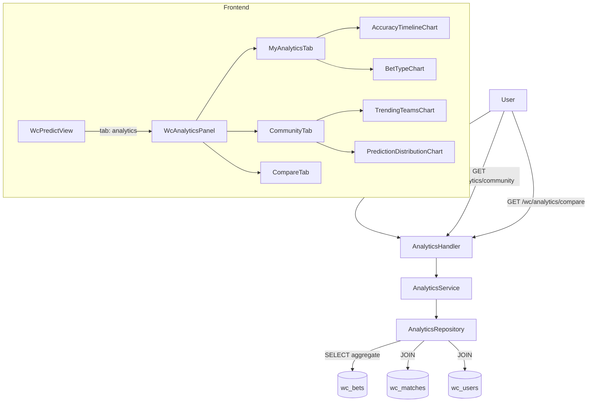

# System Design: WC Prediction Analytics

## Architecture Overview

Pure read-only analytics layer on top of existing `wc_bets` + `wc_matches` data. No new tables. New backend endpoints feed new frontend views.



**Technology additions:**
- Chart library: **Chart.js 4 + vue-chartjs 5** — lightweight (~60 KB gzip), wraps Chart.js for Vue 3, supports line + bar + doughnut charts needed here. No other chart library is currently installed.

---

## Data Models

All analytics are derived from existing tables. No schema migrations needed.

### Source tables used

**`wc_bets`** (existing)
```
user_id, match_id, type (handicap|exact_score|over_under),
selection (string), stake NUMERIC(10,2), payout NUMERIC(10,2), status (pending|settled|void),
created_at
```

**`wc_matches`** (existing)
```
id, home_team, away_team, match_date, status, stage, group
```

**`wc_users`** (existing)
```
id, name, avatar_url
```

### Accuracy definition

**Per match, net result basis** (not per individual bet):

1. Group all `settled`, non-void bets by `match_id`
2. For each match: `sum(payout)` vs `sum(stake)`
3. `win = sum(payout) > sum(stake)` using `decimal.Cmp()` — never `float64` comparison
4. `lose = sum(payout) <= sum(stake)`

This correctly handles Asian handicap partial outcomes:
- `win_half`: payout = stake × (odds+1)/2 > stake → **win**
- `lose_half`: payout = stake/2 < stake → **lose**

### Accuracy timeline (per day)

```sql
-- Step 1: compute net result per (user, match, day)
WITH match_results AS (
  SELECT
    b.user_id,
    b.match_id,
    DATE_TRUNC('day', m.match_date) AS period,
    SUM(b.payout) AS total_payout,
    SUM(b.stake)  AS total_stake
  FROM wc_bets b
  JOIN wc_matches m ON m.id = b.match_id
  WHERE b.user_id = $1
    AND b.status = 'settled'
    AND m.match_date BETWEEN $2 AND $3
  GROUP BY b.user_id, b.match_id, period
)
-- Step 2: count wins/losses per day
SELECT
  period,
  COUNT(*) FILTER (WHERE total_payout > total_stake) AS wins,
  COUNT(*) FILTER (WHERE total_payout <= total_stake) AS losses
FROM match_results
GROUP BY period
ORDER BY period
```

### Favorite teams

Handicap bets only: `selection = 'home'` → `home_team`, `selection = 'away'` → `away_team`.
Exact score bets: count both teams from the matched match (user engaged with that fixture).

### Streak computation

Walk settled matches ordered by `match_date DESC` (grouped by match_id, net result):
```
current_win_streak:  count consecutive wins from most recent match
current_lose_streak: count consecutive losses from most recent match
longest_win_streak:  all-time best win streak
```
Void bets excluded before grouping.

### Prediction profile classification

Applied in service layer. Requires ≥ 3 settled matches. First matching rule wins:

| Label | Condition |
|-------|-----------|
| `underdog_lover` | away_pick_rate (handicap) > 60% |
| `goal_hunter` | avg_predicted_goals (exact score) > 3.0 |
| `draw_master` | draw_pick_rate > 35% |
| `aggressive_predictor` | exact_score_bet_rate > 50% |
| `conservative_predictor` | handicap_bet_rate > 60% |
| `balanced_predictor` | fallback |

`away_pick_rate` used as proxy for underdog rate (simple, avoids needing handicap line direction).

### Community trending teams

```sql
SELECT
  CASE WHEN b.selection = 'home' THEN m.home_team ELSE m.away_team END AS team,
  COUNT(*) AS bet_count
FROM wc_bets b
JOIN wc_matches m ON m.id = b.match_id
WHERE b.type = 'handicap'
  AND b.status != 'void'
  AND b.created_at > NOW() - INTERVAL '7 days'
GROUP BY team
ORDER BY bet_count DESC
LIMIT 10
```

### Community prediction distribution

```sql
SELECT
  CASE
    WHEN b.type = 'handicap' AND b.selection = 'home' THEN 'home'
    WHEN b.type = 'handicap' AND b.selection = 'away' THEN 'away'
    ELSE 'other'
  END AS bucket,
  COUNT(*) AS cnt
FROM wc_bets b
WHERE b.status != 'void'
GROUP BY bucket
```

---

## API Design

All endpoints require WC JWT auth (`Authorization: Bearer <token>`).

### `GET /api/v1/wc/analytics/my`

Query params:
- `period` = `today` | `7d` | `14d` | `30d` (default `30d`)
- `date_from` + `date_to` = ISO8601 date strings for custom range (overrides `period` if both provided)

Response (all 10 compare metrics included):
```json
{
  "accuracy": 0.62,
  "settled_matches": 24,
  "wins": 15,
  "losses": 9,
  "pending_bets": 7,
  "profile_label": "goal_hunter",
  "current_win_streak": 3,
  "current_lose_streak": 0,
  "longest_win_streak": 7,
  "bet_type_distribution": {
    "handicap": 20,
    "exact_score": 12,
    "over_under": 6
  },
  "favorite_teams": [
    { "team": "Brazil", "count": 8 },
    { "team": "France", "count": 6 }
  ],
  "favorite_scorelines": [
    { "scoreline": "2-1", "count": 5 },
    { "scoreline": "1-0", "count": 4 }
  ],
  "accuracy_timeline": [
    { "period": "2026-06-15", "wins": 3, "losses": 1, "accuracy": 0.75 },
    { "period": "2026-06-16", "wins": 2, "losses": 2, "accuracy": 0.50 }
  ],
  "compare_metrics": {
    "home_bias": 0.55,
    "avg_goals_predicted": 2.8,
    "exact_score_rate": 0.32,
    "underdog_rate": 0.40,
    "avg_stake": 150000,
    "over_preference_rate": 0.60,
    "exact_score_hit_rate": 0.17,
    "bet_frequency": 0.85,
    "last_minute_rate": 0.22
  }
}
```

Notes:
- `profile_label` is `null` if fewer than 3 settled matches
- `compare_metrics` fields are `null` when no applicable bets exist (e.g., `home_bias: null` if user has no handicap bets)
- `bet_frequency` = total bets placed / total completed matches in the selected period
- `last_minute_rate` = fraction of bets placed within 2 hours before `match_date`
- `avg_stake` uses `decimal.Decimal` on backend; serialized as number in JSON

### `GET /api/v1/wc/analytics/community`

Response:
```json
{
  "total_bets_placed": 312,
  "active_users": 18,
  "prediction_distribution": {
    "home": 145,
    "away": 112,
    "other": 55
  },
  "trending_teams": [
    { "team": "Brazil", "bet_count": 42 },
    { "team": "France", "bet_count": 38 }
  ],
  "trending_scorelines": [
    { "scoreline": "2-1", "count": 28 },
    { "scoreline": "1-0", "count": 22 }
  ],
  "avg_accuracy": 0.54,
  "community_compare_metrics": {
    "home_bias": 0.48,
    "avg_goals_predicted": 2.5,
    "exact_score_rate": 0.28,
    "underdog_rate": 0.30,
    "avg_stake": 120000,
    "over_preference_rate": 0.52,
    "exact_score_hit_rate": 0.12,
    "bet_frequency": 0.72,
    "last_minute_rate": 0.18
  },
  "top_predictors": [
    { "user_id": "...", "name": "Nam", "avatar_url": "...", "accuracy": 0.75, "settled_matches": 20 },
    { "user_id": "...", "name": "Duy", "avatar_url": "...", "accuracy": 0.70, "settled_matches": 18 }
  ]
}
```

Notes:
- `top_predictors` requires minimum 3 settled matches to qualify
- `community_compare_metrics` are community-wide averages across all users

### `GET /api/v1/wc/analytics/compare`

Lightweight endpoint — frontend can also derive this by combining `/my` + `/community`, but this endpoint returns a clean side-by-side DTO:

```json
{
  "me": {
    "accuracy": 0.62,
    "home_bias": 0.55,
    "avg_goals_predicted": 2.8,
    "exact_score_rate": 0.32,
    "underdog_rate": 0.40,
    "avg_stake": 150000,
    "over_preference_rate": 0.60,
    "exact_score_hit_rate": 0.17,
    "bet_frequency": 0.85,
    "last_minute_rate": 0.22
  },
  "community": {
    "accuracy": 0.54,
    "home_bias": 0.48,
    "avg_goals_predicted": 2.5,
    "exact_score_rate": 0.28,
    "underdog_rate": 0.30,
    "avg_stake": 120000,
    "over_preference_rate": 0.52,
    "exact_score_hit_rate": 0.12,
    "bet_frequency": 0.72,
    "last_minute_rate": 0.18
  }
}
```

---

## Component Breakdown

### Backend

| File | Purpose |
|------|---------|
| `internal/wc/wc_analytics_repository.go` | SQL queries for all aggregate metrics |
| `internal/wc/wc_analytics_service.go` | Business logic, profile classification, streak computation |
| `internal/wc/wc_analytics_handler.go` | HTTP handlers for 3 endpoints |
| `internal/api/router.go` | Wire 3 new routes under authenticated WC group |

### Frontend

| File | Purpose |
|------|---------|
| `src/views/WcPredictView.vue` | **Modified** — add Analytics `el-tab-pane` between Leaderboard and Vô địch tabs |
| `src/components/wc/analytics/WcAnalyticsPanel.vue` | Root analytics component with My/Community/Compare sub-tabs |
| `src/components/wc/analytics/MyAnalyticsPanel.vue` | Personal stats panel |
| `src/components/wc/analytics/CommunityPanel.vue` | Community trending panel |
| `src/components/wc/analytics/ComparePanel.vue` | Side-by-side 10-metric compare table |
| `src/components/wc/analytics/AccuracyTimelineChart.vue` | Line chart (Chart.js wrapper) |
| `src/components/wc/analytics/BetTypeChart.vue` | Doughnut chart (Chart.js wrapper) |
| `src/components/wc/analytics/TrendingTeamsChart.vue` | Horizontal bar chart (Chart.js wrapper) |
| `src/components/wc/analytics/PredictionDistributionChart.vue` | Doughnut chart (Chart.js wrapper) |
| `src/services/wcAnalyticsApi.ts` | Axios service for analytics endpoints |
| `src/stores/wcAnalyticsStore.ts` | Pinia store for analytics state |
| `src/types/wc.ts` | New analytics response interfaces (added to existing file) |
| `src/locales/vi.json` | New keys under `analytics.*` |
| `src/locales/en.json` | New keys under `analytics.*` |

---

## Design Decisions

### Decision 1: No new DB tables
Aggregating from `wc_bets` + `wc_matches` is sufficient for Phase 1.

### Decision 2: Chart.js + vue-chartjs
Smaller and simpler than ECharts. Sufficient for line, bar, doughnut chart types required here.

### Decision 3: Three separate endpoints
`/my`, `/community`, `/compare` — each loaded lazily when the tab is first activated. Avoids over-fetching on initial page load.

### Decision 4: All 10 metrics in `/my` response
Avoids duplicate computation logic between `/my` and `/compare`. Frontend reads all personal metrics from one call. `/compare` endpoint reuses the same service functions.

### Decision 5: Profile classification in service layer
Derived label, not stored. Recalibrating thresholds requires no migration.

### Decision 6: WC JWT required for all analytics
Consistent with the rest of the WC auth model. No public analytics routes.

### Decision 7: `away_pick_rate` as underdog proxy
True underdog detection requires handicap line direction which may not always be populated. Away pick rate is a reliable proxy with no extra data dependency.

### Decision 8: No `win_rate` in trending_teams
Trending includes pending bets (matches not yet played). Win rate would be null or misleading for pending matches. Only `bet_count` is shown.

### Decision 9: Subfolder `analytics/` — `Wc` prefix only on root panel
Components live under `src/components/wc/analytics/`. The root component is `WcAnalyticsPanel.vue` (entry point, has `Wc` prefix). Internal panels (`MyAnalyticsPanel.vue`, `CommunityPanel.vue`, `ComparePanel.vue`) drop the prefix to avoid redundancy inside the subfolder.

### Decision 10: `decimal.Decimal` for all stake/payout comparisons
All `payout > stake` comparisons in Go use `shopspring/decimal` `.Cmp()`. Never `float64`. Consistent with project-wide constraint.

### Decision 11: Analytics as inline tab in WcPredictView — no separate route
Analytics tab is added to `WcPredictView.vue`'s `el-tabs` between "Bảng xếp hạng" and "🏆 Vô địch". No `/world-cup/analytics` route needed. Data is lazy-loaded via `watch(activeTab)` when the analytics tab is first activated — same pattern as the leaderboard tab.

---

## Non-Functional Requirements

**Performance:** ~20 users × ~50 bets = ~1000 rows. All queries complete in <50ms. No caching needed.

**Security:**
- `/my` and `/compare` use `c.GetString(WcUserIDKey)` from JWT context — users cannot query other users' personal analytics
- Community endpoints expose only aggregates; `top_predictors` exposes only `name` and `avatar_url` (already public on leaderboard)

**Decimal math:** All `stake` and `payout` comparisons use `shopspring/decimal`. JSON serialization of `decimal.Decimal` as number is handled by the existing pattern in the codebase.

**Responsive design:** Charts use `responsive: true, maintainAspectRatio: false`. Cards stack vertically on mobile via Tailwind `flex-col sm:flex-row`.

**i18n:** All strings keyed under `analytics.*`. Profile labels (`analytics.profile.goalHunter`, etc.), chart titles, table headers, empty states — no hardcoded text.

**Period filtering:** `date_from` / `date_to` are parsed as UTC midnight on the backend. Frontend sends dates in `YYYY-MM-DD` format; backend appends time bounds before querying.
