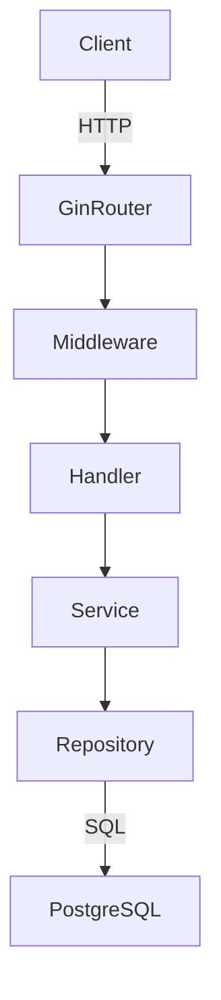
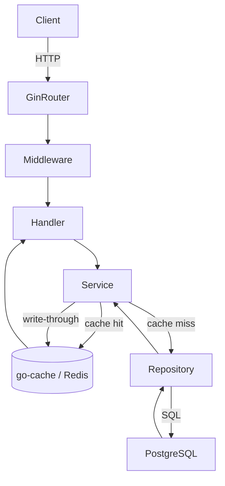

# System Design & Architecture

## Architecture Overview

Current flow (all requests hit DB):



Target flow (hot paths served from cache):



**Key components added/changed:**
- `internal/cache/` — thin cache abstraction (TTL get/set/delete)
- `internal/database/database.go` — explicit connection pool config
- `internal/repository/match_repository.go` — DB-level pagination for GetAll
- `internal/api/match_handler.go` — fix app-level pagination
- `internal/repository/wc_repository.go` — cache-aware GetLeaderboard
- `internal/api/router.go` — add gzip compression middleware
- DB migration — add missing indexes

## Data Models

No new tables. Cache entries are ephemeral:

| Cache Key | Value | TTL | Invalidated On |
|-----------|-------|-----|----------------|
| `wc:leaderboard` | `[]LeaderboardEntry` JSON | 2 min | Any score/bet settlement |
| `wc:matches:all` | `[]WCMatch` JSON | 5 min | Admin sync / match update |
| `wc:config` | `WCConfig` JSON | 10 min | Admin config save |
| `matches:feed:{page}:{limit}` | `[]FeedItem` JSON | 30 sec | New match created |

## API Design

**No breaking changes.** All existing endpoints keep identical request/response shapes.

### Fixed: GET /matches (pagination)

**Before:**
```
Handler calls matchService.GetAllMatches(0, 0)   → fetches ALL matches
Handler calls bonusService.GetAll(0, 0)          → fetches ALL bonuses
Handler merges in memory → slices result[start:end]
```

**After:**
- If match-only view: paginate at DB level
- If feed (matches + bonuses merged): add a DB view or union query, paginate at DB
- Simplest safe fix: add total count query + paginate the match query; bonuses scoped to the page's date range

**Response shape unchanged:**
```json
{
  "data": [...],
  "total": 1234,
  "page": 1,
  "limit": 20
}
```

### Caching Strategy: Service Layer

Cache logic lives in the service layer, not the repository, so repositories stay pure.

```go
// wc_service.go
func (s *WCService) GetLeaderboard() ([]LeaderboardEntry, error) {
    if cached, ok := s.cache.Get("wc:leaderboard"); ok {
        return cached.([]LeaderboardEntry), nil
    }
    entries, err := s.repo.GetLeaderboard()
    if err == nil {
        s.cache.Set("wc:leaderboard", entries, 2*time.Minute)
    }
    return entries, err
}
```

### DB Connection Pool

```go
// database.go — after gorm.Open()
sqlDB, _ := db.DB()
sqlDB.SetMaxOpenConns(25)
sqlDB.SetMaxIdleConns(5)
sqlDB.SetConnMaxLifetime(5 * time.Minute)
sqlDB.SetConnMaxIdleTime(30 * time.Second)
```

### Compression Middleware

Add after CORS in router.go:

```go
import "github.com/gin-contrib/gzip"
router.Use(gzip.Gzip(gzip.DefaultCompression))
```

## Component Breakdown

### Backend Services / Modules

| Component | Change | File |
|-----------|--------|------|
| Cache abstraction | **NEW** — `CacheStore` interface + go-cache impl | `internal/cache/cache.go` |
| Database init | **MODIFY** — add pool config | `internal/database/database.go` |
| Match repository | **MODIFY** — real DB pagination in GetAll | `internal/repository/match_repository.go` |
| Match handler | **MODIFY** — remove in-memory pagination | `internal/api/match_handler.go` |
| WC service | **MODIFY** — inject cache, wrap GetLeaderboard | `internal/service/wc_service.go` |
| WC matches service | **MODIFY** — cache GetAllMatches | `internal/service/wc_service.go` |
| Custom bet repository | **MODIFY** — batch insert options | `internal/repository/wc_custom_bet_repository.go` |
| Router | **MODIFY** — add gzip, swap logger level | `internal/api/router.go` |
| DB logger | **MODIFY** — Info → Warn | `internal/database/database.go` |
| DB migration | **NEW** — add 4 indexes | `backend/migrations/` |

### Database Indexes to Add

```sql
-- match_participants: used in every match JOIN
CREATE INDEX IF NOT EXISTS idx_match_participants_match_id
    ON match_participants(match_id);

-- wc_bets: filtered in house P&L + settlement
CREATE INDEX IF NOT EXISTS idx_wc_bets_result
    ON wc_bets(result);

-- wc_predictions: aggregated in leaderboard
CREATE INDEX IF NOT EXISTS idx_wc_predictions_result
    ON wc_predictions(result);

-- wc_chat_messages: cursor pagination ORDER BY created_at
CREATE INDEX IF NOT EXISTS idx_wc_chat_messages_created_at
    ON wc_chat_messages(created_at DESC);
```

## Design Decisions

### Cache choice: go-cache (in-memory) vs Redis

| | go-cache | Redis |
|-|----------|-------|
| **Setup** | Zero infra, single import | Requires Redis server |
| **Multi-instance** | Cache NOT shared between pods | Shared across instances |
| **Persistence** | Lost on restart | Survives restart |
| **Latency** | ~100ns | ~1ms |

**Decision: go-cache** for initial implementation.
- This is a single-server deployment (friend group app)
- Zero operational overhead
- Can swap to Redis behind the `CacheStore` interface later without changing service code

### Pagination fix approach

Two options for GET /matches feed (matches + bonuses merged):
1. **DB-level union**: Create a view or CTE that merges both, paginate in SQL — cleanest but more complex migration
2. **Scope bonuses to page**: Paginate matches at DB level; fetch bonuses only for the date range of the current page — simpler, no migration needed

**Decision: Option 2** — scope bonuses to page date range. Avoids a DB view migration, keeps existing GORM patterns, easy to implement.

### Cache invalidation strategy

**Time-based TTL only** (simplest):
- Leaderboard: 2 min TTL — users can tolerate 2-min stale data
- WC matches: 5 min TTL — match data changes rarely
- Config: 10 min TTL

**Why not event-driven?** Would require cache invalidation calls scattered across settlement/score handlers. TTL is sufficient for the scale and avoids complexity.

## Non-Functional Requirements

- **Performance**: P95 leaderboard ≤ 300ms (cached), ≤ 1500ms (cold)
- **Memory**: go-cache adds ~5MB RSS max with current data sizes
- **Correctness**: Cache must never serve stale leaderboard >2 minutes old
- **Reliability**: Cache miss must always fall through to DB — no silent failures
- **Compatibility**: Zero frontend changes required
- **DB safety**: All index migrations use `IF NOT EXISTS` — safe to re-run
