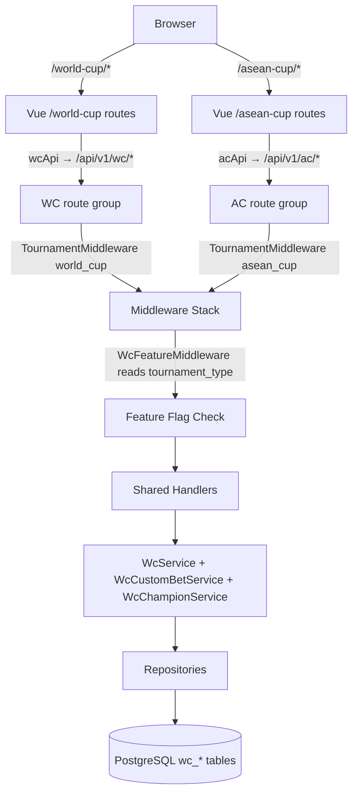

# System Design & Architecture

## Architecture Overview

The existing WC2026 system is parameterized by adding a `tournament_type` discriminator column to relevant `wc_*` tables. A `TournamentMiddleware` on each API route group injects the tournament type into the Gin context. Handlers and services are updated to accept and propagate `tournamentType`. Frontend gets new `/asean-cup/*` routes that reuse the same Vue components through a `TournamentConfig` context object, powered by a new `createTournamentApi(prefix)` axios factory.



## Data Models

### Schema Changes — Add `tournament_type` Column

Add `tournament_type VARCHAR(20) NOT NULL DEFAULT 'world_cup'` to the following tables, then remove the DEFAULT after backfill:

| Table | Change | Reason |
|-------|--------|--------|
| `wc_config` | Remove singleton (id=1); add `tournament_type` as unique key | Separate feature flag per tournament |
| `wc_matches` | Add `tournament_type` + index | Primary filter point for all match queries |
| `wc_bets` | Add `tournament_type` (denormalized from match) | Fast filtering without JOIN |
| `wc_predictions` | Add `tournament_type` (denormalized from match) | Fast filtering without JOIN |
| `wc_custom_bets` | Add `tournament_type` (denormalized from match) | Fast filtering without JOIN |
| `wc_settlements` | Add `tournament_type` | Settlement cycles are per-tournament |
| `wc_settlement_details` | No change — FK to `wc_settlements` (inherits via JOIN) | |
| `wc_champion_config` | Remove singleton (id=1); add `tournament_type` as unique key | Separate champion open/closed/winner per tournament |
| `wc_champion_teams` | Add `tournament_type` + index | ASEAN Cup has different teams than WC |
| `wc_champion_predictions` | Add `tournament_type` | Champion picks are per-tournament |
| `wc_sync_logs` | Add `tournament_type` | Differentiate sync runs per tournament |

Tables that do **not** need `tournament_type` (scoped via FK chain):
- `wc_users`, `wc_wallets`, `wc_wallet_logs` — shared across tournaments
- `wc_score_odds`, `wc_score_multipliers`, `wc_custom_bet_options`, `wc_custom_bet_entries` — scoped through `match_id` / `custom_bet_id`

### Updated `wc_config` Schema

```sql
ALTER TABLE wc_config
  ADD COLUMN tournament_type VARCHAR(20) NOT NULL DEFAULT 'world_cup';
ALTER TABLE wc_config ADD CONSTRAINT wc_config_tournament_type_unique UNIQUE (tournament_type);
INSERT INTO wc_config (tournament_type, is_enabled) VALUES ('asean_cup', false);
```

### Updated `wc_champion_config` Schema

```sql
ALTER TABLE wc_champion_config
  ADD COLUMN tournament_type VARCHAR(20) NOT NULL DEFAULT 'world_cup';
ALTER TABLE wc_champion_config ADD CONSTRAINT wc_champion_config_tournament_type_unique UNIQUE (tournament_type);
INSERT INTO wc_champion_config (tournament_type, is_open) VALUES ('asean_cup', false);
```

### Updated `wc_champion_teams` Schema

```sql
ALTER TABLE wc_champion_teams
  ADD COLUMN tournament_type VARCHAR(20) NOT NULL DEFAULT 'world_cup';
CREATE INDEX idx_wc_champion_teams_tournament_type ON wc_champion_teams (tournament_type);
-- Drop old global unique index on name; replace with per-tournament unique
ALTER TABLE wc_champion_teams DROP CONSTRAINT IF EXISTS wc_champion_teams_name_key;
ALTER TABLE wc_champion_teams ADD CONSTRAINT wc_champion_teams_name_tournament_unique UNIQUE (name, tournament_type);
```

ASEAN Cup champion teams seeded by admin via existing `POST /admin/champion/teams` (with `tournament_type` param added):
Thailand, Vietnam, Indonesia, Malaysia, Philippines, Singapore, Myanmar, Cambodia (+ Timor-Leste / Laos if included in champion pool).

### New DB Indexes

```sql
CREATE INDEX idx_wc_matches_tournament_type      ON wc_matches (tournament_type);
CREATE INDEX idx_wc_bets_tournament_type          ON wc_bets (tournament_type);
CREATE INDEX idx_wc_predictions_tournament_type   ON wc_predictions (tournament_type);
CREATE INDEX idx_wc_custom_bets_tournament_type   ON wc_custom_bets (tournament_type);
CREATE INDEX idx_wc_settlements_tournament_type   ON wc_settlements (tournament_type);
CREATE INDEX idx_wc_champion_teams_tournament_type ON wc_champion_teams (tournament_type);
```

### ASEAN Cup Match Stages

| Stage | Value | Notes |
|-------|-------|-------|
| Group | `group` | Same as WC |
| Semifinal | `sf` | 2 legs — each leg is a separate `wc_matches` row |
| Final | `final` | 2 legs — same pattern |

ASEAN Cup does not use `r32`, `r16`, `qf`, `third_place`.

Knockout legs are treated as independent matches. No aggregate-score logic needed. Admin creates two rows per tie, settles each leg separately.

### Tournament Type Enum (Go)

```go
const (
    TournamentTypeWorldCup = "world_cup"
    TournamentTypeAseanCup = "asean_cup"
)
```

## API Design

### Middleware Stack — Order Matters

`TournamentMiddleware` must run before `WcFeatureMiddleware` so the feature flag check reads the correct config row:

```go
// router.go — ASEAN Cup route groups
acPublic := v1.Group("/ac")
acPublic.Use(middleware.TournamentMiddleware("asean_cup"))

acFeature := acPublic.Group("", middleware.WcFeatureMiddleware(wcRepo))

acAuth := v1.Group("/ac")
acAuth.Use(
    middleware.TournamentMiddleware("asean_cup"),
    middleware.WcFeatureMiddleware(wcRepo),
    middleware.WcAuthMiddleware(),
)

acAdmin := v1.Group("/ac/admin")
acAdmin.Use(
    middleware.TournamentMiddleware("asean_cup"),
    middleware.WcFeatureMiddleware(wcRepo),
    middleware.WcAuthMiddleware(),
    middleware.WcAdminMiddleware(),
)
```

### `WcFeatureMiddleware` — Updated

```go
// middleware/wc_feature.go
func WcFeatureMiddleware(wcRepo *repository.WcRepository) gin.HandlerFunc {
    return func(c *gin.Context) {
        tournamentType := c.MustGet("tournament_type").(string)  // set by TournamentMiddleware
        cfg, err := wcRepo.GetConfig(tournamentType)
        if err != nil || !cfg.IsEnabled {
            c.AbortWithStatus(http.StatusServiceUnavailable)
            return
        }
        c.Next()
    }
}
```

### New Endpoints — ASEAN Cup Admin

Beyond mirroring all existing WC endpoints, ASEAN Cup requires one **new** endpoint not present in WC (matches were always API-synced for WC):

```
POST /api/v1/ac/admin/matches   → CreateMatch (new handler + service + repo method)
```

Request body:
```json
{
  "home_team": "Vietnam",
  "away_team": "Thailand",
  "home_team_code": "VIE",
  "away_team_code": "THA",
  "match_date": "2026-08-15T13:00:00Z",
  "group_name": null,
  "stage": "sf",
  "venue": "My Dinh National Stadium, Hanoi"
}
```

Also expose this on WC for parity (or restrict to AC only — acceptable since WC is read-only):
```
POST /api/v1/wc/admin/matches   → same handler (guarded by WC feature flag = off, effectively blocked)
```

### All ASEAN Cup Routes (mirrors `/wc/*` exactly)

```
# Public (no auth, no feature flag)
GET  /api/v1/ac/config
GET  /api/v1/ac/schedule

# Feature-gated public
GET  /api/v1/ac/matches
GET  /api/v1/ac/leaderboard

# Auth
GET  /api/v1/ac/matches/:id/bets
POST /api/v1/ac/matches/:id/bet
DELETE /api/v1/ac/bets/:id
GET  /api/v1/ac/wallet
GET  /api/v1/ac/predictions
GET  /api/v1/ac/matches/:id/predictions
POST /api/v1/ac/matches/:id/predict
...all other wc auth routes...

# Admin
POST /api/v1/ac/admin/matches           ← NEW (no WC equivalent)
PUT  /api/v1/ac/admin/matches/:id
POST /api/v1/ac/admin/matches/:id/finalize
POST /api/v1/ac/admin/matches/:id/settle
PUT  /api/v1/ac/admin/config
...all other wc admin routes...
```

### Handler Changes

Every handler reads `tournamentType` from context:

```go
func (h *WcHandler) ListMatches(c *gin.Context) {
    tournamentType := c.MustGet("tournament_type").(string)
    matches, err := h.wcService.ListMatches(c.Request.Context(), tournamentType, filters)
    ...
}
```

### Activity Feed WebSocket

Single shared hub — same channel for WC and ASEAN Cup events (same friend group). Add `tournament_type` to the broadcast payload so the frontend can display appropriate context:

```json
{
  "type": "bet_placed",
  "tournament_type": "asean_cup",
  "user_name": "Minh",
  "match": "Vietnam vs Indonesia",
  "bet_type": "handicap",
  "choice": "home"
}
```

Backend: when broadcasting a bet event, read `tournament_type` from the match and include in the payload. No hub architecture change needed.

## Component Breakdown

### Backend Files Changed

| File | Change |
|------|--------|
| `backend/internal/model/wc_*.go` | Add `TournamentType string` to `WcConfig`, `WcMatch`, `WcBet`, `WcPrediction`, `WcCustomBet`, `WcSettlement`, `WcChampionConfig`, `WcChampionTeam`, `WcChampionPrediction` |
| `backend/internal/repository/wc_repository.go` | `GetConfig` / `UpdateConfig`: `WHERE tournament_type = ?` instead of `WHERE id = 1`; all match/bet/prediction queries add `tournament_type` param |
| `backend/internal/repository/wc_champion_repository.go` | `GetChampionConfig`: `WHERE tournament_type = ?` instead of `WHERE id = 1`; champion team queries add `tournament_type` param |
| `backend/internal/repository/wc_*_repository.go` | Add `tournamentType` param to all query methods |
| `backend/internal/service/wc_service.go` | Add `tournamentType` param to all public methods; add `CreateMatch` method |
| `backend/internal/service/wc_custom_bet_service.go` | Add `tournamentType` param |
| `backend/internal/service/wc_champion_service.go` | Add `tournamentType` param to all methods |
| `backend/internal/api/wc_handler.go` | Read `tournament_type` from context; add `CreateMatch` handler |
| `backend/internal/api/wc_custom_bet_handler.go` | Read `tournament_type` from context |
| `backend/internal/api/wc_champion_handler.go` | Read `tournament_type` from context |
| `backend/internal/api/router.go` | Add `/ac` route groups with correct middleware order; register `CreateMatch` on `acAdmin` |
| `backend/internal/middleware/wc_feature.go` | Read `tournament_type` from Gin context; query `WHERE tournament_type = ?` |
| `backend/internal/middleware/tournament.go` | **New** — `TournamentMiddleware(type string) gin.HandlerFunc` |
| `backend/internal/database/database.go` | Seed `asean_cup` row in `wc_config`, `wc_champion_config` after migration |

### Frontend Files Changed / Added

| File | Change |
|------|--------|
| `frontend/src/services/wcApi.ts` | Refactor to `createTournamentApi(apiPrefix, loginRoute, featureName)` factory; export `wcApi` and `acApi` instances |
| `frontend/src/services/wcService.ts` | All calls use injected api instance (via composable or factory); add `createMatch` method |
| `frontend/src/router/index.ts` | Add `/asean-cup/*` routes; parameterize feature check as `isTournamentEnabled(apiBase)` |
| `frontend/src/config/tournaments.ts` | **New** — `TournamentConfig` interface + `TOURNAMENTS` map |
| `frontend/src/composables/useTournament.ts` | **New** — derive tournament config from route path |
| `frontend/src/views/wc/` | Reused for ASEAN Cup; components read `apiPrefix` from `useTournament()` composable |
| `frontend/src/components/wc/WcAdminPanel.vue` | Add "Enter Score" dialog trigger on match cards; add "Create Match" button |
| `frontend/src/components/wc/WcAdminScoreDialog.vue` | **New** — home/away score inputs; calls `PUT /admin/matches/:id` |
| `frontend/src/components/wc/WcAdminMatchCreateDialog.vue` | **New** — create match form; calls `POST /admin/matches` |
| `frontend/src/components/layout/NavSidebar.vue` | Add ASEAN Cup nav section; mark WC as "(Kết thúc)" |
| `frontend/src/locales/vi.json`, `en.json` | Add ASEAN Cup translations |

### New Components — Detail

#### `WcAdminScoreDialog.vue`
```
Fields:   Home Score [number input]   Away Score [number input]
Submit:   PUT /admin/matches/:id  → { home_score, away_score, status: "completed" }
Shown on: Each match card in admin panel (scheduled / live status only)
After:    Admin clicks existing "Tính kết quả" to settle bets
```

#### `WcAdminMatchCreateDialog.vue`
```
Fields:   Home Team, Away Team (text)
          Home Code, Away Code (3-letter)
          Match Date (datetime picker, VN timezone)
          Group (A / B / null for knockout)
          Stage (group / sf / final)
          Venue (text)
Submit:   POST /admin/matches → { home_team, away_team, home_team_code, away_team_code,
                                   match_date, group_name, stage, venue }
Shown on: Admin panel match management section, "Tạo trận đấu" button
```

### Tournament Config (Frontend)

```typescript
// src/config/tournaments.ts
export interface TournamentConfig {
  type: 'world_cup' | 'asean_cup'
  displayName: string
  shortName: string
  routePrefix: string
  apiPrefix: string
  loginRoute: string
  featureName: string
  accentColor: string
}

export const TOURNAMENTS: Record<string, TournamentConfig> = {
  world_cup: {
    type: 'world_cup', displayName: 'World Cup 2026', shortName: 'WC 2026',
    routePrefix: '/world-cup', apiPrefix: '/wc', loginRoute: '/world-cup/login',
    featureName: 'World Cup', accentColor: '#1a56db',
  },
  asean_cup: {
    type: 'asean_cup', displayName: 'ASEAN Cup 2026', shortName: 'ASEAN 2026',
    routePrefix: '/asean-cup', apiPrefix: '/ac', loginRoute: '/asean-cup/login',
    featureName: 'ASEAN Cup', accentColor: '#0d9488',
  },
}
```

### `wcApi.ts` — Factory Pattern

```typescript
export function createTournamentApi(apiPrefix: string, loginRoute: string, featureName: string) {
  const instance = axios.create({
    baseURL: (import.meta.env.VITE_API_BASE_URL || 'http://localhost:8080/api/v1') + apiPrefix,
    timeout: 10000,
    headers: { 'Content-Type': 'application/json' },
  })
  instance.interceptors.request.use((config) => {
    const token = localStorage.getItem('wc_token')  // shared token
    if (token) config.headers.Authorization = `Bearer ${token}`
    return config
  })
  instance.interceptors.response.use(
    (r) => r,
    (error) => {
      if (error.response?.status === 401) {
        localStorage.removeItem('wc_token')
        localStorage.removeItem('wc_user')
        window.location.href = loginRoute
      } else if (error.response?.status === 503) {
        ElMessage.warning(`Tính năng ${featureName} hiện đang tắt.`)
      } else { /* existing error map logic */ }
      return Promise.reject(error)
    }
  )
  return instance
}

export const wcApi = createTournamentApi('/wc', '/world-cup/login', 'World Cup')
export const acApi = createTournamentApi('/ac', '/asean-cup/login', 'ASEAN Cup')
```

### Router Guard — Parameterized

```typescript
// router/index.ts
const AC_API_BASE = (import.meta.env.VITE_API_BASE_URL || '...') + '/ac'

async function isTournamentEnabled(apiBase: string): Promise<boolean> {
  try {
    const res = await fetch(`${apiBase}/config`)
    return !!(await res.json()).is_enabled
  } catch { return false }
}

router.beforeEach(async (to) => {
  if (to.meta.requiresWcFeature) {
    const enabled = await isTournamentEnabled(WC_API_BASE)
    if (!enabled) return { name: 'not-found' }
  }
  if (to.meta.requiresAcFeature) {
    const enabled = await isTournamentEnabled(AC_API_BASE)
    if (!enabled) return { path: '/asean-cup/schedule' }
  }
  // ... auth guards unchanged
})
```

## Design Decisions

### Decision 1: `tournament_type` discriminator vs. new `ac_` tables
**Chosen:** discriminator. Same domain, same users, same wallet. Duplicating 15+ tables doubles maintenance with no benefit.

### Decision 2: One shared wallet
**Chosen:** Single `wc_wallets.balance`, carry-over from WC. No reset.

### Decision 3: Same `wc_users` / admin flag
**Chosen:** `wc_users.is_admin` covers both tournaments. Acceptable for friend-group app.

### Decision 4: Separate feature flags per tournament
**Chosen:** `wc_config` + `wc_champion_config` both become multi-row, keyed by `tournament_type`.

### Decision 5: `useTournament()` composable over store-level state
**Chosen:** Route path is the single source of truth. Same components reused without code changes.

### Decision 6: `createTournamentApi()` factory over two separate api files
**Chosen:** Factory avoids code duplication in the axios interceptor logic (401/503 handling, error map, auth header). Two named exports (`wcApi`, `acApi`) keep call sites readable.

### Decision 7: `WcFeatureMiddleware` reads tournament_type from Gin context
**Chosen:** Middleware order (`TournamentMiddleware` → `WcFeatureMiddleware`) ensures the feature flag check always hits the correct config row. No additional parameters needed on the middleware constructor.

### Decision 8: Activity feed — shared WebSocket channel + tournament_type in payload
**Chosen:** Same hub, same channel. `tournament_type` added to payload for frontend context. Zero hub architecture change.

### Decision 9: Two-legged knockout — each leg is a separate wc_matches row
**Chosen:** Simplest approach. Bets placed per-leg. Admin settles each leg independently. No aggregate-score logic.

### Decision 10: `wc_champion_teams` discriminated by tournament_type
**Chosen:** Add `tournament_type` column; unique constraint becomes `(name, tournament_type)`. Admin seeds ASEAN Cup teams separately. WC teams preserved unchanged under `tournament_type = 'world_cup'`.

## External API Coverage

| API | Coverage | Impact |
|-----|----------|--------|
| odds-api.io | Unconfirmed | Admin manual entry is primary path. Check `/v3/leagues?sport=football&apiKey=KEY` |
| football-data.org | Confirmed NOT covered | Analytics top-scorers unavailable; show match-level stats only |

## Non-Functional Requirements

- **Performance:** All 6 new `tournament_type` indexes must be created before launch.
- **Migration safety:** Add column with DEFAULT first → backfill → verify → add UNIQUE/NOT NULL constraints. Take DB backup before running.
- **Backward compatibility:** All `/api/v1/wc/*` endpoints must return identical responses post-migration. Smoke-test after each migration step.
- **Security:** No new auth surface. `wc_token` shared. `WcAuthMiddleware` and `WcAdminMiddleware` unchanged.
- **WC read-only guarantee:** WC feature flag defaults off. `WcFeatureMiddleware` blocks all WC write routes when flag is off. Admin can still access WC admin to view history (flag-exempt routes: `/wc/config`, `/wc/schedule`).
