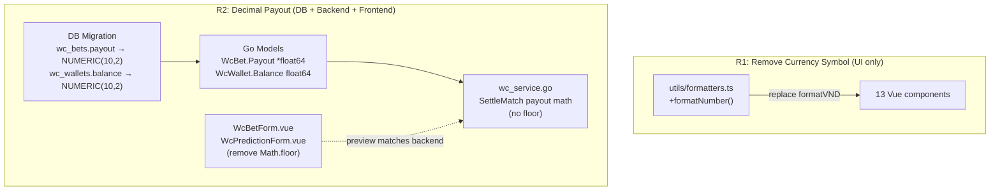

# System Design & Architecture

## Architecture Overview



R1 và R2 hoàn toàn độc lập — có thể deploy riêng. R2 phải deploy **trước hoặc cùng lúc** với `feature-house-pnl-dashboard`.

---

## Data Models — R2

### DB Migrations

```sql
-- Migration 1: wc_bets.payout
ALTER TABLE wc_bets
    ALTER COLUMN payout TYPE NUMERIC(10,2);

-- Migration 2: wc_wallets.balance
ALTER TABLE wc_wallets
    ALTER COLUMN balance TYPE NUMERIC(10,2);
```

Không cần migrate data cũ — PostgreSQL cast `INTEGER → NUMERIC(10,2)` tự động, không mất dữ liệu.

### Go Model Changes

**`internal/model/wc_match.go`:**
```go
// Trước
type WcBet struct {
    Payout *int `json:"payout,omitempty"`
    ...
}
type WcWallet struct {
    Balance int `json:"balance"`
    ...
}

// Sau
type WcBet struct {
    Payout *float64 `json:"payout,omitempty"`
    ...
}
type WcWallet struct {
    Balance float64 `json:"balance"`
    ...
}
```

GORM tự động handle `NUMERIC(10,2)` ↔ `float64` không cần custom scanner.

---

## API Design — Không thay đổi

- Endpoints hiện tại không đổi signature.
- Response JSON: `payout` và `balance` từ `int` → `number` (float trong JSON). Frontend JS đã handle `number` đúng, không cần thay đổi parsing.

---

## Component Breakdown

### R1 — Remove Currency Symbol

#### `utils/formatters.ts` — thêm helper
```ts
// Thêm vào formatters.ts (không xoá formatVND)
export function formatNumber(n: number): string {
  return new Intl.NumberFormat('vi-VN').format(n)
}
```

#### 13 files cần thay thế `formatVND` → `formatNumber`:

| File | Số chỗ |
|---|---|
| `components/wc/WcSettlementHistory.vue` | 2 (dòng 14, 102) |
| `components/wc/WcSettlementPreview.vue` | 2 (dòng 14, 120) |
| `components/settlement/SettlementList.vue` | 5 (dòng 37, 47, 51, 55, 61) |
| `components/settlement/SettlementDetails.vue` | 8 (dòng 20, 32, 37, 42, 60, 74, 75, 76) |
| `components/settlement/WinnerContributors.vue` | 1 (dòng 25) |
| `components/settlement/SettlementTriggerDialog.vue` | 4 (dòng 20, 27, 31, 119) |
| `components/shared/Leaderboard.vue` | 2 (dòng 152, 154) |
| `components/user/UserTable.vue` | 2 (dòng 65, 70) |
| `views/TournamentDetailView.vue` | 1 (dòng 25) |
| `views/DashboardView.vue` | 2 (dòng 128, 161) |
| `views/ConfigView.vue` | 2 (dòng 116, 332) |

**Không thay đổi (fund management + FundContributors):**
- `components/fund/FundTransactionList.vue`
- `components/fund/FundForm.vue`
- `components/settlement/FundContributors.vue`
- `views/FundView.vue`
- `views/DashboardView.vue:43` (fund balance stat card)

#### `WcSettlementHistory.vue` và `WcSettlementPreview.vue` — đặc biệt

Hai file này không dùng `formatVND` mà dùng inline `Intl.NumberFormat + ' ₫'`. Cần sửa trực tiếp:
```ts
// Trước
return new Intl.NumberFormat('vi-VN').format(n) + ' ₫'
// Sau
return new Intl.NumberFormat('vi-VN').format(n)
```

---

### R2 — Decimal Payout

#### Backend: `internal/service/wc_service.go` — Settlement logic

Tìm hàm `SettleMatch` và các hàm tính payout. Thay thế integer math bằng float:

```go
// Trước (integer truncation)
payout := int(math.Floor(float64(bet.Stake) * odds))

// Sau (giữ float64, round 2 decimal)
payout := math.Round(float64(bet.Stake)*odds*100) / 100
```

`math.Round(x*100)/100` đảm bảo giữ 2 chữ số thập phân mà không cắt bỏ.

#### Backend: `internal/repository/wc_repository.go`

`UpdateBetResult` nhận `payout int` → đổi sang `payout float64`:
```go
// Trước
func (r *WcRepository) UpdateBetResult(tx *gorm.DB, id uuid.UUID, result string, payout int) error

// Sau
func (r *WcRepository) UpdateBetResult(tx *gorm.DB, id uuid.UUID, result string, payout float64) error
```

`UpdateWalletBalance` nhận `delta int` → đổi sang `delta float64`:
```go
// Trước
func (r *WcRepository) UpdateWalletBalance(tx *gorm.DB, wcUserID uuid.UUID, delta int) error

// Sau
func (r *WcRepository) UpdateWalletBalance(tx *gorm.DB, wcUserID uuid.UUID, delta float64) error
```

#### Frontend: `WcBetForm.vue` — Payout preview

```ts
// Trước (5 chỗ dùng Math.floor)
const handicapPayout = computed(() =>
  Math.floor(handicapStake.value * handicapOdds.value) - handicapStake.value,
)

// Sau (giữ 2 decimal)
const handicapPayout = computed(() =>
  +(handicapStake.value * handicapOdds.value - handicapStake.value).toFixed(2),
)
```

Quarter handicap split:
```ts
// Trước
const winPayout = Math.floor(s * odds)
const winHalfPayout = Math.floor(half * odds) + Math.floor(half)
const loseHalfPayout = Math.floor(half)

// Sau
const winPayout = +(s * odds).toFixed(2)
const winHalfPayout = +(half * odds + half).toFixed(2)
const loseHalfPayout = +half.toFixed(2)
```

#### Frontend: `WcPredictionForm.vue` — tương tự WcBetForm

3 chỗ Math.floor ở dòng 213, 230, 231 — áp dụng cùng pattern `toFixed(2)`.

---

## Design Decisions

| Decision | Choice | Rationale |
|---|---|---|
| Storage type | `NUMERIC(10,2)` | 2 decimal places đủ cho betting points. Float64 tránh floating-point errors của DOUBLE PRECISION |
| Payout rounding | `math.Round(x*100)/100` | Banker's rounding — không thiên vị home/away |
| Display precision | `toFixed(2)` | Luôn hiện 2 chữ số: `+1.80`, `+2.00` — nhất quán |
| Migration safety | `ALTER COLUMN ... TYPE NUMERIC` | PostgreSQL auto-cast từ INTEGER, zero downtime |
| R1 independence | R1 deploy riêng | Không cần R2 — chỉ là display change |

---

## Non-Functional Requirements

- **R1:** Zero risk — UI-only change, không chạm DB hay logic.
- **R2 Migration:** Idempotent — chạy lại không lỗi nếu column đã là NUMERIC.
- **R2 Backward compat:** `WcWalletLog` vẫn dùng `delta int` + `balance_before/after int` → cần đổi sang `float64` đồng bộ.
- **Settlement VND output:** `float64 balance × int point_rate` → `int VND` (làm tròn ở bước cuối settlement, không ảnh hưởng in-game accuracy).
