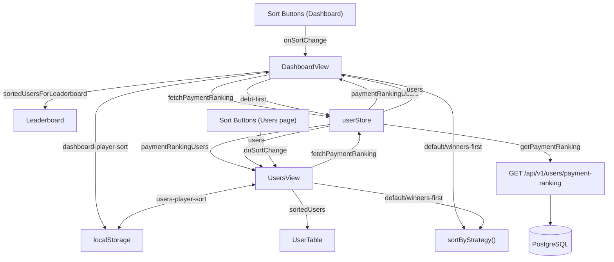

# System Design & Architecture

## Architecture Overview

Strategy 1 ("Debt First") requires a new backend endpoint to compute lifetime payment totals via SQL aggregation. Strategies 2 and 3 remain client-side sort only.



**Key components:**
- `GET /api/v1/users/payment-ranking` — **new** backend endpoint; returns all active users ordered by `SUM(debt_settlements.money_amount) DESC`. Called from both Dashboard and Users pages via the shared store.
- `userStore` (Pinia) — extended with `paymentRankingUsers` ref and `fetchPaymentRanking()` action. Both views call the same store action; data is shared and not double-fetched if already loaded.
- `DashboardView.vue` — owns Dashboard sort state, calls `userStore.fetchPaymentRanking()`, computes `sortedUsers`, renders sort control buttons (3 strategies, defaults to `debt-first`).
- `UsersView.vue` — owns Users page sort state, calls `userStore.fetchPaymentRanking()`, computes sorted user list for its `UserTable`, renders the same 3 sort buttons.
- `Leaderboard.vue` — **pure display component**: no internal sort; renders whatever `users` prop it receives (sliced to `limit`).
- `sortByStrategy()` — pure utility for strategies 2 and 3 only (no settlement data needed).

## Data Models

### New frontend type

```ts
// frontend/src/types/user.ts
export interface UserWithPaymentTotal extends User {
  total_paid: number  // SUM(money_amount) across all settlements as debtor
}
```

### Sort state (UI-only, localStorage)

```ts
type PlayerSortStrategy = 'debt-first' | 'default' | 'winners-first'
// localStorage key: 'dashboard-player-sort'
```

### Sort algorithm per strategy

| Strategy | Sort Key | Order | Tie-break |
|---|---|---|---|
| `debt-first` | `total_paid` (from `/payment-ranking`) | DESC | `name ASC` |
| `default` | `current_score` sign grouping: neg → pos → zero | neg ASC, pos DESC, zero alpha | `name ASC` |
| `winners-first` | `current_score` sign grouping: pos → zero → neg | pos DESC, zero alpha, neg ASC | `name ASC` |

### Backend SQL (payment ranking)

```sql
SELECT u.*, COALESCE(SUM(s.money_amount), 0) AS total_paid
FROM users u
LEFT JOIN debt_settlements s ON u.id = s.debtor_id
WHERE u.is_active = true
GROUP BY u.id
ORDER BY total_paid DESC, u.name ASC
```

Users with no settlement history have `total_paid = 0` and appear last (sorted alphabetically).

## API Design

### New endpoint: `GET /api/v1/users/payment-ranking`

**Request:** No parameters.

**Response:** `200 OK` — `UserWithPaymentTotal[]`

```json
[
  { "id": "...", "name": "Dave", "current_score": 2, "total_paid": 396000, "tier": "normal", ... },
  { "id": "...", "name": "Bob",  "current_score": -3, "total_paid": 132000, "tier": "normal", ... },
  { "id": "...", "name": "Carol", "current_score": 0, "total_paid": 0, "tier": "normal", ... }
]
```

**Error:** `500 Internal Server Error` on DB failure (same error structure as existing endpoints).

**Auth:** None (matches existing `/users` pattern — no auth on this tracker app).

### No changes to existing endpoints.

## Component Breakdown

### Backend changes

**`backend/internal/repository/user_repository.go`** — new method:
```go
// GetPaymentRanking returns active users sorted by total historical settlement money paid (DESC)
func (r *UserRepository) GetPaymentRanking() ([]*model.UserWithPaymentTotal, error) {
    var results []*model.UserWithPaymentTotal
    err := r.db.Raw(`
        SELECT u.*, COALESCE(SUM(s.money_amount), 0) AS total_paid
        FROM users u
        LEFT JOIN debt_settlements s ON u.id = s.debtor_id
        WHERE u.is_active = true
        GROUP BY u.id
        ORDER BY total_paid DESC, u.name ASC
    `).Scan(&results).Error
    return results, err
}
```

**`backend/internal/model/user.go`** — new struct:
```go
type UserWithPaymentTotal struct {
    User
    TotalPaid float64 `json:"total_paid"`
}
```

**`backend/internal/service/user_service.go`** — new method:
```go
func (s *UserService) GetPaymentRanking() ([]*model.UserWithPaymentTotal, error) {
    return s.userRepo.GetPaymentRanking()
}
```

**`backend/internal/api/user_handler.go`** — new handler:
```go
// GetPaymentRanking handles GET /users/payment-ranking
func (h *UserHandler) GetPaymentRanking(c *gin.Context) {
    users, err := h.userService.GetPaymentRanking()
    if err != nil {
        c.JSON(http.StatusInternalServerError, gin.H{
            "error": gin.H{"code": "INTERNAL_ERROR", "message": "Failed to fetch payment ranking"},
        })
        return
    }
    c.JSON(http.StatusOK, users)
}
```

**`backend/internal/api/router.go`** — register route:
```go
users.GET("/payment-ranking", userHandler.GetPaymentRanking)
```

> Route must be registered **before** `/users/:id` to avoid shadowing.

### Frontend: New service method

**`frontend/src/services/userService.ts`** — add:
```ts
async getPaymentRanking(): Promise<UserWithPaymentTotal[]> {
  const response = await api.get<UserWithPaymentTotal[]>('/users/payment-ranking')
  return response.data
}
```

### Frontend: Extended userStore

**`frontend/src/stores/userStore.ts`** — add to the store:
```ts
const paymentRankingUsers = ref<UserWithPaymentTotal[]>([])

async function fetchPaymentRanking() {
  try {
    paymentRankingUsers.value = await userService.getPaymentRanking()
  } catch (err: any) {
    // non-fatal: leaderboard falls back to empty for debt-first
    console.error('Failed to fetch payment ranking', err)
  }
}

// Add to return: { ..., paymentRankingUsers, fetchPaymentRanking }
```

Both `DashboardView` and `UsersView` call `userStore.fetchPaymentRanking()` in their `onMounted`. Since Pinia stores are singletons, if the user navigates Dashboard → Users, the data is already in the store and no second API call is made.

### Frontend: New sort utility

**`frontend/src/utils/sort.ts`** (new file):
```ts
import type { User } from '@/types/user'

export type PlayerSortStrategy = 'debt-first' | 'default' | 'winners-first'

export function sortByStrategy(users: User[], strategy: PlayerSortStrategy): User[] {
  const byName = (a: User, b: User) => a.name.localeCompare(b.name)
  const neg = [...users.filter(u => u.current_score < 0)].sort((a, b) => a.current_score - b.current_score || byName(a, b))
  const pos = [...users.filter(u => u.current_score > 0)].sort((a, b) => b.current_score - a.current_score || byName(a, b))
  const zer = [...users.filter(u => u.current_score === 0)].sort(byName)

  switch (strategy) {
    case 'default':       return [...neg, ...pos, ...zer]
    case 'winners-first': return [...pos, ...zer, ...neg]
    default:              return [...neg, ...pos, ...zer]  // fallback for unknown strategy
  }
}
```

Note: `debt-first` is intentionally absent — it is handled via the backend-sorted `paymentRankingUsers` list, not this utility.

### Modified: `frontend/src/views/DashboardView.vue` and `UsersView.vue`

**Dashboard — new state and fetch:**
```ts
import { sortByStrategy, type PlayerSortStrategy } from '@/utils/sort'

const DASHBOARD_SORT_KEY = 'dashboard-player-sort'

function readSort(key: string, fallback: PlayerSortStrategy): PlayerSortStrategy {
  try { return (localStorage.getItem(key) as PlayerSortStrategy) ?? fallback } catch { return fallback }
}

const sortStrategy = ref<PlayerSortStrategy>(readSort(DASHBOARD_SORT_KEY, 'debt-first'))  // defaults to debt-first

function onSortChange(s: PlayerSortStrategy) {
  sortStrategy.value = s
  try { localStorage.setItem(DASHBOARD_SORT_KEY, s) } catch {}
}
```

**Extended `onMounted`:**
```ts
onMounted(async () => {
  await Promise.all([
    userStore.fetchUsers(),
    userStore.fetchPaymentRanking(),  // new — shared store action
    matchStore.fetchMatches(),
    settlementStore.fetchSettlements(),
    fundStore.fetchStats(),
    fundStore.fetchTransactions(),
    configStore.fetchConfigs(),
  ])
})
```

**Computed sorted list:**
```ts
const sortedUsersForLeaderboard = computed(() => {
  if (sortStrategy.value === 'debt-first') return userStore.paymentRankingUsers
  return sortByStrategy(userStore.users, sortStrategy.value)
})
```

**UsersView — same pattern:**
```ts
const USERS_SORT_KEY = 'users-player-sort'
const sortStrategy = ref<PlayerSortStrategy>(readSort(USERS_SORT_KEY, 'debt-first'))

onMounted(async () => {
  await Promise.all([
    userStore.fetchUsers(),
    userStore.fetchPaymentRanking(),  // same store action — no double fetch if already loaded
    ...
  ])
})

const sortedUsers = computed(() => {
  if (sortStrategy.value === 'debt-first') return userStore.paymentRankingUsers
  return sortByStrategy(userStore.users, sortStrategy.value)
})
```

UsersView uses `sortedUsers` as the data source for `UserTable`. The same 3-button sort control is added to the Users page header.

**Sort control buttons (inside leaderboard card header):**
```html
<div class="card-header">
  <span class="card-title">{{ t('dashboard.topPlayers') }}</span>
  <el-button-group size="small">
    <el-button
      v-for="s in sortOptions" :key="s.value"
      :type="sortStrategy === s.value ? 'primary' : 'default'"
      @click="onSortChange(s.value)"
    >{{ s.label }}</el-button>
  </el-button-group>
  <router-link to="/users" class="view-all-link">{{ t('dashboard.viewAll') }}</router-link>
</div>
```

```ts
const sortOptions = computed(() => [
  { value: 'debt-first' as PlayerSortStrategy,     label: t('dashboard.sortDebtFirst') },
  { value: 'default' as PlayerSortStrategy,        label: t('dashboard.sortDefault') },
  { value: 'winners-first' as PlayerSortStrategy,  label: t('dashboard.sortWinnersFirst') },
])
```

**Pass to Leaderboard:**
```html
<Leaderboard :users="sortedUsersForLeaderboard" :debt-threshold="configStore.debtThreshold" :limit="10" compact />
```

### Modified: `frontend/src/components/shared/Leaderboard.vue`

Remove internal sort. Replace `displayUsers` computed:
```ts
// Before:
const displayUsers = computed(() => {
  const sorted = [...props.users].sort((a, b) => b.current_score - a.current_score)
  return props.limit ? sorted.slice(0, props.limit) : sorted
})

// After (pure display — no sort):
const displayUsers = computed(() => {
  return props.limit ? props.users.slice(0, props.limit) : props.users
})
```

> Since Leaderboard is only used in DashboardView (confirmed), this change has no other call-site impact.

### i18n additions

`en.json` (inside `"dashboard"` object):
```json
"sortDebtFirst":    "Debt First",
"sortDefault":      "Default",
"sortWinnersFirst": "Winners First"
```

`vi.json`:
```json
"sortDebtFirst":    "Nợ Trước",
"sortDefault":      "Mặc Định",
"sortWinnersFirst": "Thắng Trước"
```

## Design Decisions

**Backend computation for Strategy 1:** Lifetime settlement totals require a SQL `GROUP BY` aggregation across two tables. This cannot be accurately derived from settlement records alone client-side once settlements are paginated or filtered. Pushing it to the backend is correct — the query is simple and performant for the expected data size (< 100 users, < 1000 settlements).

**Pre-fetch on Dashboard mount:** Since users already wait for 6 parallel fetches, adding a 7th has no perceived latency impact. Instant strategy switching is better UX than a loading spinner on first "Debt First" click.

**Leaderboard as pure display:** Removing the internal sort from Leaderboard keeps it as a dumb rendering component. All sort logic — regardless of strategy — lives in one place: `DashboardView`. This makes the sort behavior easy to reason about and test.

**`sortByStrategy` handles only strategies 2 and 3:** Strategy 1 uses a completely different data source (backend-aggregated), so forcing it through the same utility would require passing heterogeneous data. Keeping them separate is cleaner.

**`debt-first` vs `default` distinction:** Both show all users, but `debt-first` orders by lifetime payment history while `default` orders by current score grouping. They are meaningfully different.

**localStorage with try/catch:** Private browsing or storage quota errors should not break the sort control. Fallback is in-memory state (ref persists for session).

## Non-Functional Requirements

- **Performance:** The `payment-ranking` SQL query joins two small tables and runs a simple aggregation. Response time should be < 100ms with indexes on `debt_settlements.debtor_id` and `users.id`.
- **Mobile:** `el-button-group` with 3 short labels must not overflow the card header row. Test at 375 px. Labels ("Debt First", "Default", "Winners First") are each ≤ 13 chars.
- **i18n:** All sort labels present in both `en.json` and `vi.json`.
- **No auth impact:** New endpoint follows the same no-auth pattern as all other endpoints in this app.
