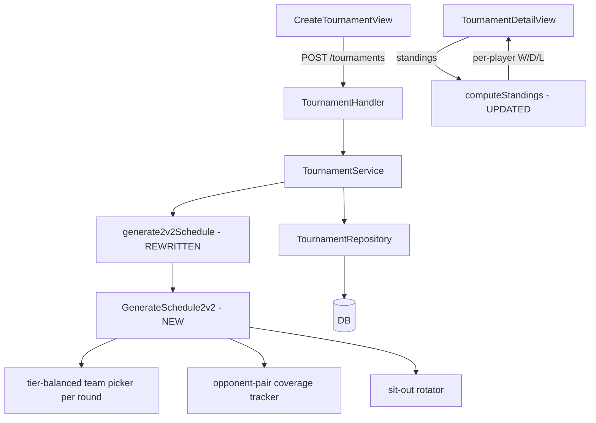

# System Design & Architecture

## Architecture Overview



**No DB schema changes required.** `TournamentMatch` already supports per-round team assignment. Only the schedule-generation algorithm changes.

## Data Models

### Unchanged models
- `TournamentMatch` — already stores Team1Player1/2, Team2Player1/2, HandicapTeam1/2, Round, MatchOrder
- `TournamentParticipant` — stores tier/handicap snapshots per player

### New in-memory structures (Go, not persisted)

```go
// RoundSlot represents one scheduled round
type RoundSlot struct {
    Team1   [2]uuid.UUID   // always 2 players
    Team2   [2]uuid.UUID   // always 2 players
    SitOut  []uuid.UUID    // N-4 players sitting out
}

// pairKey is a canonical unordered pair key for tracking coverage
type pairKey struct{ A, B uuid.UUID } // always A < B

// schedulerState tracks coverage and diversity
type schedulerState struct {
    opponentCovered  map[pairKey]bool
    teammateCounts   map[pairKey]int   // times A,B were teammates
    opponentCounts   map[pairKey]int   // times A,B were opponents
    sitOutCounts     map[uuid.UUID]int // times player sat out
    totalRounds      int
}
```

## Algorithm Design: Greedy 2v2 Scheduler

### Termination condition
Generate rounds until all `C(N,2)` opponent pairs are covered.

### Per-round algorithm

```
GenerateSchedule2v2(players):
  state = initial empty state
  while not allPairsCovered(state):
    slot = pickBestRound(players, state)
    append slot to schedule
    update state with slot
  return schedule
```

**`pickBestRound`** = enumerate all candidate round configurations and score them:

1. **Generate candidates**: for each combination of 4 players from N:
   - For each valid 2v2 split of those 4 (there are 3 splits: AB|CD, AC|BD, AD|BC):
     - Check tier-balance: if possible, at least one team has Pro+NonPro pairing
     - Compute score (see below)
   - Keep best-scored (team1, team2, sitOut) tuple

2. **Scoring function** (lower = better):
   ```
   score = -2 * newOpponentPairs     (maximize new coverage)
           + 1 * maxRepeatTeammate   (penalize repeated partners)
           + 1 * maxRepeatOpponent   (penalize repeated opponents)
           + 2 * maxSitOutImbalance  (penalize unfair sit-outs)
   ```
   Where `newOpponentPairs` = count of opponent pairs not yet covered.

3. **Tier-balance override**: if a tier-balanced split exists (Pro+NonPro on each team), prefer it over a marginally higher-scoring unbalanced split.

### Complexity
- N=6: C(6,4)=15 subsets × 3 splits = 45 candidates per round, ~5–7 rounds → ~315 iterations. Negligible.
- N=16: C(16,4)=1820 × 3 = 5460 candidates × ~30 rounds → ~163k iterations. Fast enough (<10ms).

## API Design

**No API changes.** Existing endpoints:
- `POST /tournaments` — unchanged request/response
- `GET /tournaments/:id` — unchanged; `TournamentMatch.round` and `match_order` still work

## Component Breakdown

### Backend changes

| File | Change |
|------|--------|
| `backend/internal/service/round_robin.go` | No change (1v1 still uses polygon rotation) |
| `backend/internal/service/team_assigner.go` | No change (AssignTeams2v2 may be removed or kept) |
| `backend/internal/service/dynamic_scheduler.go` | **NEW** — `GenerateSchedule2v2(players []*model.User) []RoundSlot` |
| `backend/internal/service/tournament_service.go` | Replace `generate2v2Schedule` to use new algorithm |

### Frontend changes

| File | Change |
|------|--------|
| `frontend/src/views/TournamentDetailView.vue` | `computeStandings` — switch to per-player stats |

## Design Decisions

### Decision 1: Greedy over combinatorial design
Combinatorial designs (e.g. Kirkman schoolgirl, resolvable designs) guarantee minimum rounds but are hard to implement with arbitrary N + tier constraints. Greedy with scoring covers all pairs and is much simpler to test and maintain.

### Decision 2: Coverage-first, then fairness
Primary goal is opponent coverage. Sit-out balance and teammate diversity are secondary scoring terms. This ensures termination is guaranteed.

### Decision 3: Keep `TournamentMatch` model unchanged
Each `RoundSlot` maps directly to one `TournamentMatch` record. No schema migration needed.

### Decision 4: Per-player standings
Since teams are ephemeral (re-formed each round), standings track individual players. A player "wins" a round if their team wins that round. Points: Win=3, Draw=1, Loss=0 (same as before).

## Non-Functional Requirements

- Schedule generation for N≤16 must complete in <100ms
- All existing match result recording / score integration flows unchanged
- Existing 1v1 tournament scheduling unaffected
