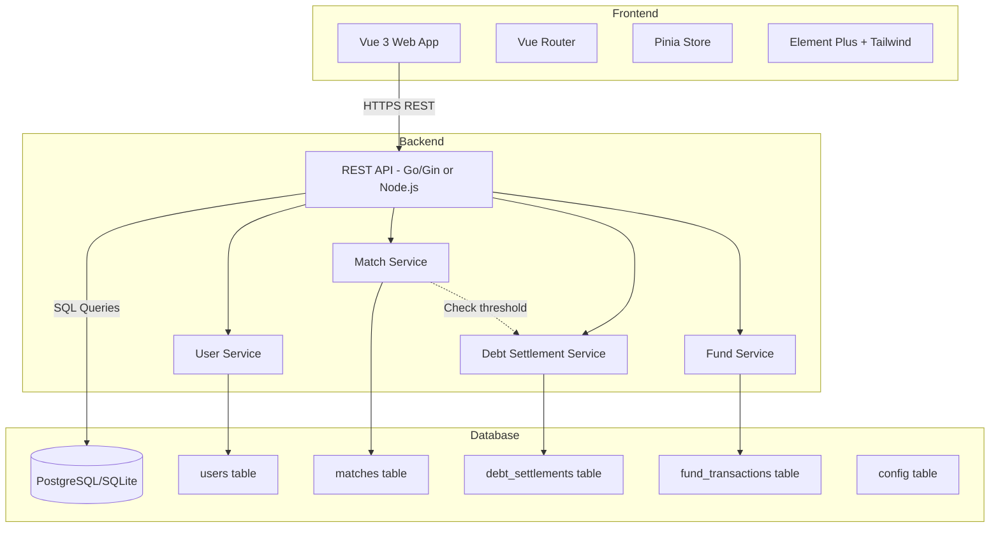

# System Design & Architecture

## Architecture Overview

### High-Level System Structure



### Technology Stack

**Frontend:**
- **Framework:** Vue 3 + TypeScript + Vite
- **UI Library:** Element Plus (forms, tables, modals)
- **Styling:** Tailwind CSS
- **State:** Pinia (global state) + Vue Query (server state)
- **Router:** Vue Router
- **HTTP Client:** Axios

**Backend Option 1 (Go - RECOMMENDED):**
- **Framework:** Gin (fast, simple REST API)
- **Database:** PostgreSQL via `gorm` ORM
- **Validation:** `go-playground/validator`
- **Migrations:** golang-migrate

**Backend Option 2 (Node.js - Alternative):**
- **Framework:** Express.js + TypeScript
- **Database:** PostgreSQL via Prisma ORM
- **Validation:** Zod

**Database:**
- **Primary:** PostgreSQL (Supabase free tier or Railway)
- **Alternative:** SQLite (for local deployment)

**Deployment:**
- **Frontend:** Vercel (free tier, auto-deploy from Git)
- **Backend:** Railway/Render (free tier) or Supabase Edge Functions
- **Database:** Supabase PostgreSQL (free tier: 500MB)

### Architecture Decisions

**Why Vue 3 instead of React?**
- Matches existing Phase 2 tech stack (see user memory)
- Faster development for forms-heavy UI
- Better TypeScript integration out of the box

**Why Go/Gin instead of Node.js?**
- Better performance for simple CRUD operations
- Simpler deployment (single binary)
- Good match history query performance

**Why PostgreSQL instead of MongoDB?**
- Relational data (users, matches, settlements)
- ACID transactions for debt settlement
- Better for money calculations (no floating point issues with numeric type)

**Why no real-time WebSocket?**
- Manual page refresh is acceptable for MVP
- Can add later with Socket.io or SSE if needed

## Data Models

### Entity Relationship Diagram

```mermaid
erDiagram
    users ||--o{ match_participants : "participates in"
    matches ||--|{ match_participants : "has"
    matches ||--o| debt_settlements : "may trigger"
    users ||--o{ debt_settlements : "owes debt"
    fund_transactions }o--|| debt_settlements : "created by"
    
    users {
        uuid id PK
        string name
        int current_score
        timestamp created_at
        timestamp updated_at
        boolean is_active
    }
    
    matches {
        uuid id PK
        string match_type "1v1 or 2v2"
        uuid winner_team
        timestamp match_date
        string recorded_by
        timestamp created_at
        boolean is_locked
    }
    
    match_participants {
        uuid id PK
        uuid match_id FK
        uuid user_id FK
        int team_number "1 or 2"
        int point_change "+1 or -1"
    }
    
    debt_settlements {
        uuid id PK
        uuid debtor_id FK
        int debt_amount "negative score"
        decimal money_amount "VND"
        decimal to_fund "50% of money"
        decimal to_winners "50% of money"
        jsonb winner_distribution "who got paid what"
        timestamp settled_at
    }
    
    fund_transactions {
        uuid id PK
        decimal amount
        string transaction_type "debt_in, expense_out"
        string description
        uuid related_settlement_id FK nullable
        timestamp created_at
    }
    
    config {
        string key PK
        string value
        string description
    }
```

### Schema Details

**users table:**
```sql
CREATE TABLE users (
    id UUID PRIMARY KEY DEFAULT gen_random_uuid(),
    name VARCHAR(100) NOT NULL UNIQUE,
    current_score INTEGER DEFAULT 0,
    created_at TIMESTAMP DEFAULT NOW(),
    updated_at TIMESTAMP DEFAULT NOW(),
    is_active BOOLEAN DEFAULT TRUE
);

CREATE INDEX idx_users_score ON users(current_score DESC);
CREATE INDEX idx_users_active ON users(is_active);
```

**matches table:**
```sql
CREATE TABLE matches (
    id UUID PRIMARY KEY DEFAULT gen_random_uuid(),
    match_type VARCHAR(10) NOT NULL CHECK (match_type IN ('1v1', '2v2')),
    winner_team INTEGER NOT NULL CHECK (winner_team IN (1, 2)),
    match_date TIMESTAMP DEFAULT NOW(),
    recorded_by VARCHAR(100),
    created_at TIMESTAMP DEFAULT NOW(),
    is_locked BOOLEAN DEFAULT FALSE
);

CREATE INDEX idx_matches_date ON matches(match_date DESC);
```

**match_participants table:**
```sql
CREATE TABLE match_participants (
    id UUID PRIMARY KEY DEFAULT gen_random_uuid(),
    match_id UUID NOT NULL REFERENCES matches(id) ON DELETE CASCADE,
    user_id UUID NOT NULL REFERENCES users(id),
    team_number INTEGER NOT NULL CHECK (team_number IN (1, 2)),
    point_change INTEGER NOT NULL CHECK (point_change IN (-1, 0, 1)),
    UNIQUE(match_id, user_id)
);

CREATE INDEX idx_participants_match ON match_participants(match_id);
CREATE INDEX idx_participants_user ON match_participants(user_id);
```

**debt_settlements table:**
```sql
CREATE TABLE debt_settlements (
    id UUID PRIMARY KEY DEFAULT gen_random_uuid(),
    debtor_id UUID NOT NULL REFERENCES users(id),
    debt_amount INTEGER NOT NULL,
    money_amount NUMERIC(12, 2) NOT NULL,
    to_fund NUMERIC(12, 2) NOT NULL,
    to_winners NUMERIC(12, 2) NOT NULL,
    winner_distribution JSONB NOT NULL,
    settled_at TIMESTAMP DEFAULT NOW()
);

CREATE INDEX idx_settlements_debtor ON debt_settlements(debtor_id);
CREATE INDEX idx_settlements_date ON debt_settlements(settled_at DESC);
```

**fund_transactions table:**
```sql
CREATE TABLE fund_transactions (
    id UUID PRIMARY KEY DEFAULT gen_random_uuid(),
    amount NUMERIC(12, 2) NOT NULL,
    transaction_type VARCHAR(20) NOT NULL CHECK (transaction_type IN ('debt_in', 'expense_out')),
    description TEXT,
    related_settlement_id UUID REFERENCES debt_settlements(id),
    created_at TIMESTAMP DEFAULT NOW()
);

CREATE INDEX idx_fund_transactions_date ON fund_transactions(created_at DESC);
```

**config table:**
```sql
CREATE TABLE config (
    key VARCHAR(50) PRIMARY KEY,
    value TEXT NOT NULL,
    description TEXT
);

-- Default config values
INSERT INTO config (key, value, description) VALUES
    ('debt_threshold', '-6', 'Score threshold that triggers debt settlement'),
    ('point_to_vnd', '22000', 'Conversion rate: 1 point = X VND'),
    ('fund_split_percent', '50', 'Percentage of debt that goes to fund (rest to winners)');
```

## API Design

### REST API Endpoints

**Base URL:** `/api/v1`

#### User Management

```
GET    /users              - List all active users with scores
POST   /users              - Create new user
GET    /users/:id          - Get user details with match history
PUT    /users/:id          - Update user name
DELETE /users/:id          - Soft delete user (set is_active=false)
GET    /users/:id/matches  - Get user's match history
```

#### Match Management

```
GET    /matches            - List recent matches (paginated, default 50)
POST   /matches            - Create new match and update scores
GET    /matches/:id        - Get match details with participants
PUT    /matches/:id        - Update match (only if not locked)
DELETE /matches/:id        - Delete match and revert scores (only if not locked)
```

**POST /matches Request Body:**
```json
{
  "match_type": "1v1" | "2v2",
  "match_date": "2026-04-14T19:30:00Z",
  "team1": ["user_id_1", "user_id_2"],  // 1 player for 1v1, 2 for 2v2
  "team2": ["user_id_3", "user_id_4"],
  "winner_team": 1 | 2,
  "recorded_by": "Admin Name"
}
```

**POST /matches Response:**
```json
{
  "match": { /* match object */ },
  "score_updates": [
    { "user_id": "...", "user_name": "Player1", "old_score": 5, "new_score": 6, "change": +1 }
  ],
  "debt_settlements_triggered": [
    { /* settlement object if any player hit threshold */ }
  ]
}
```

#### Debt Settlement

```
GET    /settlements            - List all settlements (paginated)
GET    /settlements/:id        - Get settlement details
GET    /users/:id/settlements  - Get user's settlement history
```

#### Fund Management

```
GET    /fund                   - Get current fund balance and recent transactions
POST   /fund/expense           - Record fund expense
GET    /fund/transactions      - List all fund transactions (paginated)
```

**POST /fund/expense Request Body:**
```json
{
  "amount": 500000,
  "description": "Bought new FIFA disk"
}
```

#### Configuration

```
GET    /config                 - Get all config values
PUT    /config/:key            - Update config value
```

### Authentication/Authorization

**MVP Approach (No Auth):**
- No login required
- Anyone can access and modify data
- `recorded_by` field is free text (honor system)

**Future Enhancement:**
- Add simple admin password for destructive operations
- Or add basic user accounts with roles

### Error Handling

**Standard Error Response:**
```json
{
  "error": {
    "code": "VALIDATION_ERROR",
    "message": "User-friendly error message",
    "details": { /* field-specific errors */ }
  }
}
```

**Error Codes:**
- `VALIDATION_ERROR` - Invalid input data
- `NOT_FOUND` - Resource not found
- `CONFLICT` - Duplicate name or locked match edit
- `INTERNAL_ERROR` - Server error

## Component Breakdown

### Frontend Components

```
src/
├── views/
│   ├── DashboardView.vue          - Main page with leaderboard
│   ├── UsersView.vue              - User management page
│   ├── MatchesView.vue            - Match history page
│   ├── CreateMatchView.vue        - Match entry form
│   ├── FundView.vue               - Fund management page
│   └── SettingsView.vue           - Config page
├── components/
│   ├── UserTable.vue              - Leaderboard table
│   ├── UserForm.vue               - Add/Edit user form
│   ├── MatchForm.vue              - Match entry form (1v1/2v2)
│   ├── MatchList.vue              - Match history list
│   ├── MatchCard.vue              - Single match display
│   ├── DebtBadge.vue              - Debt status indicator
│   ├── ScoreDisplay.vue           - Score with VND conversion
│   ├── FundBalance.vue            - Fund balance widget
│   └── SettlementModal.vue        - Debt settlement details
├── stores/
│   ├── userStore.ts               - User state (Pinia)
│   ├── matchStore.ts              - Match state
│   ├── fundStore.ts               - Fund state
│   └── configStore.ts             - Config state
├── services/
│   ├── api.ts                     - Axios instance
│   ├── userService.ts             - User API calls
│   ├── matchService.ts            - Match API calls
│   └── fundService.ts             - Fund API calls
└── types/
    ├── user.ts                    - User types
    ├── match.ts                   - Match types
    ├── settlement.ts              - Settlement types
    └── fund.ts                    - Fund types
```

### Backend Services (Go/Gin)

```
cmd/
└── server/
    └── main.go                    - Entry point

internal/
├── api/
│   ├── router.go                  - Route setup
│   ├── middleware.go              - CORS, logging
│   ├── user_handler.go            - User endpoints
│   ├── match_handler.go           - Match endpoints
│   ├── settlement_handler.go      - Settlement endpoints
│   ├── fund_handler.go            - Fund endpoints
│   └── config_handler.go          - Config endpoints
├── service/
│   ├── user_service.go            - User business logic
│   ├── match_service.go           - Match + auto settlement logic
│   ├── settlement_service.go      - Settlement calculations
│   └── fund_service.go            - Fund calculations
├── repository/
│   ├── user_repository.go         - User DB operations
│   ├── match_repository.go        - Match DB operations
│   ├── settlement_repository.go   - Settlement DB operations
│   └── fund_repository.go         - Fund DB operations
└── model/
    ├── user.go                    - User model
    ├── match.go                   - Match model
    ├── settlement.go              - Settlement model
    └── fund.go                    - Fund model
```

## Design Decisions

### Key Architectural Decisions

**1. Separate match_participants table**
- **Why:** Allows flexible querying of user match history
- **Alternative:** JSON array in matches table (harder to query)
- **Trade-off:** More joins, but better data integrity

**2. Auto-trigger debt settlement on match creation**
- **Why:** Ensures immediate settlement, prevents forgotten debts
- **Alternative:** Manual settlement button (more control but adds friction)
- **Implementation:** Check all participants' scores after match save

**3. Lock matches after debt settlement**
- **Why:** Prevents data inconsistency if settlement already paid
- **Alternative:** Allow edits with settlement reversal (complex logic)
- **Trade-off:** Less flexibility, but simpler and safer

**4. Store config in database**
- **Why:** Allow runtime configuration without code changes
- **Alternative:** Environment variables (requires restart)
- **Trade-off:** Slightly more complex, but more user-friendly

**5. Use NUMERIC for money amounts**
- **Why:** Avoids floating-point precision errors
- **Alternative:** Store cents as integers (less readable)
- **Implementation:** PostgreSQL NUMERIC(12,2) = up to 9,999,999,999.99

### Patterns Applied

- **Repository Pattern:** Separate DB access from business logic
- **Service Layer:** Business logic isolated from HTTP handlers
- **DTO Pattern:** Request/response objects separate from DB models
- **Transaction Script:** Debt settlement runs in DB transaction

## Non-Functional Requirements

### Performance Targets

- **Page Load:** < 2s for leaderboard (30 users)
- **Match Save:** < 1s including debt settlement check
- **Match History:** < 1s for 50 matches
- **Leaderboard Update:** Immediate after match save
- **Database Queries:** All < 100ms with proper indexes

### Scalability Considerations

**Current Scale (MVP):**
- 30 users
- ~100 matches/day = 36,500/year
- Database size: < 100MB/year

**Growth Path:**
- Can scale to 100 users, 1000/day matches
- Add Redis cache for leaderboard if needed
- Add pagination for match history (already in design)

### Security Requirements

**Authentication (MVP):**
- No login required (trusted group)

**Data Validation:**
- All inputs validated on backend
- SQL injection prevention via ORM
- XSS prevention via Vue's automatic escaping

**CORS:**
- Allow frontend domain only
- No wildcard in production

**Future Enhancements:**
- Add admin password for deletions
- Rate limiting on match creation
- Audit log for all changes

### Reliability/Availability Needs

**Uptime Target:** 95% (acceptable for casual use)

**Error Handling:**
- All database operations in transactions
- Rollback on debt settlement failure
- Graceful error messages to user

**Data Backup:**
- Daily automated backups via Supabase
- Manual export button for CSV download

**Monitoring:**
- Basic logging to console (MVP)
- Future: Add Sentry for error tracking
