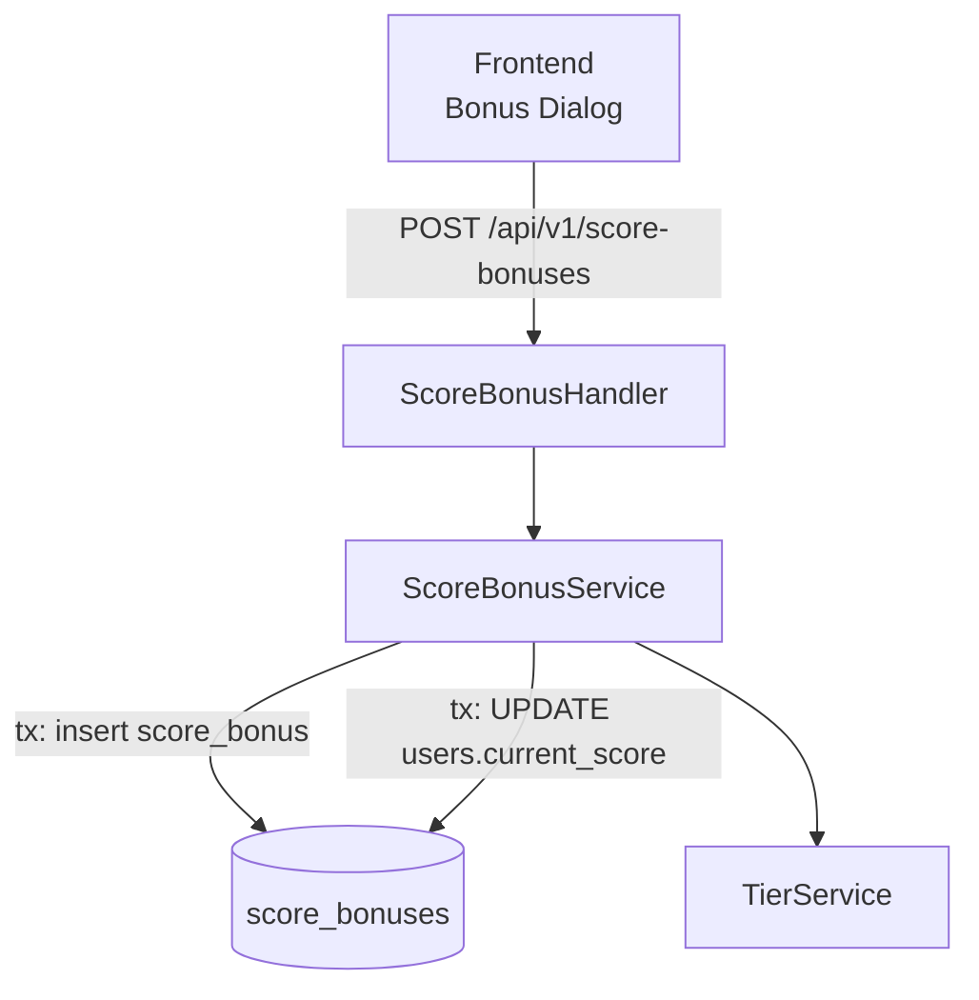

# System Design & Architecture

## Architecture Overview

A new `score_bonuses` table, service, and API endpoint are added. The bonus operation credits a player's score only — no fund transaction is auto-created (fund is topped up manually via the existing Deposit flow).



## Data Models

### New table: `score_bonuses`

```sql
CREATE TABLE score_bonuses (
  id               UUID PRIMARY KEY DEFAULT gen_random_uuid(),
  user_id          UUID NOT NULL REFERENCES users(id),
  points           INT NOT NULL CHECK (points > 0),
  description      TEXT,
  recorded_by      VARCHAR(100),
  bonus_date       TIMESTAMPTZ NOT NULL DEFAULT now(),
  created_at       TIMESTAMPTZ NOT NULL DEFAULT now()
);
```

### Go model: `internal/model/score_bonus.go`

```go
type ScoreBonus struct {
    ID          uuid.UUID `gorm:"type:uuid;primary_key;default:gen_random_uuid()" json:"id"`
    UserID      uuid.UUID `gorm:"type:uuid;not null" json:"user_id"`
    Points      int       `gorm:"not null" json:"points"`
    Description string    `gorm:"type:text" json:"description"`
    RecordedBy  string    `gorm:"type:varchar(100)" json:"recorded_by"`
    BonusDate   time.Time `gorm:"default:now()" json:"bonus_date"`
    CreatedAt   time.Time `json:"created_at"`
    User        User      `gorm:"foreignKey:UserID" json:"user,omitempty"`
}
```

### Relationship to existing models

- `score_bonuses.user_id` → `users.id` (the winner)
- No relationship to `fund_transactions` — fund is managed separately

## API Design

### `GET /api/v1/matches` — unified activity feed (updated)

Always returns both matches **and** bonuses, merged and sorted by date descending. Each item carries a `"type"` discriminator field.

**Response 200:**
```json
[
  { "type": "match", "id": "...", "match_type": "1v2", "winner_team": 1, "participants": [...], "match_date": "..." },
  { "type": "bonus", "id": "...", "user_id": "...", "points": 3, "description": "Cookie thua cược", "bonus_date": "...", "user": {...} },
  { "type": "match", "id": "...", "match_type": "1v1", ... }
]
```

Backend implementation: `MatchHandler.GetAll` is injected with `ScoreBonusService`. It fetches both collections, builds a merged `[]interface{}` with the `type` field embedded, sorts by date, and returns.

### `POST /api/v1/score-bonuses`

**Request:**
```json
{
  "user_id": "<uuid>",
  "points": 3,
  "description": "Cookie thua cược – 3 điểm",
  "bonus_date": "2026-06-04T20:00:00Z"
}
```

**Response 201:** the created `ScoreBonus` record (with `user` populated).

**Errors:**
- 400 `VALIDATION_ERROR` — missing/invalid fields
- 400 `INVALID_POINTS` — points ≤ 0
- 404 `USER_NOT_FOUND` — user_id not found

### `DELETE /api/v1/score-bonuses/:id`

Reverts: subtracts `points` from `user.current_score`, deletes the bonus record. All in one transaction.

## Component Breakdown

### Backend: `internal/model/score_bonus.go`
New Go struct (see above).

### Backend: `internal/repository/score_bonus_repository.go`
- `Create(bonus *model.ScoreBonus) error`
- `GetAll(limit, offset int) ([]*model.ScoreBonus, error)`
- `GetByID(id uuid.UUID) (*model.ScoreBonus, error)`
- `Delete(id uuid.UUID) error`

### Backend: `internal/service/score_bonus_service.go`

```go
type CreateScoreBonusRequest struct {
    UserID      uuid.UUID  `json:"user_id" binding:"required"`
    Points      int        `json:"points" binding:"required"`
    Description string     `json:"description"`
    BonusDate   *time.Time `json:"bonus_date,omitempty"`
}

func (s *ScoreBonusService) CreateBonus(req *CreateScoreBonusRequest) (*model.ScoreBonus, error)
func (s *ScoreBonusService) DeleteBonus(id uuid.UUID) error
func (s *ScoreBonusService) GetAll(limit, offset int) ([]*model.ScoreBonus, error)  // used internally by MatchHandler
```

`CreateBonus` logic:
1. Validate: points > 0, user exists
2. Begin DB transaction
3. Insert `score_bonuses` record
4. `UPDATE users SET current_score = current_score + points WHERE id = user_id`
5. Commit
6. Post-commit: `TierService.RecalculateForUsers([user_id])`

### Backend: `internal/api/match_handler.go` — updated `GetAll` and `GetRecent`

`MatchHandler` receives `ScoreBonusService` as an additional dependency.

- **`GetAll`**: fetches both collections, wraps each with a `type` field, merges, sorts by date descending, paginates, returns.
- **`GetRecent`**: same merge approach — bonuses appear in the Dashboard "Recent" feed alongside matches.
- **`GetStats`**: unchanged — counts only `matches` table rows. Bonus records do NOT count toward `total`/`today` stats.

```go
type matchFeedItem struct {
    Type string `json:"type"`
    *model.Match
}
type bonusFeedItem struct {
    Type string `json:"type"`
    *model.ScoreBonus
}
```

### Backend: `internal/api/score_bonus_handler.go`
Handles only `POST` (Create) and `DELETE` (Delete). No `GET` — reading is done via `/matches`.

### Backend: `internal/api/router.go`
```go
// score-bonuses: mutating endpoints only
bonuses := v1.Group("/score-bonuses")
{
    bonuses.POST("", bonusHandler.Create)
    bonuses.DELETE("/:id", bonusHandler.Delete)
}
```

### Backend: DB migration
New migration file: `add_score_bonuses_table.sql` (or GORM AutoMigrate).

### Frontend: `frontend/src/types/scoreBonus.ts`
```ts
export interface ScoreBonus {
  id: string
  user_id: string
  points: number
  description: string
  bonus_date: string
  created_at: string
  user?: User
}
// Note: no fund_amount — fund is managed separately

export interface CreateScoreBonusRequest {
  user_id: string
  points: number
  description: string
  bonus_date?: string
}
```

### Frontend: UI — "Add Bet Bonus" dialog
- Accessible from the **Fund** page or Dashboard via a new button "Cộng điểm cá cược"
- Form fields: Player (searchable dropdown of users), Points (number input), Description (text), Date (optional)
- On submit: call `POST /api/v1/score-bonuses`, then refresh leaderboard + player history

### Frontend: `matchStore` — type change

`matchStore.matches` changes from `Match[]` → `MatchFeedItem[]`. Update the store type declaration and any consumer that assumed `Match` directly.

### Frontend: `MatchesView` — no change to fetch logic

`GET /api/v1/matches` already returns the merged feed. `matchStore` fetches as before — no second API call needed.

```ts
// types/match.ts — add discriminated union
export type FeedItemType = 'match' | 'bonus'

export interface MatchFeedItem {
  type: FeedItemType
  // match fields (when type === 'match')
  match_type?: MatchType
  participants?: MatchParticipant[]
  winner_team?: number
  match_date?: string
  is_locked?: boolean
  // bonus fields (when type === 'bonus')
  points?: number
  bonus_date?: string
  user?: User
  // shared (both types)
  id: string
  description?: string
  created_at: string
}
```

### Frontend: `MatchList` component — unified rendering + filter

**Type filter** — add `[Cược]` option; bonus items always pass through non-bonus filters and are hidden when a match-type filter is active:
```html
<el-option :label="t('matches.types.oneVsTwo')" value="1v2" />
<el-option :label="t('matches.bet')" value="bonus" />
```

Filter logic:
```ts
// in filteredMatches computed:
if (typeFilter === 'bonus') return item.type === 'bonus'
if (typeFilter) return item.type === 'match' && item.match_type === typeFilter
return true // 'all'
```

**Rendering bonus card** — when `item.type === 'bonus'`:
- Show `[Cược]` tag instead of match type badge
- Show `⭐ item.user.name  +Npts` and `item.description`
- No team1/team2 section — render a single row
- Delete button calls `DELETE /api/v1/score-bonuses/:id` (not the match delete endpoint)
- No lock badge (`is_locked` is undefined → treated as unlocked)

**Status filter** — "locked" filter hides bonus items (undefined `is_locked` = not locked).

## Design Decisions

| Decision | Chosen | Alternative |
|---|---|---|
| Separate `score_bonuses` table | Yes — clean audit trail | Reuse `matches` with special type |
| No auto fund deposit | Yes — fund managed manually | Auto-create fund_transaction per bonus |
| Revert on delete | Yes — score revert only | Soft-delete only |
| Bonus shown in MatchesView | Yes — merged on backend, 1 API call | Frontend merge (2 API calls) |
| GET /matches returns unified feed | Yes — backend merges + sorts | Separate /activity endpoint |

## Security & Performance

- No new privilege level needed — same admin-level access as match recording
- Transaction is short (4 DB ops) — no performance concern
- No player search is exposed; user must be a registered `users` record
