# System Design & Architecture — FC25 Head-to-Head Popup

## Architecture Overview
**What is the high-level system structure?**

A read-only feature: one new backend endpoint that aggregates opposing-side encounters between two players, and a Dashboard-launched Vue modal that visualizes the result. No schema changes, no new tables.

```mermaid
graph TD
  Dashboard[DashboardView.vue<br/>So-tài card: 2 el-select] -->|open| Modal[HeadToHeadModal.vue]
  Modal -->|getHeadToHead p1,p2| Svc[userService.ts]
  Svc -->|GET /users/head-to-head| Handler[UserHandler.GetHeadToHead]
  Handler --> UService[UserService.GetHeadToHead]
  UService -->|cache-aside| Cache[(Redis / go-cache)]
  UService --> MRepo[MatchRepository.GetHeadToHeadMatches]
  MRepo --> DB[(PostgreSQL<br/>matches ⋈ match_participants×2)]
  Modal --> Chart[Doughnut chart.js]
```



Components and responsibilities:
- **MatchRepository.GetHeadToHeadMatches** — single SQL query returning the lean rows needed (per opposing-side match: player1 team, winner team, type, date).
- **UserService.GetHeadToHead** — validates inputs, loads both users, aggregates counts / win rates / streak / form, wraps with cache-aside.
- **UserHandler.GetHeadToHead** — parses/validates query params, maps sentinel errors to HTTP codes.
- **HeadToHeadModal.vue** — fetches, renders stats + doughnut + recent list + form badges.
- **DashboardView.vue** — hosts the two player selectors + trigger button.

Tech stack rationale: reuses the existing core-esport layering and the already-installed chart.js/vue-chartjs (used by WC analytics) — zero new dependencies.

## Data Models
**What data do we need to manage?**

No new persisted entities. New transport DTOs only.

Existing tables used (read-only):
- `matches` (`id`, `match_type`, `winner_team`, `match_date`, `is_locked`)
- `match_participants` (`match_id`, `user_id`, `team_number`)
- `users` (`id`, `name`, `avatar_url`, `favorite_club`, `tier`)

Opposing-side encounter query (the crux):
```sql
SELECT m.id            AS match_id,
       m.match_type,
       m.winner_team,
       m.match_date,
       mp1.team_number AS p1_team
FROM matches m
JOIN match_participants mp1
  ON mp1.match_id = m.id AND mp1.user_id = @p1
JOIN match_participants mp2
  ON mp2.match_id = m.id AND mp2.user_id = @p2
 AND mp2.team_number <> mp1.team_number
ORDER BY m.match_date DESC;
```
- The `team_number <> team_number` join condition is what enforces **opposing sides** — teammate encounters (2v2/1v2 same team) are naturally excluded.
- `player1_won := (p1_team == winner_team)`; `player2_won := !player1_won` (no draws, `winner_team` always 1 or 2).
- **This lean query drives the aggregates** (total, wins, win-rate, form, streak) over the *full* history.

**Two-step retrieval** (lineups needed only for the recent list):
The recent-matches list must show the full lineup per match (e.g. "A+C vs B+D") for 2v2/1v2. Rather than bloat the aggregation query, do a bounded second fetch for just the **top-10** most-recent match IDs:
```go
// step 2: MatchRepository.GetMatchesWithParticipants(ids []uuid.UUID)
db.Preload("Participants.User").Where("id IN ?", top10IDs).Find(&matches)
```
This yields each participant's `user_id`, `name`, `avatar_url`, and `team_number`, from which the frontend groups the two sides. No goal scoreline exists in the schema — the list shows lineup + match type + winning side only.

Backend response DTO (`HeadToHeadResponse`, JSON snake_case):
```go
type H2HPlayer struct {
    ID           uuid.UUID `json:"id"`
    Name         string    `json:"name"`
    AvatarURL    *string   `json:"avatar_url"`
    FavoriteClub *string   `json:"favorite_club"`
    Tier         string    `json:"tier"`
    IsActive     bool      `json:"is_active"` // false = soft-deleted; UI tags "đã nghỉ"
}
type H2HParticipant struct {
    UserID    uuid.UUID `json:"user_id"`
    Name      string    `json:"name"`
    AvatarURL *string   `json:"avatar_url"`
    Team      int       `json:"team"` // 1 or 2
}
type H2HMatch struct {
    MatchID      uuid.UUID         `json:"match_id"`
    MatchType    string            `json:"match_type"`
    MatchDate    time.Time         `json:"match_date"`
    WinnerTeam   int               `json:"winner_team"`
    Player1Team  int               `json:"player1_team"`
    Player1Won   bool              `json:"player1_won"`
    Participants []H2HParticipant  `json:"participants"` // full lineup, both teams — for "A+C vs B+D"
}
type H2HStreak struct {
    PlayerID *uuid.UUID `json:"player_id"` // whose current streak (nil if no matches)
    Count    int        `json:"count"`     // consecutive wins for that player, most-recent run
}
type HeadToHeadResponse struct {
    Player1        H2HPlayer  `json:"player1"`
    Player2        H2HPlayer  `json:"player2"`
    TotalMatches   int        `json:"total_matches"`
    Player1Wins    int        `json:"player1_wins"`
    Player2Wins    int        `json:"player2_wins"`
    Player1WinRate float64    `json:"player1_win_rate"` // 0..1, 0 when total=0
    Player2WinRate float64    `json:"player2_win_rate"`
    CurrentStreak  H2HStreak  `json:"current_streak"`
    Form           []string   `json:"form"`           // ["W","L",...] from P1 POV, most-recent first, max 10
    RecentMatches  []H2HMatch `json:"recent_matches"` // most-recent first, max 10
}
```

Frontend types (`src/types` — camelCase mirror is optional; snake_case API type is primary, per convention):
```ts
export interface HeadToHeadResponse { /* snake_case mirror of the above */ }
```

## API Design
**How do components communicate?**

New endpoint (core esport group, public — same access level as other `/users` reads):
```
GET /api/v1/users/head-to-head?player1={uuid}&player2={uuid}
```
- 200 → `HeadToHeadResponse`
- 400 → missing/invalid UUID, or `player1 == player2`
- 404 → either player ID does not exist. **Inactive/soft-deleted players are accepted** (they must remain viewable for historical matchups) — do not 404 on `is_active = false`.

Route wiring in `backend/internal/api/router.go`, in the `users := v1.Group("/users")` block. **Must be registered before** the `/:id` param routes so `head-to-head` is not swallowed by `GET /users/:id`. (Gin matches static segments before params within the same group, but place it adjacent to `/leaderboard` and `/payment-ranking` for clarity and safety.)

Frontend service (`src/services/userService.ts`):
```ts
getHeadToHead: (player1: string, player2: string) =>
  api.get<HeadToHeadResponse>('/users/head-to-head', { params: { player1, player2 } }).then(r => r.data)
```

No auth/authorization changes — this mirrors the existing unauthenticated core `/users` read endpoints.

## Component Breakdown
**What are the major building blocks?**

Backend:
- **Inactive-player support (required):** all existing user reads (`UserRepository.GetAll`, `GetByID`, `GetLeaderboard`, `GetAllIDs`) hard-filter `is_active = true`. Because the feature must show matchups involving soft-deleted players, add:
  - `UserRepository.GetByIDIncludingInactive(id)` (or a `bool` param) — used by `UserService.GetHeadToHead` to load the two players **regardless of active state** (404 only when the row truly does not exist).
  - A way to list **all** players for the dropdown: `UserRepository.GetAllIncludingInactive()` exposed via either a new `GET /users?include_inactive=true` query flag or a dedicated endpoint. The DTO should carry `is_active` so the UI can tag "đã nghỉ".
  - Keep the current active-only behavior as the default for all existing callers — do not change their semantics.
- `MatchRepository.GetHeadToHeadMatches(p1, p2 uuid.UUID) ([]model.H2HRow, error)` — the lean join query above (drives all aggregates).
- `MatchRepository.GetMatchesWithParticipants(ids []uuid.UUID) ([]*model.Match, error)` — `Preload("Participants.User")` for the top-10 recent match IDs, to build lineups. Service maps these into `[]H2HParticipant` per `H2HMatch`.
- `UserService.GetHeadToHead(p1, p2 uuid.UUID) (*HeadToHeadResponse, error)` — aggregation + cache-aside + sentinel errors (`ErrSamePlayer`, reuse existing not-found).
- `UserHandler.GetHeadToHead(c *gin.Context)` — parse params, call service, map errors.

Frontend:
- `src/components/user/HeadToHeadModal.vue` — `el-dialog`; props `player1Id`, `player2Id`, `v-model:visible`; fetches on open; renders:
  - header with both players (avatar, name, tier badge via existing `PlayerTierBadge.vue`);
  - stat row (total matches, each player's wins + win-rate %);
  - **doughnut chart** (P1 wins vs P2 wins) using `vue-chartjs` `Doughnut` + `ChartJS.register(ArcElement, Tooltip, Legend)` — follow the pattern in `src/components/wc/analytics/*`;
  - **form** row: W/L badges (green/red), most-recent first;
  - **recent matches** list: per row show date, match-type tag, the two lineups grouped by team (e.g. "A+C vs B+D"), and which side won (highlight winner; mark P1/P2). Built from `H2HMatch.participants`;
  - empty state when `total_matches === 0`.
- `DashboardView.vue` — add a "So tài đối đầu" card: two `el-select` player pickers listing **all** players including soft-deleted (inactive ones tagged "đã nghỉ" via `el-option` label/`el-tag`) + a compare button (disabled until two distinct players chosen) that opens the modal. If the `userStore` only holds active users, source the full list from `GET /users` (which returns inactive when requested) or add an all-users getter — decide in implementation.
- i18n keys under `dashboard.headToHead.*` in `src/locales/vi.*` and `en.*`.

## Design Decisions
**Why did we choose this approach?**

- **Server-side aggregation (Approach A)** over client-side intersection (B/C): keeps win-determination logic in one place (the service already owns match semantics), ships a tiny payload, is cacheable, and honors the project rule "never compute domain stats on the client / handlers never call repos."
- **Opposing-side-only via SQL join condition** (`team_number <>`): correctness is enforced in the query itself, so teammate encounters can never leak into the stats — no post-filtering needed.
- **Reuse matches cache-version key** for invalidation: any match create/update/delete already bumps `esport:matches:version`; embedding that version in the H2H cache key makes stale H2H entries unreachable with zero extra invalidation code.
- **No draws branch**: FC25 matches always have a decisive `winner_team`, so `player2_wins = total - player1_wins` — simpler and provably consistent.
- **Reusable modal, single entry point**: props-driven modal keeps a future Users-page trigger a one-liner, per the secondary goal.

Alternatives considered: pure client-side (rejected — duplicates logic, large payload); raw-list endpoint + client math (rejected — same convention smell, smaller).

## Non-Functional Requirements
**How should the system perform?**

- **Performance**: aggregation is a single indexed join (`match_participants.user_id` is indexed; `match_id` FK). A second `Preload` fetch is **bounded to the top-10** match IDs for lineups — small and constant. Result set is small (a friend group). Both are wrapped in one cache-aside entry with `singleflight` to prevent stampede.
- **Caching**: key `esport:h2h:v{matchesVersion}:{player1}:{player2}` — the pair is kept **ordered** (not sorted), because the response is oriented to Player 1 (its win counts, form, and streak flip when the players swap). `(A,B)` and `(B,A)` are therefore distinct cache entries; that is intentional and correct. TTL 5 min as a backstop.
- **Scalability**: dataset is tiny; no pagination needed. Lists capped at 10 rows.
- **Security**: read-only, no mutations, no PII beyond existing public player fields; UUID params validated. No new auth surface.
- **Reliability**: gracefully returns an empty (zeroed) response with `total_matches = 0` rather than an error when players simply never met.
- **i18n**: all strings via vue-i18n; no hardcoded text.
</content>
