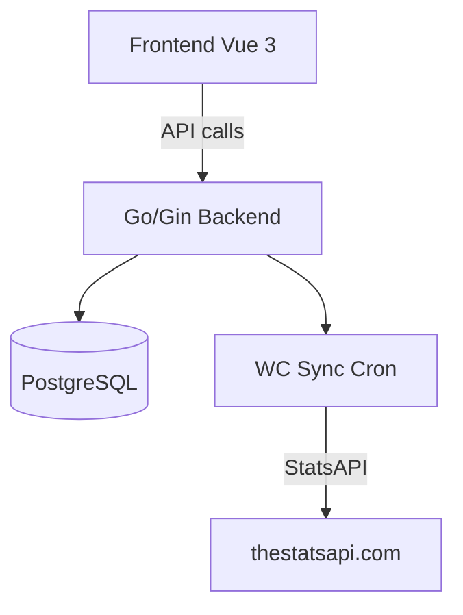

# System Design & Architecture

## Architecture Overview

All eight fixes are self-contained and do not cross the WC ↔ core-esport boundary. The changes touch three layers:



Bug map by layer:

| Bug | Frontend | Backend | DB |
|-----|----------|---------|-----|
| 1 – Auto-redirect | ✅ WcScheduleView.vue | – | – |
| 2 – Scroll to next match | ✅ WcScheduleView.vue | – | – |
| 3 – Per-match collapse | ✅ WcPredictView.vue | – | – |
| 4 – P&L only previewed matches | – | ✅ wc_service.go | – |
| 5 – Champion responsive | ✅ WcChampionPanel.vue | – | – |
| 6 – Multi-pick champion | ✅ WcChampionPanel.vue | ✅ wc_champion_service.go, wc_champion_handler.go | ✅ migration |
| 7 – Smart cron | – | ✅ cron/wc_sync.go, wc_service.go | – |
| 8 – Settlement user name | – | ✅ model/wc_match.go | – |

---

## Bug-by-Bug Design

### Bug 1 — Auto-redirect to `/world-cup/predict`

**File:** `frontend/src/views/WcScheduleView.vue`

In `onMounted`, after fetching the WC config and matches, if `featureEnabled` is `true` AND `wcAuthStore.isLoggedIn` is `true`, call `router.push({ name: 'wc-predict' })`. The existing button remains as a fallback for non-logged-in users or when the feature is disabled.

Edge cases:
- If the user is an admin and feature is disabled, the admin link still shows (no redirect).
- If the user is not logged in and feature is enabled, redirect to `wc-login` instead of `wc-predict`.

```
onMounted:
  fetchMatches()
  fetchConfig()
  if featureEnabled:
    if wcAuthStore.isLoggedIn → push('wc-predict')
    else → push('wc-login')
```

---

### Bug 2 — Auto-scroll to next upcoming match

**File:** `frontend/src/views/WcScheduleView.vue`

The existing `computeDefaultFilter` function already identifies the date for the next upcoming match group. After `selectedFilter` is set and `nextTick` resolves, scroll to the first `.wc-date-group` element that corresponds to the next date.

Implementation:
1. After `selectedFilter.value = computeDefaultFilter(...)`, call `await nextTick()`.
2. Query the DOM for the first `.wc-date-group` child element (or the first `.wc-match-list > *` card).
3. Call `element.scrollIntoView({ behavior: 'smooth', block: 'start' })`.

Note: This scroll only makes sense if the page is not immediately redirected (Bug 1 redirects logged-in users). So Bug 2 scroll applies to anonymous users viewing the schedule, or when the feature is disabled.

---

### Bug 3 — Per-match independent collapse/expand

**File:** `frontend/src/views/WcPredictView.vue`

Current state: `expandedMatchId = ref<string | null>(null)` — only one match can be open at a time.

Fix: Replace with `expandedMatchIds = ref<Set<string>>(new Set())`.

```typescript
// Before
const expandedMatchId = ref<string | null>(null)
function toggleMatchPredictions(matchId: string) {
  if (expandedMatchId.value === matchId) {
    expandedMatchId.value = null; return
  }
  expandedMatchId.value = matchId
  store.fetchMatchPredictions(matchId)
}
// Template: v-if="expandedMatchId === match.id"

// After
const expandedMatchIds = ref<Set<string>>(new Set())
async function toggleMatchPredictions(matchId: string) {
  if (expandedMatchIds.value.has(matchId)) {
    expandedMatchIds.value.delete(matchId)
    expandedMatchIds.value = new Set(expandedMatchIds.value) // trigger reactivity
    return
  }
  expandedMatchIds.value = new Set([...expandedMatchIds.value, matchId])
  await store.fetchMatchPredictions(matchId)
  matchPredictionCounts.value[matchId] = store.matchPredictions.length
}
// Template: v-if="expandedMatchIds.has(match.id)"
```

The `matchPredictions` in the store is a single flat array (last fetched). Each expanded match needs its own predictions cache. Options:
- **Option A**: Store predictions per match in `matchPredictionsMap: Record<string, WcPrediction[]>` locally in the view.
- **Option B**: Keep fetching fresh on toggle-open (acceptable since these are small lists).

**Decision**: Option A — local `matchPredictionsMap` in the view. Each toggle-open fetches and caches into the map. Closing does not clear the cache (avoids re-fetch on re-open during same session).

```typescript
const matchPredictionsMap = ref<Record<string, WcPrediction[]>>({})

async function toggleMatchPredictions(matchId: string) {
  const ids = new Set(expandedMatchIds.value)
  if (ids.has(matchId)) {
    ids.delete(matchId)
  } else {
    ids.add(matchId)
    if (!matchPredictionsMap.value[matchId]) {
      await store.fetchMatchPredictions(matchId)
      matchPredictionsMap.value[matchId] = [...store.matchPredictions]
      matchPredictionCounts.value[matchId] = store.matchPredictions.length
    }
  }
  expandedMatchIds.value = ids
}
```

Template:
```html
<div v-if="expandedMatchIds.has(match.id)" class="wc-match-bets-panel">
  <WcMatchPredictionList :predictions="matchPredictionsMap[match.id] ?? []" />
</div>
```

---

### Bug 4 — P&L preview only for non-already-settled matches

**File:** `backend/internal/service/wc_service.go` — `buildPreviewResult` function

**Scope**: Guard applies to `finalize-match` and `finalize-all` only. `refinalize-all` intentionally includes all matches (purpose is to review recalculated total P&L across everything).

**Approach**: Pass a boolean flag `excludeSettled` into `buildPreviewResult`. Both `PreviewFinalizeMatch` and `PreviewFinalizeAll` pass `true`; `PreviewRefinalizeAll` passes `false`.

```go
func buildPreviewResult(matches []*model.WcMatch, getPredictions func(uuid.UUID) ([]*model.WcPrediction, error), getUserName func(uuid.UUID) string, excludeSettled bool) (*model.FinalizePreviewResult, error) {
    // ...
    for _, m := range matches {
        // ...
        countInSummary := !excludeSettled || m.SettledAt == nil
        for _, bet := range bets {
            row := buildPreviewRow(bet, *m.HomeScore, *m.AwayScore)
            row.UserName = getUserName(bet.WcUserID)
            pm.Predictions = append(pm.Predictions, row)
            if countInSummary {
                result.HouseSummary.TotalStaked += float64(bet.Points)
                result.HouseSummary.TotalPaidOut += row.NewPointsEarned
                result.HouseSummary.PredictionCount++
            }
        }
        result.Matches = append(result.Matches, pm)
        if countInSummary {
            result.HouseSummary.MatchCount++
        }
    }
    // ...
}

// Callers:
// PreviewFinalizeMatch  → buildPreviewResult(..., excludeSettled: true)
// PreviewFinalizeAll    → buildPreviewResult(..., excludeSettled: true)
// PreviewRefinalizeAll  → buildPreviewResult(..., excludeSettled: false)
```

No API or frontend changes needed — the `house_summary` fields remain the same; the values are just computed correctly.

---

### Bug 5 — Champion tab responsive fix

**File:** `frontend/src/components/wc/WcChampionPanel.vue`

Issues on mobile (< 600px):
1. `grid-template-columns: 380px 1fr` — the fixed 380px left column overflows on narrow screens; the existing media query targets 900px but 380px is still too wide on tablets.
2. The `el-table` for all predictions can overflow its container on narrow viewports; needs `overflow-x: auto` wrapper.
3. `teams-pick-grid: 1fr 1fr` at 2 columns is fine on most screens but the team name overflows at very small widths.

Fixes:
```css
/* Lower breakpoint so single-column kicks in earlier */
@media (max-width: 700px) {
  .champion-main { grid-template-columns: 1fr; }
}

/* Wrap the prediction table to prevent horizontal overflow */
.champion-predictions-table-wrapper {
  overflow-x: auto;
  -webkit-overflow-scrolling: touch;
}

/* Team pick grid: single column on very small screens */
@media (max-width: 420px) {
  .teams-pick-grid { grid-template-columns: 1fr; }
}
```

Wrap the `<el-table>` in a `<div class="champion-predictions-table-wrapper">`.

---

### Bug 6 — Champion multi-pick (multiple predictions per user)

This is the largest change. Overview of required changes:

#### Database

Remove the UNIQUE constraint on `wc_champion_predictions.user_id`. Add migration:

```sql
-- migration: remove unique constraint on user_id
ALTER TABLE wc_champion_predictions
  DROP CONSTRAINT IF EXISTS wc_champion_predictions_user_id_key;
```

The `id` (UUID primary key) remains. Multiple rows per user are now allowed.

#### Backend Model

`wc_champion.go` — `WcChampionPrediction` already has `UserID` without the DB-level unique constraint; the GORM model tag `uniqueIndex` needs to be removed.

#### Backend Champion Service

- `PlaceChampionPrediction(userID, teamID, points)`:
  - Remove the "upsert/replace" logic (old: if user already has a prediction for this team, update it).
  - Change to INSERT always — one new row per call.
  - Add validation: user cannot place two predictions on the **same team** (team-level dedup per user is reasonable; remove only the global user UNIQUE).

- `DeleteChampionPrediction(userID, predictionID)`:
  - Old signature: `DeleteChampionPrediction(userID uuid.UUID)` — deletes all predictions for user.
  - New signature: `DeleteChampionPrediction(userID, predictionID uuid.UUID)` — deletes one specific prediction by ID, with ownership check.

- `GetMyChampionPredictions(userID)`:
  - Old: returns a single `*WcChampionPrediction` (or nil).
  - New: returns `[]*WcChampionPrediction` (slice, possibly empty).

- `SettleChampion(winnerTeamID)`:
  - Loop over ALL predictions in a single transaction.
  - **Winners** (`team_id = winnerTeamID`): add `points × odds_snapshot` to wallet.
  - **Losers** (`team_id ≠ winnerTeamID`): subtract `points_wagered` from wallet. This deduction is NEW behavior (current code only pays winners, never deducts losers).
  - Points are **not** deducted at placement time — settlement is the only wallet operation.
  - Each prediction settles independently: a user with 2 correct picks gets paid twice; a user with 1 correct + 1 incorrect is paid for the win and charged for the loss in the same transaction.
  - Response adds `settled_user_count` (distinct users) alongside `settled_count` (total predictions), e.g.: `"10 dự đoán từ 7 người"`.
  - Delete constraint unchanged: user can only delete when `cfg.IsOpen = true`.

#### Backend API Handler

`wc_champion_handler.go`:

- `GET /wc/champion/my-prediction` → `GET /wc/champion/my-predictions` (returns array; keep old path aliased for backward compat if needed, or update frontend simultaneously).
- `DELETE /wc/champion/predict` → `DELETE /wc/champion/predictions/:id` (accepts prediction ID in path).
- `POST /wc/champion/predict` → unchanged path; now inserts a new row every time.

#### Backend Repository

`wc_champion_repository.go`:
- `GetMyPrediction(userID) → *WcChampionPrediction` → `GetMyPredictions(userID) → []*WcChampionPrediction`
- `CreateOrUpdatePrediction(...)` → `CreatePrediction(...)` (pure insert with team-level uniqueness check)
- `DeletePrediction(userID uuid.UUID)` → `DeletePredictionByID(predictionID, userID uuid.UUID)`

#### Frontend WcChampionPanel.vue

- `myPrediction: ref<WcChampionPredictionMine | null>` → `myPredictions: ref<WcChampionPredictionMine[]>`
- Show all of the user's predictions in a "My predictions" list (not just one card).
- Each card has a delete button tied to its prediction ID.
- The "place form" remains (can place another pick while window is open); button label changes to "Add another prediction".
- `handleDelete(predictionId)` deletes one prediction by ID.
- `handlePlace()` inserts a new pick; refreshes `myPredictions` and `allPredictions`.

#### Frontend Types

`wc.ts`:
- `WcChampionPredictionMine` gets an `id: string` field (to pass to delete).
- Service methods updated accordingly.

---

### Bug 7 — Smart cron scheduling

**File:** `backend/internal/cron/wc_sync.go`

Replace the fixed-interval ticker with an adaptive loop:

```
LIVE_INTERVAL  = 5 min  (env: WC_LIVE_SYNC_INTERVAL_MINUTES, default 5)
IDLE_INTERVAL  = 30 min (env: WC_SYNC_INTERVAL_MINUTES, existing default 30)
```

Algorithm:
1. After each sync, query the DB (or the just-synced match list) for any matches with `status = 'live'`.
2. If any live matches exist → sleep LIVE_INTERVAL before next sync.
3. Else, compute time-to-next-scheduled-match:
   - If there is a match starting within the next 2 hours → sleep 10 min (pre-match warm-up).
   - Otherwise → sleep IDLE_INTERVAL.

**Decision**: Option A — add a separate lightweight `svc.GetMatchScheduleSummary()` method. Does not require changing `SyncMatches()`'s return type; two cheap DB queries per cycle.

```go
// Pseudocode for adaptive cron loop
func StartWcMatchSync(svc *service.WcService) {
    for {
        count, err := svc.SyncMatches()
        // log
        
        interval := computeNextInterval(svc)
        time.Sleep(interval)
    }
}

func computeNextInterval(svc *service.WcService) time.Duration {
    summary, _ := svc.GetMatchScheduleSummary()
    if summary.LiveCount > 0 {
        return liveInterval
    }
    if summary.NextMatchWithin2h {
        return preMatchInterval  // e.g., 10 min
    }
    return idleInterval
}
```

`GetMatchScheduleSummary()` runs two cheap DB queries:
1. `SELECT COUNT(*) FROM wc_matches WHERE status = 'live'`
2. `SELECT MIN(match_date) FROM wc_matches WHERE status = 'scheduled' AND match_date > NOW()`

---

### Bug 8 — Settlement user name missing

**File:** `backend/internal/model/wc_match.go`

The frontend TypeScript types (`WcSettlementDetailWithUser`, `WcSettlementPreviewRow`) expect a `user_name` JSON field. The backend Go models return `name` (because the DB column is `u.name`).

Fix — change JSON tags in two structs:

```go
// WcSettlementDetailWithUser
type WcSettlementDetailWithUser struct {
    WcSettlementDetail
    // Before: Name string `json:"name"`
    Name string `json:"user_name"`
}

// WcSettlementPreviewRow
type WcSettlementPreviewRow struct {
    WcUserID  uuid.UUID `json:"wc_user_id"`
    // Before: Name string `json:"name"`
    Name      string    `json:"user_name"`
    Balance   float64   `json:"balance"`
    Direction string    `json:"direction"`
    Amount    float64   `json:"amount"`
}
```

No frontend changes needed — the TS types already expect `user_name`.

---

## Data Models

### Bug 6 — DB Migration

```sql
-- Remove user-level unique constraint; allow multiple predictions per user
ALTER TABLE wc_champion_predictions
  DROP CONSTRAINT IF EXISTS wc_champion_predictions_user_id_key;

-- Optional: add unique constraint scoped to (user_id, team_id) 
-- to prevent betting the same team twice
ALTER TABLE wc_champion_predictions
  ADD CONSTRAINT uq_champion_prediction_user_team UNIQUE (user_id, team_id);
```

### Bug 6 — WcChampionPrediction model (GORM)

Remove `uniqueIndex` tag on `UserID`:

```go
type WcChampionPrediction struct {
    ID             uuid.UUID  `gorm:"type:uuid;primary_key;..." json:"id"`
    // Before: UserID uuid.UUID `gorm:"type:uuid;not null;uniqueIndex" ...`
    UserID         uuid.UUID  `gorm:"type:uuid;not null;index;uniqueIndex:uq_champion_user_team" json:"user_id"`
    TeamID         uuid.UUID  `gorm:"type:uuid;not null;uniqueIndex:uq_champion_user_team" json:"team_id"`
    // ... rest unchanged
}
```

---

## API Design

### Bug 6 — Champion endpoint changes

| Method | Old path | New path | Change |
|--------|----------|----------|--------|
| GET    | `/wc/champion/my-prediction`  | `/wc/champion/my-predictions` | Returns `[]` instead of single object |
| POST   | `/wc/champion/predict`        | `/wc/champion/predict`        | Same path; now always inserts (no upsert) |
| DELETE | `/wc/champion/predict`        | `/wc/champion/predictions/:id`| ID required; ownership-checked |

The public `GET /wc/champion/predictions` is unchanged (still returns all users' predictions).

---

## Component Breakdown

Changes by file:

| File | Bug | Change |
|------|-----|--------|
| `frontend/src/views/WcScheduleView.vue` | 1, 2 | Add router redirect + scroll logic in `onMounted` |
| `frontend/src/views/WcPredictView.vue` | 3 | Replace `expandedMatchId` with `expandedMatchIds` Set + `matchPredictionsMap` |
| `frontend/src/components/wc/WcChampionPanel.vue` | 5, 6 | Responsive CSS fixes + multi-pick UI |
| `frontend/src/services/wcService.ts` | 6 | Update champion service methods |
| `frontend/src/types/wc.ts` | 6 | Add `id` to `WcChampionPredictionMine`; change return type to array |
| `backend/internal/service/wc_service.go` | 4, 7 | Fix `buildPreviewResult` HouseSummary guard; add `GetMatchScheduleSummary` |
| `backend/internal/cron/wc_sync.go` | 7 | Replace fixed ticker with adaptive loop |
| `backend/internal/model/wc_match.go` | 8 | Change JSON tags on `WcSettlementDetailWithUser` and `WcSettlementPreviewRow` |
| `backend/internal/model/wc_champion.go` | 6 | Remove uniqueIndex on UserID; add composite uniqueIndex |
| `backend/internal/repository/wc_champion_repository.go` | 6 | Update query methods |
| `backend/internal/service/wc_champion_service.go` | 6 | Update service methods for multi-pick |
| `backend/internal/api/wc_champion_handler.go` | 6 | Update handler signatures and routes |
| `backend/internal/api/router.go` | 6 | Register new DELETE route with `:id` param |
| `frontend/src/components/wc/WcChampionAdminPanel.vue` | 6 | Update settlement result display: show `"X dự đoán từ Y người"` using new `settled_user_count` field |
| DB migration | 6 | Drop user UNIQUE constraint; add (user_id, team_id) composite UNIQUE |

---

## Design Decisions

### Bug 3 — Why local `matchPredictionsMap` instead of Pinia store?

The `store.matchPredictions` is a flat array updated on every fetch. Keeping per-match prediction caches in local view state avoids polluting the store with display-specific state and avoids race conditions when multiple matches are expanded simultaneously.

### Bug 6 — Why (user_id, team_id) composite UNIQUE?

Allowing a user to predict the same team twice (e.g., Argentina at 5pts and Argentina at 3pts) provides no meaningful additional signal. The composite unique prevents duplicate team picks while still allowing multiple different team picks per user. This is the minimal schema change.

### Bug 7 — Why not a pure time-based scheduler?

A pure time-based scheduler (e.g., next sync at match_date + 15min) would be brittle if match times shift or extra matches are added. The "is there a live match right now?" check is simpler, stateless, and self-healing.

---

## Non-Functional Requirements

- All fixes are non-breaking for existing data.
- Bug 6 migration is additive (drops a constraint, adds a more targeted one) — safe to run against live data.
- Bug 7 must not exceed StatsAPI rate limits. Default LIVE interval of 5 min means at most 12 calls/hour during a live match — well within typical free-tier limits.
- Bugs 1, 2, 3, 5 are pure frontend — zero risk to data integrity.
