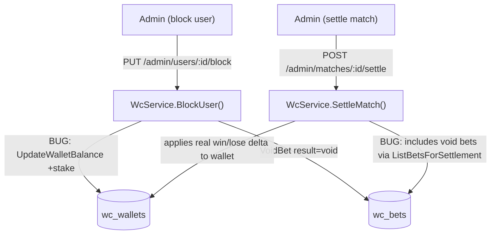

# System Design & Architecture

## Architecture Overview

Both bugs live entirely in the Go backend. No DB schema changes, no frontend changes.



---

## Bug Analysis

### Bug 1 — `BlockUser` incorrectly refunds stake

**File:** `backend/internal/service/wc_service.go` lines 827–835

```go
// Current code (WRONG)
for _, bet := range pendingBets {
    if err := s.repo.VoidBet(tx, bet.ID, bet.Stake); err != nil {
        return err
    }
    if err := s.repo.UpdateWalletBalance(tx, targetID, float64(bet.Stake)); err != nil { // BUG
        return err
    }
    voidedCount++
}
```

**Root cause:** The original design doc (`feature-wc-user-block.md`) specified "refund stake to wallet for each voided bet". However, `wc_bets` uses **deferred deduction** — stake is never taken from the wallet at placement time. So there is no stake to refund. Calling `UpdateWalletBalance(+stake)` incorrectly inflates the blocked user's balance.

**Evidence deferred model is in effect:**
- `PlaceBet()` in `wc_service.go` does NOT call `UpdateWalletBalance`
- Integration test `TestWcBet_ZeroBalance_Accepted` confirms zero-balance users can place bets
- Knowledge doc `wc-custom-bet.md` states: _"No balance check at placement — stake is NOT deducted when placing an entry (same as `wc_bets` and `wc_predictions`)"_

**Fix:** Remove the `UpdateWalletBalance` call entirely from the block loop.

```go
// Fixed code
for _, bet := range pendingBets {
    if err := s.repo.VoidBet(tx, bet.ID, bet.Stake); err != nil {
        return err
    }
    // No wallet change: deferred-deduction model means stake was never taken
    voidedCount++
}
```

---

### Bug 2 — `SettleMatch` re-settles voided bets

**File:** `backend/internal/repository/wc_repository.go` lines 513–517

```go
// Current code (WRONG)
func (r *WcRepository) ListBetsForSettlement(matchID uuid.UUID) ([]*model.WcBet, error) {
    var bets []*model.WcBet
    err := r.db.Where("match_id = ?", matchID).Find(&bets).Error  // BUG: includes void bets
    return bets, err
}
```

**Root cause:** The query returns ALL bets for a match — including those with `result = 'void'`. In `SettleMatch`, the idempotency reversal for a voided bet is:
- `prevNet = payout - stake = stake - stake = 0` → no wallet reversal (correct)
- But then the bet is re-evaluated normally and a real win/lose/push result + wallet change is applied (WRONG)

This means an admin-voided bet (or a bet voided by `BlockUser`) gets unsettled and re-settled.

**Combined impact with Bug 1:** A blocked user with pending bets that would have won ends up with:
1. `+stake` added to wallet (Bug 1: incorrect refund)
2. `+(payout - stake)` applied at settlement (Bug 2: void overridden by real settlement)
3. Final wallet = `+payout` — as if the block never happened

**Fix:** Exclude void bets from the query.

```go
// Fixed code
func (r *WcRepository) ListBetsForSettlement(matchID uuid.UUID) ([]*model.WcBet, error) {
    var bets []*model.WcBet
    err := r.db.Where("match_id = ? AND (result IS NULL OR result != 'void')", matchID).Find(&bets).Error
    return bets, err
}
```

This preserves idempotency for re-settlement (settled bets with `result != 'void'` are still included and reversed correctly) while permanently excluding voided bets from settlement.

---

## Component Breakdown

### Backend (2 file changes)

#### `backend/internal/service/wc_service.go`

In `BlockUser()`, remove the `UpdateWalletBalance` call in the void-bets loop (lines 831–835).

#### `backend/internal/repository/wc_repository.go`

In `ListBetsForSettlement()`, add `AND (result IS NULL OR result != 'void')` to the WHERE clause (line 516).

---

## Data Models

No schema changes required. Both fixes are logic-only.

---

## API Design

No endpoint changes. The behavior of `PUT /admin/users/:id/block` and `POST /admin/matches/:id/settle` is unchanged from the outside — the fixes only correct the internal wallet arithmetic.

---

## Design Decisions

| Decision | Choice | Rationale |
|---|---|---|
| Remove refund entirely (not reduce it) | Remove `UpdateWalletBalance` from `BlockUser` | Deferred model means no stake was taken; a refund of 0 is a no-op, so removal is clean |
| Exclude voids from settlement query | `result IS NULL OR result != 'void'` | Preserves idempotency for already-settled bets while permanently skipping void bets |
| Keep `payout = stake` in `VoidBet` | No change | Semantically correct: if a voided bet were ever re-examined, the recorded payout = stake means net 0, consistent with stake never being taken |
| No wallet log needed for BlockUser | No change | Voiding bets causes no wallet change (post-fix), so nothing to log |

---

## Testing

### New unit tests to add (`wc_integration_test.go`)

**`TestWcBet_BlockUser_NoBadWalletInflation`**
1. Seed user with known wallet balance (e.g. 0)
2. Place a pending `wc_bet` (wallet must stay 0 — deferred model)
3. `BlockUser` → wallet must still be 0 (not +stake)

**`TestWcSettle_VoidedBetsSkipped`**
1. Seed user with 0 balance
2. Place a `wc_bet` (stake=100, odds=1.9 — would pay 190)
3. Admin voids the bet via `VoidBet`
4. Set match score and call `SettleMatch`
5. Wallet must remain 0 (voided bet must be skipped, not re-settled to +90)

**`TestWcBet_BlockUserThenSettle_WalletCorrect`**
1. Seed user
2. Place bet (stake=100, odds=1.9) on a match
3. Block user → bet voided, wallet stays 0
4. Set score (winning result) and call `SettleMatch`
5. Wallet must remain 0 (blocked user must not receive winnings)

---

## Non-Functional Requirements

- **Atomicity:** BlockUser is already wrapped in a transaction — removing the wallet call keeps it atomic.
- **Idempotency:** `SettleMatch` idempotency is preserved — re-settlement still reverses the previous net for non-void bets.
- **Backward compatibility:** Existing blocked users in the DB may already have inflated wallets. A data correction script may be needed (out of scope for this fix; see Open Items).
- **No downtime:** Both fixes are backward-compatible logic changes.

---

## Open Items

1. **Data correction for already-blocked users:** Any users currently blocked who had pending bets at block time may have inflated wallet balances. Admin should manually audit `wc_wallets` for blocked users (`is_blocked = true`) and check if their balance needs adjustment.
2. **Void bets in `FinalizeMatch`:** The `FinalizeMatch` path (for `wc_predictions`) does not have the same void concept, so it's unaffected. But confirm there is no equivalent issue in the predictions settlement path.
3. **Wallet audit logs missing from FinalizeMatch/SettleMatch:** Wallet changes from prediction/bet settlement are not logged in `wc_wallet_logs` (unlike admin top-ups and champion settlement). This is a separate UX issue — users can't see their bet settlement history in the wallet log.
