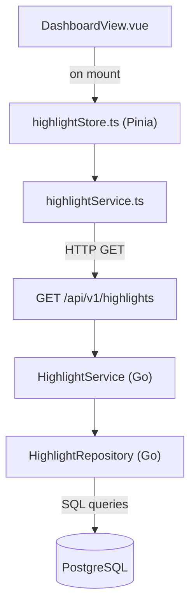

# System Design & Architecture

## Architecture Overview



No new tables. All highlight data is computed at query time from `matches`, `match_participants`, and `users`.

**Dashboard placement:** `HighlightFeedPanel` is a full-width card below the existing Leaderboard + Recent Matches row:

```
┌─────────────────────────────────────────┐
│  Stats grid (4 StatCards)               │
├─────────────────────────────────────────┤
│  Leaderboard card  │  Recent Matches    │
│                    │  Recent Settlements│
├─────────────────────────────────────────┤
│  🔥 Highlights (full width, el-tabs)    │
└─────────────────────────────────────────┘
```

## Data Models

### Backend — response types

```go
// internal/model/highlight.go

type Highlight struct {
    PlayerID   uuid.UUID `json:"player_id"`
    PlayerName string    `json:"player_name"`
    Type       string    `json:"type"`     // type constant (see table below)
    Section    string    `json:"section"`  // "trending" | "daily_recap" | "competitive" | "social"
    Emoji      string    `json:"emoji"`
    Message    string    `json:"message"`  // Vietnamese, ready to render
    Value      float64   `json:"value"`    // numeric context: win rates as 0.80, counts/points as float64
    Priority   int       `json:"priority"` // higher = shown first within section
}

type HighlightsResponse struct {
    Trending    []Highlight `json:"trending"`
    DailyRecap  []Highlight `json:"daily_recap"`
    Competitive []Highlight `json:"competitive"`
    Social      []Highlight `json:"social"`
    GeneratedAt time.Time   `json:"generated_at"`
}
```

**`value` field conventions by type:**

| Category | What `value` stores | Example |
|---|---|---|
| Streaks | streak length (count) | `5.0` = 5-match streak |
| Win rate | rate as decimal | `0.80` = 80% win rate |
| Points | point delta | `120.0` = +120 pts |
| Rank | positions moved | `3.0` = moved 3 ranks |
| Activity | match count | `20.0` = 20 matches |
| Milestones | threshold value | `100.0` = 100th win |

### Highlight type constants

| Type | Section | Time window | Example message |
|---|---|---|---|
| `streak_win` | trending | all-time current | 🔥 Player X đang thắng liên tục 5 trận |
| `streak_lose` | daily_recap | all-time current | 😵 Player X đã thua 7 trận liên tiếp |
| `streak_unbeaten` | trending | all-time current | 🛡️ Player X bất bại 10 trận gần nhất |
| `streak_broken_win` | social | latest match | 💥 Player X vừa kết thúc chuỗi thắng của Player Y |
| `streak_broken_lose` | social | latest match | 🎯 Player X vừa phá chuỗi thua kéo dài |
| `points_gained_today` | daily_recap | today | 🚀 Player X vừa tăng +120 điểm hôm nay |
| `points_lost_today` | daily_recap | today | 📉 Player X mất -95 điểm chỉ trong hôm nay |
| `rank_climbed` | competitive | today vs yesterday | 🏆 Player X vừa leo lên Top 1 |
| `rank_dropped` | competitive | today vs yesterday | 😬 Player X tụt 4 bậc trên BXH |
| `fastest_climber_today` | trending | today | ⚡ Player X tăng rank nhanh nhất hôm nay |
| `biggest_collapse` | competitive | this week | 📉 Player X tụt rank mạnh nhất tuần |
| `form_hot` | trending | last 10 matches | 🔥 Player X thắng 8/10 trận gần nhất |
| `form_cold` | daily_recap | last 10 matches | 🥶 Player X đang tụt phong độ |
| `form_stable` | social | last 10 matches | 🎮 Player X là người chơi ổn định nhất tuần |
| `most_active_today` | trending | today | 🎮 Player X chơi nhiều trận nhất hôm nay |
| `marathon` | social | today | 🕹️ Player X vừa marathon 20 trận |
| `active_streak_days` | social | rolling daily | 📅 Player X active liên tục 5 ngày |
| `fast_climb_hour` | trending | last 60 min | ⚡ Player X vừa gain 50 điểm trong 30 phút |
| `fast_collapse_hour` | competitive | last 60 min | 📉 Player X tụt rank nhanh nhất trong 1 giờ |
| `hot_player` | trending | last 10 + today | 🔥 Không ai cản nổi Player X hôm nay |
| `cold_player` | daily_recap | current streak | 🥶 Player X đang gặp khó khăn với 6 trận thua |
| `milestone_wins` | social | career | 🎉 Player X cán mốc 100 trận thắng |
| `milestone_points` | social | career | 🏅 Player X đạt 1000 điểm |
| `milestone_matches` | social | career | 🎮 Player X vừa chơi trận thứ 500 |
| `milestone_top10` | competitive | today vs yesterday | 👑 Player X vừa lọt vào Top 10 hôm nay |
| `social_cooking` | social | last 10 + today | 🔥 Player X is cooking |
| `social_tilt` | social | streak + today | 😅 Player X cần reset mental |
| `social_tryhard` | social | today | 💀 Player X vừa bật mode tryhard |
| `social_grinder` | social | today | 🕹️ Player X đang spam rank |
| `social_sneaky` | social | today vs yesterday | 👀 Player X đang âm thầm leo rank |

**Note on `hot_player` + `social_cooking` overlap:** Both are intentionally present — `hot_player` appears in Trending for visibility, `social_cooking` appears in Social for tone. This is by design, not a bug.

### Frontend — TypeScript types

```ts
// src/types/highlight.ts
export interface Highlight {
  player_id: string
  player_name: string
  type: string
  section: 'trending' | 'daily_recap' | 'competitive' | 'social'
  emoji: string
  message: string
  value: number   // float64 from Go; win rates as 0.80, counts as integers
  priority: number
}

export interface HighlightsResponse {
  trending: Highlight[]
  daily_recap: Highlight[]
  competitive: Highlight[]
  social: Highlight[]
  generated_at: string
}
```

## API Design

### `GET /api/v1/highlights`

No parameters. Returns all highlights grouped by section.

**Response:**
```json
{
  "trending": [
    {
      "player_id": "uuid",
      "player_name": "Player X",
      "type": "hot_player",
      "section": "trending",
      "emoji": "🔥",
      "message": "Không ai cản nổi Player X hôm nay",
      "value": 0.9,
      "priority": 95
    }
  ],
  "daily_recap": [...],
  "competitive": [...],
  "social": [...],
  "generated_at": "2026-05-22T10:30:00+07:00"
}
```

**Performance target:** ≤ 500 ms for up to 30 active players.

## Repository Queries

`HighlightRepository` provides **9 aggregation queries** (all users in one batch per query — no N+1):

| Method | Returns | Notes |
|---|---|---|
| `GetCurrentStreaks()` | current win/lose/unbeaten streak per user | Walks match_participants DESC until result changes |
| `GetLongestStreaks()` | all-time longest win/lose streak per user | Full history scan |
| `GetPointsMovementToday()` | sum of point_change (gained + lost) + match count today per user | Needed for hot/cold, activity, rank snapshot |
| `GetPointsMovementLastHour()` | sum of point_change in rolling 60-min window per user | Uses `NOW() - INTERVAL '1 hour'` |
| `GetRankSnapshot()` | current rank + yesterday's rank per user | See computation note below |
| `GetRecentForm()` | last 10 decisive results as `[]bool` per user | Draws excluded; win rate derived from this in service |
| `GetWeeklyActivity()` | match count this week + consecutive active days per user | Active day = any day with ≥1 decisive match |
| `GetTotals()` | total wins, losses, matches, current_score per user | Used for milestones and `biggest_collapse` week window |
| `GetStreakBreakers()` | for each match today where a player's streak ≥3 was broken, returns breaker + victim + streak length | Joins match_participants for both players in the same match |

**`GetRankSnapshot()` computation:**
```sql
-- Step 1: compute yesterday's effective score for all users
-- yesterday_score = current_score - SUM(point_change today)
WITH today_deltas AS (
  SELECT mp.user_id, SUM(mp.point_change) AS delta
  FROM match_participants mp
  JOIN matches m ON m.id = mp.match_id
  WHERE m.match_date >= CURRENT_DATE AT TIME ZONE 'Asia/Ho_Chi_Minh'
  GROUP BY mp.user_id
),
scores AS (
  SELECT u.id, u.current_score,
         u.current_score - COALESCE(td.delta, 0) AS yesterday_score
  FROM users u
  LEFT JOIN today_deltas td ON td.user_id = u.id
  WHERE u.is_active = true
)
-- Step 2: rank both ways and return delta
SELECT id,
  RANK() OVER (ORDER BY current_score DESC)   AS current_rank,
  RANK() OVER (ORDER BY yesterday_score DESC) AS yesterday_rank
FROM scores
```

**`milestone_top10` detection:** Uses `GetRankSnapshot()` — fires when `current_rank ≤ 10 AND yesterday_rank > 10`. This means "entered Top 10 today" rather than "all-time first time" — more practical and achievable without schema changes.

## Component Breakdown

### Backend

| File | Responsibility |
|---|---|
| `internal/model/highlight.go` | `Highlight`, `HighlightsResponse` structs + type constants |
| `internal/repository/highlight_repository.go` | All 9 aggregation queries |
| `internal/service/highlight_service.go` | Rule engine for all 8 categories; runs 9 queries concurrently via goroutines |
| `internal/api/highlight_handler.go` | Gin handler for `GET /api/v1/highlights` |
| `internal/api/router.go` | Register route (existing file) |

### Frontend

| File | Responsibility |
|---|---|
| `src/types/highlight.ts` | `Highlight`, `HighlightsResponse` interfaces |
| `src/services/highlightService.ts` | `getHighlights()` API call |
| `src/stores/highlightStore.ts` | Pinia store — sectioned highlights, loading, `fetchHighlights()` |
| `src/components/HighlightFeedPanel.vue` | Full-width card with `el-tabs` (Trending / Daily Recap / Competitive / Social Feed); `el-skeleton` loading; empty state per tab |
| `src/views/DashboardView.vue` | Mount `HighlightFeedPanel` below the content-grid (existing file) |

## Design Decisions

**Compute on-demand, don't store highlights.**
Always derived from match/participant data. Staleness risk outweighs perf gain at current scale (< 30 players).

**Run 9 repository queries concurrently in `HighlightService`.**
Each query is independent. Use goroutines + `sync.WaitGroup` (or `errgroup`) to parallelise them. Reduces total latency from sum of all query times to max of any single query.

**Drop `GetLast10WinRate()` — derive from `GetRecentForm()`.**
`GetRecentForm()` returns the ordered result list; win rate is `wins / len(results)` in the service layer. One fewer DB round trip.

**`value` is `float64` throughout.**
Win rates stored as `0.80`, counts/points stored as `5.0`, `120.0`. Avoids lossy int conversion and keeps the field general-purpose across all highlight types.

**Rule engine in `HighlightService`, not SQL.**
SQL returns raw aggregates. Go assembles messages, applies thresholds, assigns sections and priority. Thresholds are named constants — easy to tune without schema changes.

**Social/fun messages use random variant selection.**
Each social condition maps to 2–3 Vietnamese template variants; one is picked at random per call for feed freshness.

**`hot_player` (Trending) + `social_cooking` (Social) both fire on the same condition.**
Intentional: they serve different sections and different tones (factual vs fun). Not a conflict.

**Priority scoring (within section):**

| Condition | Priority |
|---|---|
| Milestone hit | 100 |
| Hot player (80%+ wr, 5+ today) | 95 |
| Streak ≥ 10 | 95 |
| Rank entered Top 3 today | 90 |
| Fast climb in last hour | 90 |
| Streak ≥ 5 | 80 |
| Points gained today ≥ 100 | 80 |
| Rank moved ≥ 3 positions | 75 |
| Form 8/10 or better | 70 |
| Cold / tilt | 65 |
| Activity / social | 50 |

Cap: 5 highlights per section (20 total), top by priority within each.

## Non-Functional Requirements

**Performance:** Queries hit indexed columns (`match_participants.user_id`, `matches.match_date`). All users fetched in batch. Queries run concurrently — expected p95 < 250 ms total.

**Scalability:** On-demand fine up to ~200 active players. Beyond that, add a 60 s TTL cache on the handler.

**Security:** Read-only, no auth required (same policy as `/leaderboard`). No user input accepted.

**Reliability:** On computation error, return empty sections with HTTP 200 — panel shows graceful empty state, dashboard remains functional.
