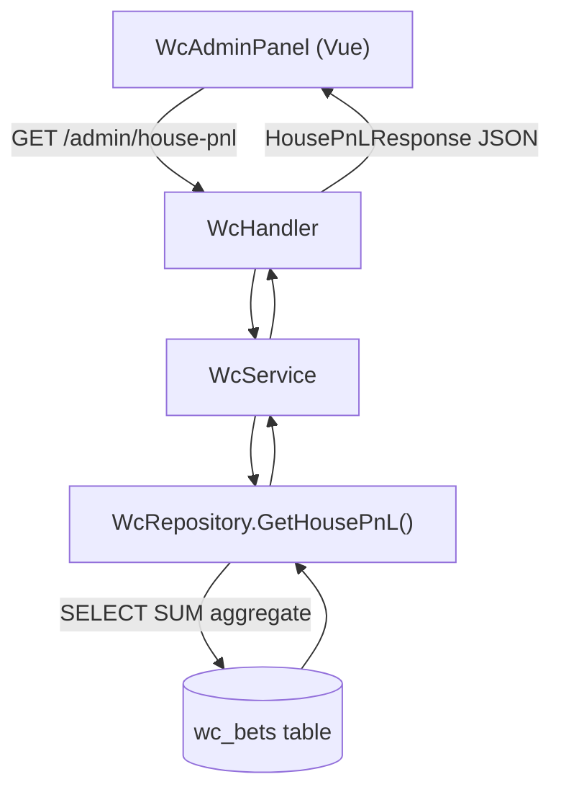

# System Design & Architecture

## Architecture Overview



Không cần thay đổi schema DB cho feature này — toàn bộ dữ liệu đã có trong `wc_bets`.  
**Dependency:** `feature-betting-refinements` phải deploy trước để `wc_bets.payout` là `NUMERIC(10,2)` thay vì `INTEGER`.

---

## Data Models

### Không thêm bảng mới

Tất cả dữ liệu lấy từ `wc_bets` và `wc_matches` hiện tại.

### Go Response DTO

```go
// HousePnLResponse là response của GET /api/v1/wc/admin/house-pnl
// Dùng float64 vì wc_bets.payout và wc_wallets.balance đã đổi sang NUMERIC(10,2)
// (feature-betting-refinements phải deploy trước)
type HousePnLResponse struct {
    // Settled bets only (result IS NOT NULL AND result != 'void')
    TotalStakeSettled  float64 `json:"total_stake_settled"`
    TotalPayoutSettled float64 `json:"total_payout_settled"`
    HouseProfit        float64 `json:"house_profit"` // = TotalStakeSettled - TotalPayoutSettled

    // Void bets (result = 'void', payout = stake — refunded)
    TotalStakeVoid float64 `json:"total_stake_void"`

    // Pending bets (result IS NULL)
    TotalStakePending float64 `json:"total_stake_pending"`
    PendingBetCount   int     `json:"pending_bet_count"`

    // Per-match breakdown (settled matches only)
    MatchBreakdown []HousePnLMatch `json:"match_breakdown"`

    // Meta
    SettledBetCount int    `json:"settled_bet_count"`
    GeneratedAt     string `json:"generated_at"` // RFC3339
}

type HousePnLMatch struct {
    MatchID  string `json:"match_id"`
    HomeTeam string `json:"home_team"`
    AwayTeam string `json:"away_team"`
    MatchDate string `json:"match_date"`
    Stage    string `json:"stage"`

    Stake    float64 `json:"stake"`
    Payout   float64 `json:"payout"`
    Profit   float64 `json:"profit"` // = Stake - Payout
    BetCount int     `json:"bet_count"`
}
```

---

## API Design

### `GET /api/v1/wc/admin/house-pnl`

**Auth:** WcAdminMiddleware (admin only)  
**Method:** GET — không cần request body  
**Response:** `HousePnLResponse` (JSON)

**SQL được gọi (2 queries):**

```sql
-- Query 1: Tổng aggregate
SELECT
    COALESCE(SUM(stake) FILTER (WHERE result IS NOT NULL AND result != 'void'), 0) AS total_stake_settled,
    COALESCE(SUM(payout) FILTER (WHERE result IS NOT NULL AND result != 'void'), 0) AS total_payout_settled,
    COALESCE(COUNT(*) FILTER (WHERE result IS NOT NULL AND result != 'void'), 0) AS settled_bet_count,
    COALESCE(SUM(stake) FILTER (WHERE result = 'void'), 0) AS total_stake_void,
    COALESCE(SUM(stake) FILTER (WHERE result IS NULL), 0) AS total_stake_pending,
    COALESCE(COUNT(*) FILTER (WHERE result IS NULL), 0) AS pending_bet_count
FROM wc_bets;

-- Query 2: Per-match breakdown
SELECT
    b.match_id,
    m.home_team,
    m.away_team,
    m.match_date,
    m.stage,
    SUM(b.stake)  AS stake,
    SUM(b.payout) AS payout,
    COUNT(b.id)   AS bet_count
FROM wc_bets b
JOIN wc_matches m ON m.id = b.match_id
WHERE b.result IS NOT NULL AND b.result != 'void'
GROUP BY b.match_id, m.home_team, m.away_team, m.match_date, m.stage
ORDER BY (SUM(b.stake) - SUM(b.payout)) ASC; -- lỗ nhiều nhất lên đầu
```

---

## Component Breakdown

### Backend

#### `internal/repository/wc_repository.go` — thêm method
```go
func (r *WcRepository) GetHousePnL() (*model.HousePnLResponse, error)
```
Chạy 2 queries trên, assemble response.

#### `internal/service/wc_service.go` — thêm method
```go
func (s *WcService) GetHousePnL() (*model.HousePnLResponse, error) {
    return s.repo.GetHousePnL()
}
```
Thin wrapper — logic chính ở repo query.

#### `internal/api/wc_handler.go` — thêm handler
```go
// GetHousePnL handles GET /api/v1/wc/admin/house-pnl
func (h *WcHandler) GetHousePnL(c *gin.Context) {
    pnl, err := h.svc.GetHousePnL()
    if err != nil {
        c.JSON(http.StatusInternalServerError, gin.H{"error": "failed to compute P&L"})
        return
    }
    c.JSON(http.StatusOK, pnl)
}
```

#### `cmd/server/main.go` — thêm route
```go
adminGroup.GET("/house-pnl", wcHandler.GetHousePnL)
```

### Frontend

#### `frontend/src/services/wcService.ts` — thêm method
```ts
getHousePnL(): Promise<HousePnLResponse>
```

#### `frontend/src/types/wc.ts` — thêm types
```ts
// number trong TypeScript handle cả int lẫn float — không cần thay đổi khi backend đổi sang float64
interface HousePnLResponse {
    total_stake_settled: number
    total_payout_settled: number
    house_profit: number
    total_stake_void: number
    total_stake_pending: number
    pending_bet_count: number
    settled_bet_count: number
    match_breakdown: HousePnLMatch[]
    generated_at: string
}

interface HousePnLMatch {
    match_id: string
    home_team: string
    away_team: string
    match_date: string
    stage: string
    stake: number
    payout: number
    profit: number
    bet_count: number
}
```

#### `frontend/src/components/wc/WcHousePnL.vue` *(mới)*
Card/section trong admin panel hiển thị:
- **Summary row:** 3 metric chips — Stake thu | Payout trả | Lời/Lỗ (màu xanh/đỏ)
- **Pending row:** Stake đang chờ settle (warning style)
- **Match breakdown table:** collapsible, sort theo profit ASC

#### `WcAdminPanel.vue` — tích hợp
Thêm `<WcHousePnL />` component vào đầu panel (trước phần match list).  
Sau khi `SettleMatch` thành công → emit event → `WcHousePnL` reload.

---

## Design Decisions

| Decision | Choice | Rationale |
|---|---|---|
| Schema | Không thêm bảng | Dữ liệu đủ trong `wc_bets` — aggregate on-the-fly |
| Caching | Không cache | Dữ liệu nhỏ, query nhanh, admin cần real-time sau settle |
| Void bets | Tách riêng, không tính vào profit | Void = hoàn tiền, không ảnh hưởng P&L thực |
| Pending | Hiển thị riêng, không cộng vào profit | Chưa settled = chưa chắc, không nên claim là profit |
| Sort | Lỗ nhiều → lên đầu | Admin cần biết trận nguy hiểm nhất trước |

---

## Non-Functional Requirements

- **Performance:** 2 queries đơn giản, < 100ms với ~1000 bets. Không cần index mới (result và match_id đã có index).
- **Security:** Route dưới `WcAdminMiddleware` — không ai ngoài admin gọi được.
- **Correctness:** `COALESCE(..., 0)` đảm bảo không trả về NULL khi chưa có bet nào.
