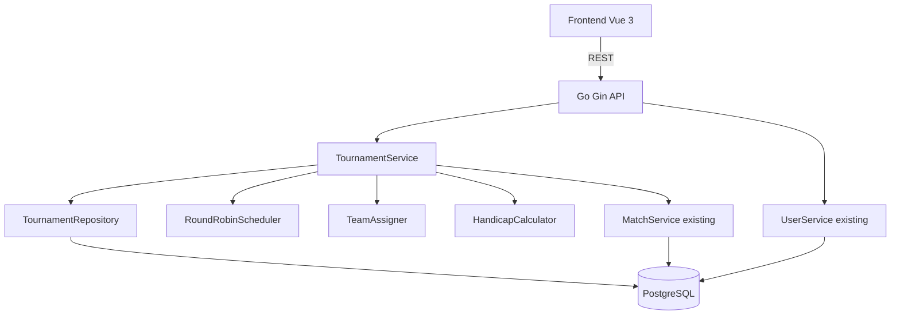

# System Design & Architecture

## Architecture Overview



## Data Models

### Modified: `users` table
```sql
ALTER TABLE users ADD COLUMN tier VARCHAR(10) NOT NULL DEFAULT 'normal';
ALTER TABLE users ADD COLUMN handicap_rate FLOAT NOT NULL DEFAULT 0.0;
-- tier enum values: 'pro', 'normal', 'noop'
```

```go
type User struct {
    // ... existing fields ...
    Tier         string  `gorm:"type:varchar(10);default:'normal'" json:"tier"` // pro | normal | noop
    HandicapRate float64 `gorm:"default:0.0" json:"handicap_rate"`
}
```

### Modified: `matches` table
```sql
ALTER TABLE matches ADD COLUMN tournament_match_id UUID REFERENCES tournament_matches(id) ON DELETE SET NULL;
```

```go
type Match struct {
    // ... existing fields ...
    TournamentMatchID *uuid.UUID `gorm:"type:uuid" json:"tournament_match_id,omitempty"` // set = match from a tournament
}
```

> **Key rule:** Every tournament match result creates a `Match` record regardless of `affects_score`.
> - `affects_score=true` → Match is created normally (scores updated, settlement may trigger)
> - `affects_score=false` → Match is created with `winner_team=0` (draw/no-op) so no score change; tagged via `tournament_match_id`
>
> Frontend uses `tournament_match_id != null` to show "tournament-only" badge in main match history.

### New: `tournaments` table
```go
type Tournament struct {
    ID           uuid.UUID              `gorm:"type:uuid;primary_key;default:gen_random_uuid()" json:"id"`
    Name         string                 `gorm:"type:varchar(200);not null" json:"name"`
    MatchType    string                 `gorm:"type:varchar(10);not null" json:"match_type"` // "1v1" | "2v2"
    Status       string                 `gorm:"type:varchar(20);default:'active'" json:"status"` // active | completed
    AffectsScore bool                   `gorm:"default:true" json:"affects_score"`
    EntryFee     int                    `gorm:"default:0" json:"entry_fee"` // VND, 0 = free
    CreatedAt    time.Time              `json:"created_at"`
    UpdatedAt    time.Time              `json:"updated_at"`
    Participants []TournamentParticipant `gorm:"foreignKey:TournamentID;constraint:OnDelete:CASCADE" json:"participants,omitempty"`
    Matches      []TournamentMatch       `gorm:"foreignKey:TournamentID;constraint:OnDelete:CASCADE" json:"matches,omitempty"`
}
```

### New: `tournament_participants` table
```go
type TournamentParticipant struct {
    ID                  uuid.UUID `gorm:"type:uuid;primary_key;default:gen_random_uuid()" json:"id"`
    TournamentID        uuid.UUID `gorm:"type:uuid;not null" json:"tournament_id"`
    UserID              uuid.UUID `gorm:"type:uuid;not null" json:"user_id"`
    TierSnapshot        string    `gorm:"type:varchar(10)" json:"tier_snapshot"`          // tier at time of creation
    HandicapRateSnapshot float64  `gorm:"default:0.0" json:"handicap_rate_snapshot"`      // snapshot for history
    User                User      `gorm:"foreignKey:UserID" json:"user,omitempty"`
}
```

### New: `tournament_matches` table
```go
type TournamentMatch struct {
    ID            uuid.UUID  `gorm:"type:uuid;primary_key;default:gen_random_uuid()" json:"id"`
    TournamentID  uuid.UUID  `gorm:"type:uuid;not null" json:"tournament_id"`
    Round         int        `gorm:"not null" json:"round"` // round number in round-robin
    MatchOrder    int        `gorm:"not null" json:"match_order"` // order within round
    // Team 1 players (1 or 2 UUIDs)
    Team1Player1ID uuid.UUID `gorm:"type:uuid;not null" json:"team1_player1_id"`
    Team1Player2ID *uuid.UUID `gorm:"type:uuid" json:"team1_player2_id,omitempty"` // nil for 1v1
    // Team 2 players
    Team2Player1ID uuid.UUID `gorm:"type:uuid;not null" json:"team2_player1_id"`
    Team2Player2ID *uuid.UUID `gorm:"type:uuid" json:"team2_player2_id,omitempty"` // nil for 1v1
    // Handicaps (snapshotted at schedule generation)
    HandicapTeam1  float64   `gorm:"default:0.0" json:"handicap_team1"`
    HandicapTeam2  float64   `gorm:"default:0.0" json:"handicap_team2"`
    // Result (nil until recorded)
    Status         string    `gorm:"type:varchar(20);default:'pending'" json:"status"` // pending | completed
    ActualScore1   *int      `json:"actual_score1,omitempty"`   // FC25 goals team1
    ActualScore2   *int      `json:"actual_score2,omitempty"`   // FC25 goals team2
    EffectiveWinner *int     `json:"effective_winner,omitempty"` // 1 or 2 after handicap, nil = draw
    MatchID        *uuid.UUID `gorm:"type:uuid" json:"match_id,omitempty"` // linked regular match (if affects_score)
    CreatedAt      time.Time  `json:"created_at"`
    UpdatedAt      time.Time  `json:"updated_at"`
}
```

## API Design

### User API — Changes
| Method | Path | Description |
|--------|------|-------------|
| PUT | `/api/v1/users/:id` | Extended: accepts `tier` and `handicap_rate` fields |

**Request body addition:**
```json
{
  "name": "Duy",
  "tier": "pro",
  "handicap_rate": 0.5
}
```

### Tournament API — New
| Method | Path | Description |
|--------|------|-------------|
| GET | `/api/v1/tournaments` | List all tournaments |
| POST | `/api/v1/tournaments` | Create tournament + generate schedule |
| GET | `/api/v1/tournaments/:id` | Get tournament detail with matches |
| DELETE | `/api/v1/tournaments/:id` | Delete tournament (and unlink regular matches if any) |
| POST | `/api/v1/tournaments/:id/matches/:matchId/result` | Record match result |
| PUT | `/api/v1/tournaments/:id/complete` | Mark tournament as completed |

**POST /api/v1/tournaments — Request:**
```json
{
  "name": "Weekly Tourney #5",
  "match_type": "2v2",
  "player_ids": ["uuid1", "uuid2", "uuid3", "uuid4"],
  "affects_score": true,
  "entry_fee": 0
}
```

**Response includes generated schedule:**
```json
{
  "id": "uuid",
  "name": "Weekly Tourney #5",
  "match_type": "2v2",
  "status": "active",
  "affects_score": true,
  "participants": [...],
  "matches": [
    {
      "id": "uuid",
      "round": 1,
      "match_order": 1,
      "team1_player1_id": "...",
      "team1_player2_id": "...",
      "team2_player1_id": "...",
      "team2_player2_id": "...",
      "handicap_team1": 0.5,
      "handicap_team2": 0.0,
      "status": "pending"
    }
  ]
}
```

**POST /api/v1/tournaments/:id/matches/:matchId/result — Request:**
```json
{
  "actual_score1": 2,
  "actual_score2": 2,
  "recorded_by": "Admin"
}
```

**Response includes effective winner:**
```json
{
  "actual_score1": 2,
  "actual_score2": 2,
  "effective_winner": 2,
  "handicap_applied": "team1:-0.5 team2:0.0 → effective 1.5 vs 2.0",
  "match_id": "uuid-of-regular-match-if-affects-score"
}
```

## Component Breakdown

### Backend
```
internal/
  model/
    user.go             ← add Tier, HandicapRate fields
    tournament.go       ← new: Tournament, TournamentParticipant, TournamentMatch
  repository/
    user_repository.go  ← update for new fields
    tournament_repository.go  ← new
  service/
    tournament_service.go     ← new: orchestrates creation, scheduling, result recording
    round_robin.go            ← new: schedule generation algorithm
    team_assigner.go          ← new: tier-balanced team assignment for 2v2
    handicap.go               ← new: handicap calculation logic
  api/
    tournament_handler.go     ← new
    router.go                 ← add tournament routes
  database/
    migrations/               ← new migration for users + tournament tables
```

### Frontend
```
src/
  types/
    tournament.ts       ← Tournament, TournamentMatch interfaces
  services/
    tournamentService.ts← API calls
  stores/
    tournamentStore.ts  ← Pinia store
  views/
    TournamentsView.vue       ← list tournaments
    TournamentDetailView.vue  ← view schedule + record results
    CreateTournamentView.vue  ← create tournament wizard
  components/
    TournamentBracket.vue     ← round-robin table display
    TournamentMatchCard.vue   ← individual match with result input
    PlayerTierBadge.vue       ← tier badge (Pro/Normal/Noop)
  router/index.ts     ← add tournament routes
```

## Key Algorithms

### Round-Robin Schedule Generation
Use standard round-robin algorithm (polygon rotation method):
- For N players, `N-1` rounds if N is even, `N` rounds if N is odd (add a "bye")
- In 2v2: pairs within each match are already assigned as teams
- Algorithm is deterministic post-team-assignment, so randomness comes from team/player shuffle before scheduling

### 2v2 Team Assignment (Tier-Balanced)
```
Input: players list with tiers
1. Separate pros = players where tier == "pro"
2. For each pro, find a partner: prefer noop first, else normal
3. Pair remaining players randomly
4. Shuffle all pairs and form (team1, team2) matchups
```

### Handicap Calculation
```go
func effectiveWinner(score1, score2 int, handicap1, handicap2 float64) int {
    eff1 := float64(score1) - handicap1
    eff2 := float64(score2) - handicap2
    if eff1 > eff2 { return 1 }
    if eff2 > eff1 { return 2 }
    return 0 // draw
}
```

### RecordResult Flow
```
1. Compute effectiveWinner = EffectiveWinner(score1, score2, h1, h2)  // 0=draw
2. If tm.Status == "completed" (override):
     a. Delete linked regular match (reverting scores via existing DeleteMatch)
3. Determine matchWinnerTeam:
     - affects_score=true  AND effectiveWinner != 0  → matchWinnerTeam = effectiveWinner (scores updated)
     - affects_score=true  AND effectiveWinner == 0  → matchWinnerTeam = 0 (no score change)
     - affects_score=false                           → matchWinnerTeam = 0 (no score change)
4. Create regular Match with TournamentMatchID = tm.ID, WinnerTeam = matchWinnerTeam
5. Update TournamentMatch: scores, effectiveWinner, matchID, status="completed"
```

> **`WinnerTeam=0` support in MatchService:** `CreateMatch` must be updated to handle `WinnerTeam=0` (no point changes, match still recorded). This is a required change to the existing service.

## Design Decisions

| Decision | Choice | Rationale |
|----------|--------|-----------|
| Handicap snapshot | Snapshot at schedule creation | Changing handicap mid-tournament shouldn't affect existing matches |
| Team assignment constraint | Pro can only pair with Normal/Noop | Ensures balanced competition |
| Tournament match ↔ regular match | Always create a regular Match (even affects_score=false), tagged via tournament_match_id | Enables "tournament-only" tag in main history without a second API endpoint |
| affects_score=false match | WinnerTeam=0 (no point change) | Reuses existing match model; no new table needed |
| Tournament delete | Delete all linked regular matches (reverting scores) + delete tournament | Data consistency; avoids ghost score changes |
| Status transition | active → completed (manual by admin) | Avoid accidental auto-complete on last match entry |
| Round-robin algorithm | Polygon rotation | Standard, O(n²) matches, well-understood |
| EffectiveWinner in TournamentMatch | `int` (0=draw, 1=team1, 2=team2) | Avoids nullable pointer confusion; 0 is a meaningful "no winner" value |

## Security & Performance Considerations
- No auth system; existing pattern (no auth) applies
- Schedule generation is O(n²) — for n≤16 this is negligible
- Snapshots (tier, handicap_rate) prevent data drift on historical tournaments
- Tournament delete cascades via DB ON DELETE CASCADE for tournament tables; regular matches deleted explicitly in service layer
