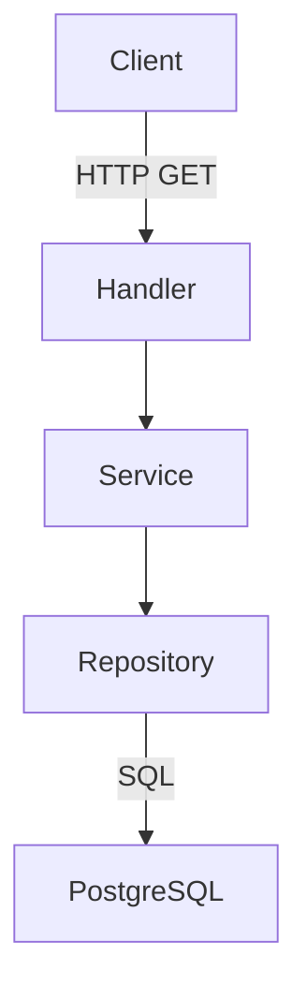
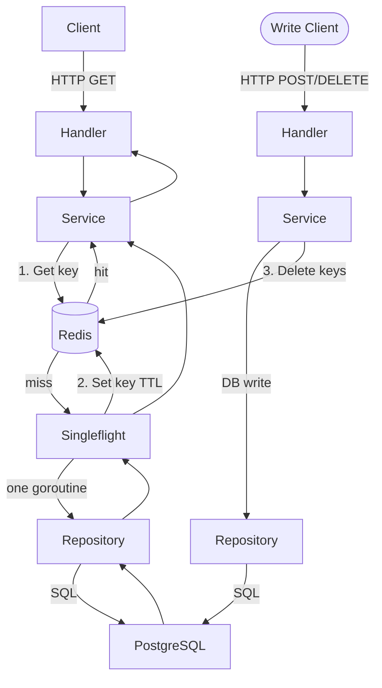

# System Design & Architecture

## Architecture Overview

Current flow (every read hits DB):



Target flow (Cache-Aside — reads served from Redis, writes invalidate):



**New files:**
- `backend/internal/cache/cache.go` — `CacheStore` interface
- `backend/internal/cache/redis.go` — Redis implementation
- `backend/internal/cache/gocache.go` — go-cache fallback (dev mode)
- `backend/internal/cache/noop.go` — no-op implementation for tests

**Modified files:**
- `backend/internal/api/router.go` — init Redis with soft fallback, inject into services
- `backend/internal/service/user_service.go` — cache users + leaderboard
- `backend/internal/service/match_service.go` — cache match feed (versioned keys), invalidate on write
- `backend/internal/service/config_service.go` — cache config
- `backend/internal/service/fund_service.go` — cache fund totals
- `backend/internal/service/score_bonus_service.go` — invalidate leaderboard + users on write
- `backend/internal/service/wc_service.go` — cache WC leaderboard + matches (scoped by `tournament_type`)
- `backend/internal/cron/wc_sync.go` — invalidate `wc:matches:all:{tournament_type}` after sync
- `backend/internal/database/database.go` — no changes needed

## Data Models

No new DB tables. All cache values are JSON-serialized Go structs.

### Cache Key Taxonomy

| Cache Key | Cached Value | TTL | Invalidated By |
|-----------|-------------|-----|----------------|
| `esport:users:all` | `[]User` | **10 min** | User create / update / delete |
| `esport:users:leaderboard` | `[]LeaderboardEntry` | **5 min** | Match create / delete, score bonus create / delete, settlement |
| `esport:users:payment-ranking` | `[]PaymentRankEntry` | **10 min** | Settlement create |
| `esport:matches:version` | integer counter | **no TTL** | Match create / delete (INCR) |
| `esport:matches:v{N}:{page}:{limit}:{playerID}` | `[]Match + bonuses` | **2 min** | Orphaned when version increments; self-cleans via TTL |
| `esport:config` | `Config` | **30 min** | Config update |
| `esport:fund:totals` | `FundSummary` | **15 min** | Settlement create |
| `wc:leaderboard:{tournament_type}` | `[]WCLeaderboardEntry` | **5 min** | Bet settlement, score update |
| `wc:matches:all:{tournament_type}` | `[]WCMatch` | **5 min** | Admin sync, cron sync |
| `wc:config:{tournament_type}` | `WCConfig` | **15 min** | Admin config save |
| `wc:analytics:{tournament_type}:{type}` | analytics JSON | **30 min** | Admin sync |

> **Note:** `esport:matches:version` is a bare Redis integer (no JSON). It has no TTL — it persists until Redis restarts, at which point it resets to 0 and keys warm up naturally.

### Versioned Match Cache Keys

Paginated match pages use a **version counter** instead of pattern delete. The counter lives at `esport:matches:version` and is incremented atomically with `INCR` on every match write.

**Read path:**
1. `GET esport:matches:version` → `N`
2. Build key: `esport:matches:v{N}:{page}:{limit}:{playerID}`
3. `GET` that key → hit or miss → normal Cache-Aside from there

**Write path (CreateMatch / DeleteMatch):**
1. Complete DB transaction
2. `INCR esport:matches:version` → old page keys (v0, v1, …) become unreachable orphans
3. Orphans expire naturally via their 2-minute TTL — no scan, no delete

**Benefits over `DeleteByPattern`:**
- O(1) invalidation regardless of how many paginated keys exist
- No Redis `SCAN` operation needed
- Teaches a real-world cache-busting technique

```go
// match_service.go — versioned cache read
func (s *MatchService) GetAllMatches(page, limit int, playerID *uuid.UUID) ([]*model.Match, error) {
    version, _ := s.cache.GetInt("esport:matches:version")
    key := fmt.Sprintf("esport:matches:v%d:%d:%d:%s", version, page, limit, playerIDStr(playerID))
    return cache.GetOrFetch(s.cache, &s.group, key, 2*time.Minute, func() ([]*model.Match, error) {
        return s.matchRepo.GetAllFiltered(page, limit, playerID)
    })
}

// match_service.go — version bump on write
func (s *MatchService) CreateMatch(req *CreateMatchRequest) (*model.Match, error) {
    // ... existing transaction ...
    s.cache.Incr("esport:matches:version")
    s.cache.Delete("esport:users:leaderboard")
    s.cache.Delete("esport:users:all")
    return createdMatch, nil
}
```

This requires adding `GetInt(key string) (int64, error)` and `Incr(key string) error` to the `CacheStore` interface.

### TTL Rationale

- **2 min** — matches feed: `POST /matches` happens during gameplay sessions; short TTL limits stale data window after a recording
- **5 min** — leaderboards: score-competitive data, users notice stale rankings; 5 min acceptable
- **10 min** — user list / payment ranking: profile data changes almost never during a session
- **15 min** — config / fund: set-and-forget by admin, changing mid-session would be unusual
- **30 min** — analytics: expensive external API calls, intentionally long
- **Long TTL philosophy**: Because data rarely changes (besides match recording), errors are on the side of long TTLs + write invalidation rather than short TTLs + no invalidation

## API Design

**No endpoint shape changes.** The cache is fully transparent to callers.

### CacheStore Interface

```go
// backend/internal/cache/cache.go
package cache

import "time"

type CacheStore interface {
    // Get retrieves a string value. Returns (value, true) on hit, ("", false) on miss.
    Get(key string) (string, bool)
    // Set stores a JSON string with TTL.
    Set(key string, value string, ttl time.Duration) error
    // Delete removes one key. Idempotent — no error if key absent.
    Delete(key string) error
    // DeleteByPattern removes all keys matching a glob pattern (e.g. "esport:users:*").
    // Uses SCAN+DEL on Redis; prefix scan on go-cache. Kept as general utility.
    DeleteByPattern(pattern string) error
    // GetInt retrieves an integer counter. Returns 0 on miss (no error).
    GetInt(key string) (int64, error)
    // Incr atomically increments an integer counter and returns the new value.
    // Creates the key with value 1 if it doesn't exist. No TTL set.
    Incr(key string) (int64, error)
}
```

### Redis Implementation

```go
// backend/internal/cache/redis.go
package cache

import (
    "context"
    "time"

    "github.com/redis/go-redis/v9"
)

type RedisCache struct {
    client *redis.Client
    ctx    context.Context
}

func NewRedisCache(redisURL string) (*RedisCache, error) {
    opt, err := redis.ParseURL(redisURL)
    if err != nil {
        return nil, err
    }
    client := redis.NewClient(opt)
    ctx := context.Background()
    if err := client.Ping(ctx).Err(); err != nil {
        return nil, err
    }
    return &RedisCache{client: client, ctx: ctx}, nil
}

func (r *RedisCache) Get(key string) (string, bool) {
    val, err := r.client.Get(r.ctx, key).Result()
    if err == redis.Nil {
        return "", false
    }
    if err != nil {
        return "", false  // Redis error = treat as cache miss (fallback to DB)
    }
    return val, true
}

func (r *RedisCache) Set(key, value string, ttl time.Duration) error {
    return r.client.Set(r.ctx, key, value, ttl).Err()
}

func (r *RedisCache) Delete(key string) error {
    return r.client.Del(r.ctx, key).Err()
}

func (r *RedisCache) DeleteByPattern(pattern string) error {
    var cursor uint64
    for {
        keys, nextCursor, err := r.client.Scan(r.ctx, cursor, pattern, 100).Result()
        if err != nil {
            return err
        }
        if len(keys) > 0 {
            r.client.Del(r.ctx, keys...)
        }
        cursor = nextCursor
        if cursor == 0 {
            break
        }
    }
    return nil
}
```

### Cache-Aside Pattern in Service Layer

All cache reads follow this exact template — no variation:

```go
// Generic cache-aside helper (in cache package or service base)
func GetOrFetch[T any](
    store CacheStore,
    group *singleflight.Group,
    key string,
    ttl time.Duration,
    fetch func() (T, error),
) (T, error) {
    // 1. Cache hit
    if raw, ok := store.Get(key); ok {
        var result T
        if err := json.Unmarshal([]byte(raw), &result); err == nil {
            return result, nil
        }
    }

    // 2. Cache miss — use singleflight to prevent stampede
    val, err, _ := group.Do(key, func() (interface{}, error) {
        result, err := fetch()
        if err != nil {
            return nil, err
        }
        // 3. Populate cache
        if b, jsonErr := json.Marshal(result); jsonErr == nil {
            store.Set(key, string(b), ttl)
        }
        return result, nil
    })
    if err != nil {
        var zero T
        return zero, err
    }
    return val.(T), nil
}
```

### Singleflight — Cache Stampede Explained

`singleflight.Group` maps a string key to an in-flight call. When key `"esport:users:leaderboard"` expires:

1. Request A misses Redis → calls `group.Do("esport:users:leaderboard", fn)` → fn starts running
2. Request B misses Redis → calls `group.Do("esport:users:leaderboard", fn)` → **blocked**, not a new call
3. Request C misses Redis → same, blocked on the same flight
4. fn completes → DB result shared with A, B, C simultaneously → key populated once

Without singleflight: A, B, C each hit DB independently — 3 identical expensive queries.

### Cache Invalidation on Write

Every mutating service method ends with cache deletion:

```go
// match_service.go — after successful CreateMatch transaction commit
func (s *MatchService) CreateMatch(req *CreateMatchRequest) (*model.Match, error) {
    // ... existing transaction logic ...
    
    // Bump version counter — all existing paginated match keys become orphans
    s.cache.Incr("esport:matches:version")
    // Invalidate score-dependent caches
    s.cache.Delete("esport:users:leaderboard")
    s.cache.Delete("esport:users:all")
    
    return createdMatch, nil
}
```

**Invalidation map:**

| Write Operation | Keys to Invalidate |
|----------------|-------------------|
| `CreateMatch` | `INCR esport:matches:version`, `esport:users:leaderboard`, `esport:users:all` |
| `DeleteMatch` | `INCR esport:matches:version`, `esport:users:leaderboard`, `esport:users:all` |
| `CreateUser` | `esport:users:all`, `esport:users:leaderboard` |
| `UpdateUser` | `esport:users:all`, `esport:users:leaderboard`, `esport:users:payment-ranking` |
| `DeleteUser` | `esport:users:all`, `esport:users:leaderboard` |
| `UpdateConfig` | `esport:config` |
| `CreateSettlement` | `esport:users:leaderboard`, `esport:users:payment-ranking`, `esport:fund:totals` |
| `CreateScoreBonus` | `esport:users:leaderboard`, `esport:users:all` |
| `DeleteScoreBonus` | `esport:users:leaderboard`, `esport:users:all` |
| WC `SettleBets` | `wc:leaderboard:{tournament_type}` |
| WC cron sync | `wc:matches:all:{tournament_type}` |
| WC admin sync | `wc:matches:all:{tournament_type}` |
| WC `UpdateConfig` | `wc:config:{tournament_type}` |

## Component Breakdown

### New: `backend/internal/cache/` Package

| File | Responsibility |
|------|---------------|
| `cache.go` | `CacheStore` interface definition + `GetOrFetch` generic helper |
| `redis.go` | Redis implementation of `CacheStore` |
| `gocache.go` | go-cache implementation (dev fallback when `REDIS_URL` unset) |
| `noop.go` | No-op implementation (always miss, no writes) — for unit tests |

### Modified: Services

Each service that owns a read path gets:
1. A `cache CacheStore` field
2. A `group singleflight.Group` field  
3. `GetOrFetch` calls on reads
4. `cache.Delete*` calls on writes

Services to modify:
- `user_service.go` — leaderboard, all-users, payment-ranking
- `match_service.go` — matches feed (versioned keys + version INCR on write)
- `config_service.go` — config read
- `fund_service.go` — fund totals
- `score_bonus_service.go` — invalidate leaderboard + users on create / delete
- `wc_service.go` — WC leaderboard + matches (keys scoped by `tournament_type`)
- `wc_analytics_service.go` — migrate existing go-cache to `CacheStore` (keys scoped by `tournament_type`)

### Modified: `router.go`

```go
// Determine cache backend based on env — soft startup: Redis failure falls back to go-cache
var cacheStore cache.CacheStore
if redisURL := os.Getenv("REDIS_URL"); redisURL != "" {
    rc, err := cache.NewRedisCache(redisURL)
    if err != nil {
        log.Printf("⚠️  Redis unavailable (%v) — falling back to go-cache", err)
        cacheStore = cache.NewGoCacheStore(10*time.Minute, 5*time.Minute)
    } else {
        cacheStore = rc
        log.Println("Cache backend: Redis")
    }
} else {
    cacheStore = cache.NewGoCacheStore(10*time.Minute, 5*time.Minute)
    log.Println("Cache backend: go-cache (dev mode)")
}

// Inject into services
userService     := service.NewUserService(userRepo, configService, cacheStore)
matchService    := service.NewMatchService(matchRepo, ..., cacheStore)
configService   := service.NewConfigService(configRepo, cacheStore)
// etc.
```

## Design Decisions

### Decision 1: Redis vs go-cache as primary

**Choice: Redis, with go-cache fallback in dev.**
- Redis is the learning goal; go-cache was only ever a stepping stone (noted in `feature-api-performance-optimization.md`)
- `CacheStore` interface means the fallback costs nothing extra
- Production deployment gains shared cache (if ever horizontally scaled) and persistence across restarts

### Decision 2: Cache in service layer, not repository or middleware

**Choice: Service layer.**
- Repositories stay pure DB access — they don't need to know about cache
- Middleware-level (response caching) would cache HTTP responses, losing type safety and making invalidation harder
- Service layer owns the business read paths, so it's the natural place

### Decision 3: `singleflight.Group` per service vs shared

**Choice: One `singleflight.Group` per service.**
- Stampede keys are namespaced per service anyway (`"esport:users:leaderboard"` vs `"wc:leaderboard"`)
- A shared group would require passing it around and gains nothing
- Each service owns its own concurrency control, matching DI patterns

### Decision 4: Write-invalidate vs write-through

**Choice: Write-invalidate (delete on write, not update).**
- Simpler: always delete the stale key, let the next read repopulate
- Write-through requires marshaling and writing the new value at write time — doubles complexity
- At friend-group scale, the one extra DB hit on cache-miss-after-write is irrelevant

### Decision 5: JSON serialization for cache values

**Choice: JSON strings in Redis.**
- Human-readable in `redis-cli` → great for learning/debugging
- No custom serializer needed — standard `encoding/json`
- Trade-off: slightly larger than msgpack; irrelevant at this data size

### Decision 6: Error handling on Redis failure

**Choice: Silently treat Redis errors as cache misses, fall through to DB.**
- Cache is a performance optimization, not a correctness requirement
- A Redis restart / network blip should not cause 5xx errors for users
- Log the error at WARN level but never bubble it up as an HTTP error

## Non-Functional Requirements

- **Performance**: Cached reads should respond in < 5ms from Redis (vs 50–500ms DB queries)
- **Correctness**: Stale data window bounded by TTL; writes immediately invalidate relevant keys
- **Reliability**: Redis failure → transparent fallback to DB; no user-visible error
- **Observability**: Log cache hits/misses at DEBUG level, errors at WARN level
- **Security**: `REDIS_URL` stored in `.env` / server environment, never committed; Redis not exposed to internet
- **Dev ergonomics**: `REDIS_URL` unset → go-cache fallback, no Docker required to run locally
