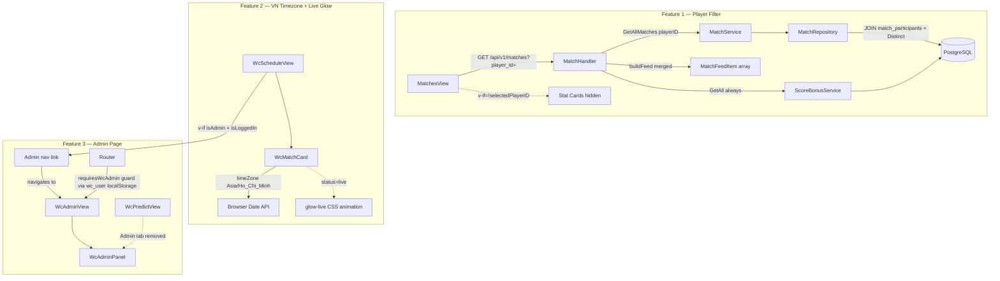

# System Design & Architecture

## Architecture Overview

All three features touch only existing layers; no new services or tables.



---

## Data Models

No schema changes. All three features work with existing tables:
- `matches` + `match_participants` + `users` (Feature 1)
- `wc_matches.match_date` (stored UTC, displayed as VN) (Feature 2)
- `wc_users.is_admin` (already exists, used by Feature 3 guard) (Feature 3)

---

## API Design

### Feature 1 — Player filter on GET /api/v1/matches

**Current signature:**
```
GET /api/v1/matches?limit=N&offset=M
```

**New signature:**
```
GET /api/v1/matches?limit=N&offset=M&player_id=<uuid>
```

- `player_id` is optional. When absent, behaviour is unchanged (full merged feed).
- When present, only matches where the player is a participant are included; **score bonuses are always included regardless of the filter**.
- Response shape is unchanged — still a merged `[]feedEntry` (matches + bonuses) sorted by date, with pagination applied after merge.

**Match repository — new method:**
```go
// GetAllFiltered returns all matches optionally filtered by a participant user ID.
func (r *MatchRepository) GetAllFiltered(limit, offset int, playerID *uuid.UUID) ([]*model.Match, error)
```
Internally: if `playerID != nil`, appends `.Joins("JOIN match_participants mp ON mp.match_id = matches.id").Where("mp.user_id = ?", *playerID).Distinct()`. Reuses the same `Preload("Participants.User").Order(...)` pattern already in `GetAll()`.

**Match service — update `GetAllMatches`** (actual method name — not `GetAll`):
```go
func (s *MatchService) GetAllMatches(limit, offset int, playerID *uuid.UUID) ([]*model.Match, error)
```
Delegates to `GetAllFiltered`. The existing `GetAll()` on the repo is unchanged; `GetAllFiltered` is a new sibling method.

**Match handler — update `GetAll` handler method:**
```go
playerIDStr := c.Query("player_id")
var playerID *uuid.UUID
if playerIDStr != "" {
    parsed, err := uuid.Parse(playerIDStr)
    if err != nil {
        c.JSON(http.StatusBadRequest, gin.H{"code": "INVALID_UUID", "message": "invalid player_id"})
        return
    }
    playerID = &parsed
}

// Matches filtered by player (or all if nil); bonuses always fetched in full
matches, err := h.matchService.GetAllMatches(0, 0, playerID)
if err != nil { /* ... */ }

bonuses, err := h.bonusService.GetAll(0, 0)  // unchanged — always all bonuses
if err != nil { /* ... */ }

feed := h.buildFeed(matches, bonuses)
// existing pagination logic on merged feed unchanged
```

---

### Feature 2 — No API changes

The `match_date` field is already returned as an ISO8601 string. The fix is purely in the Vue component.

---

### Feature 3 — No new API endpoints

The existing WC admin endpoints under `/api/v1/wc/admin/*` are unchanged. The new page is a frontend-only routing addition.

---

## Component Breakdown

### Feature 1 — Frontend

**`MatchesView.vue`** — add a player select dropdown above the match list:
- Loads players from the existing user store (`userStore.users.filter(u => u.is_active)`).
- Controlled by a `selectedPlayerID` ref (`string | null`).
- On change: re-calls `matchStore.fetchMatches({ player_id: selectedPlayerID })` — resets to page 1.
- A "Clear" option / empty selection resets the filter and re-fetches the full feed.
- **Stat cards (Total/Today/Locked) are conditionally hidden** (`v-if="!selectedPlayerID"`) while a player filter is active, since they show global counts that no longer match the filtered list.

**`matchStore.ts`** — update `fetchMatches` action: extend the `params` argument to accept `player_id?: string` and forward it to the service.

**`matchService.ts`** — `getAll` currently accepts `PaginationParams` from `@/types/api`. Add a new `MatchFilterParams` type:
```ts
// types/api.ts — extend or add alongside PaginationParams
export interface MatchFilterParams extends PaginationParams {
  player_id?: string
}
```
Update `matchService.getAll(params?: MatchFilterParams)` so `player_id` is forwarded as a query parameter via axios `params`.

### Feature 2 — Frontend

**`WcMatchCard.vue`** — single-line fix in two `computed` properties:
```ts
// Before
matchDate.value.toLocaleDateString('vi-VN', { day: '2-digit', month: '2-digit' })
matchDate.value.toLocaleTimeString('vi-VN', { hour: '2-digit', minute: '2-digit' })

// After
matchDate.value.toLocaleDateString('vi-VN', { day: '2-digit', month: '2-digit', timeZone: 'Asia/Ho_Chi_Minh' })
matchDate.value.toLocaleTimeString('vi-VN', { hour: '2-digit', minute: '2-digit', timeZone: 'Asia/Ho_Chi_Minh' })
```

**Live glow** — add CSS to `.wc-match-card--live`:
```css
.wc-match-card--live {
  border-color: #16a34a;
  box-shadow: 0 0 0 2px rgba(22, 163, 74, 0.25), 0 0 16px rgba(22, 163, 74, 0.2);
  animation: glow-live 2s ease-in-out infinite alternate;
}
@keyframes glow-live {
  from { box-shadow: 0 0 0 2px rgba(22, 163, 74, 0.25), 0 0 8px rgba(22, 163, 74, 0.15); }
  to   { box-shadow: 0 0 0 2px rgba(22, 163, 74, 0.40), 0 0 20px rgba(22, 163, 74, 0.30); }
}
```

The existing `.wc-badge--live` pulsing badge remains; the new glow is card-level.

### Feature 3 — Frontend

**`WcAdminView.vue`** (new file) — thin wrapper that renders `WcAdminPanel` with the same layout shell as `WcPredictView` (header with user name, Admin badge, logout button).

**`WcScheduleView.vue`** — add an Admin navigation link in the page header, visible only when `wcAuthStore.isLoggedIn && wcAuthStore.isAdmin`. Requires importing `useWcAuthStore`. This is the primary discovery point for admins.
```vue
<!-- in page-header-right area -->
<router-link v-if="wcAuthStore.isLoggedIn && wcAuthStore.isAdmin" :to="{ name: 'wc-admin' }" class="...">
  Admin
</router-link>
```

**`router/index.ts`** — add route:
```ts
{
  path: '/world-cup/admin',
  name: 'wc-admin',
  component: () => import('../views/WcAdminView.vue'),
  meta: { requiresWcAuth: true, requiresWcFeature: true, requiresWcAdmin: true }
}
```

**`router/index.ts` guard** — extend `beforeEach`. Do NOT use `parseJwt()` (no such utility exists). Instead read from `wc_user` localStorage key (already stored as JSON by `useWcAuthStore`):
```ts
if (to.meta.requiresWcAdmin) {
  try {
    const raw = localStorage.getItem('wc_user')
    const user = raw ? JSON.parse(raw) : null
    if (!user?.isAdmin) return { name: 'wc-schedule' }
  } catch {
    return { name: 'wc-schedule' }
  }
}
```

**`WcPredictView.vue`** — remove the Admin `<el-tab-pane>` and all admin-related refs/logic from this component.

---

## Design Decisions

| Decision | Rationale |
|---|---|
| Server-side player filter (not client-side) | Scales when match history grows; avoids loading all matches to filter in memory |
| Bonuses always unfiltered in feed | Bonuses have no `user_participants` concept; filtering them would require a separate bonus endpoint change |
| `playerID *uuid.UUID` pointer in service/repo | `nil` = no filter (backward-compatible); avoids a separate code path |
| `Distinct()` on filtered match query | The JOIN on `match_participants` could produce duplicate `matches` rows if a player appears multiple times |
| Stat cards hidden (not recomputed) when filtering | Stats endpoint returns global counts; recomputing from filtered feed requires no backend change and avoids misleading totals |
| `MatchFilterParams extends PaginationParams` | Keeps existing callers unchanged; adds `player_id` only where needed |
| `timeZone: 'Asia/Ho_Chi_Minh'` hardcoded | All team members are in VN; no per-user preference needed |
| Glow on card border, not background | Less disruptive to readability; more visually "electric" than a colour wash |
| Admin guard reads `wc_user` localStorage (not JWT parse) | `wc_user` is already a JSON object with `isAdmin` stored by `useWcAuthStore`; no base64 decoding needed and no risk of JWT format changes breaking the parse |
| Admin link in WcScheduleView (not main sidebar) | Schedule page is the natural WC landing; keeps admin discovery inside the WC section without touching `MainLayout.vue` |
| `WcAdminView` is a thin wrapper, not a copy | All admin logic stays in `WcAdminPanel`; the new view is just a route shell |

---

## Non-Functional Requirements

- **Performance**: server-side filter uses an existing indexed JOIN (`match_participants.user_id`); no N+1 risk (GORM Preload is already used).
- **Security**: `/world-cup/admin` is guarded both in the router (client) and by the existing `WcAdminMiddleware` on all `/api/v1/wc/admin/*` endpoints.
- **Timezone correctness**: `Intl.DateTimeFormat` with `timeZone` option is supported in all modern browsers; no polyfill needed.
