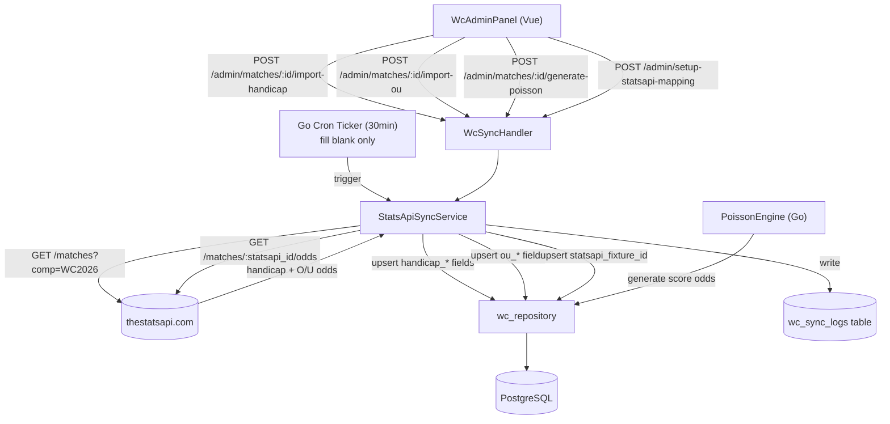

# System Design & Architecture

## Architecture Overview



**Key design decisions:**
- `StatsApiSyncService` là service layer mới, tách biệt với `WcService` hiện tại.
- Cron chạy trong goroutine khi backend start, dùng `time.Ticker`.
- Manual import và cron dùng cùng sync logic, chỉ khác trigger và overwrite policy.

---

## Data Models

### Thêm columns vào `wc_matches`
```sql
-- Mapping ID với TheStatsAPI (KHÔNG xoá external_id cũ — football-data.org ID vẫn giữ)
ALTER TABLE wc_matches ADD COLUMN statsapi_fixture_id VARCHAR(64);
CREATE UNIQUE INDEX ON wc_matches (statsapi_fixture_id) WHERE statsapi_fixture_id IS NOT NULL;

-- Over/Under odds (mới hoàn toàn)
ALTER TABLE wc_matches ADD COLUMN ou_line       NUMERIC(4,1);
ALTER TABLE wc_matches ADD COLUMN odds_over     NUMERIC(5,2);
ALTER TABLE wc_matches ADD COLUMN odds_under    NUMERIC(5,2);
ALTER TABLE wc_matches ADD COLUMN ou_synced_at  TIMESTAMPTZ;

-- Handicap sync timestamp (đã có handicap_* fields, chỉ thêm timestamp)
ALTER TABLE wc_matches ADD COLUMN odds_synced_at TIMESTAMPTZ;
```

### Bảng mới: `wc_sync_logs`
```sql
CREATE TABLE wc_sync_logs (
  id              UUID PRIMARY KEY DEFAULT gen_random_uuid(),
  trigger         VARCHAR(20) NOT NULL,  -- 'manual' | 'cron'
  sync_type       VARCHAR(20) NOT NULL,  -- 'handicap' | 'ou' | 'mapping'
  triggered_by    UUID,                  -- wc_user_id nếu manual, NULL nếu cron
  matches_updated INT NOT NULL DEFAULT 0,
  matches_failed  INT NOT NULL DEFAULT 0,
  error_detail    TEXT,
  created_at      TIMESTAMPTZ NOT NULL DEFAULT NOW()
);
```

### Go DTOs

```go
// Response từ TheStatsAPI — xác nhận format từ API docs
type StatsApiOdds struct {
    StatsapiFixtureID string

    // Asian Handicap (confirmed available)
    HandicapLine  float64 // âm = home chấp, dương = away chấp
    HandicapHome  float64 // odds phía home
    HandicapAway  float64 // odds phía away

    // Over/Under (confirmed available)
    OULine  float64 // vd 2.5
    OddsOver  float64
    OddsUnder float64
    // Note: TheStatsAPI trả key dạng "over_under_25" → parse line từ key
}

// Fixture từ TheStatsAPI cho mapping setup
type StatsApiFixture struct {
    ID       string
    HomeTeam string
    AwayTeam string
    MatchDate time.Time
}

// Poisson input — λ (avg goals per team)
type PoissonInput struct {
    MatchID     uuid.UUID
    HomeLambda  float64 // avg goals scored by home team
    AwayLambda  float64 // avg goals scored by away team
    HouseMargin float64 // vd 0.10 = 10%
    MinProb     float64 // vd 0.01 = chỉ include scorelines ≥ 1%
}
```

---

## API Design

### New Admin Endpoints

#### POST `/api/v1/wc/admin/setup-statsapi-mapping`
One-time: fetch tất cả WC2026 fixtures từ TheStatsAPI và auto-match với `wc_matches`.

**Request:** `{ "preview_only": true }`  
**Response:**
```json
{
  "matched": [
    { "wc_match_id": "...", "home_team": "Brazil", "away_team": "Argentina",
      "statsapi_fixture_id": "sa_789", "confidence": "exact" }
  ],
  "unmatched_local": [...],   // wc_matches không tìm được trận tương ứng trên API
  "unmatched_api": [...],     // fixtures trên API không có trong DB
  "total_api_fixtures": 64
}
```
**Response (preview_only=false):** `{ "ok": true, "mapped": 60, "skipped": 4 }`

---

#### POST `/api/v1/wc/admin/matches/:id/import-handicap`
Import kèo chấp cho 1 trận. Yêu cầu `statsapi_fixture_id` đã được set.

**Request:** `{ "preview_only": false }`  
**Response (preview_only=true):**
```json
{
  "match_id": "...",
  "statsapi_fixture_id": "sa_789",
  "current": { "handicap_team": null, "handicap_value": null, "odds_handicap_home": null, "odds_handicap_away": null },
  "proposed": { "handicap_team": "home", "handicap_value": 0.5, "odds_handicap_home": 1.85, "odds_handicap_away": 2.05 },
  "source": "thestatsapi.com",
  "fetched_at": "2026-06-17T10:00:00Z"
}
```
**Response (preview_only=false):** `{ "ok": true, "synced_at": "..." }`

---

#### POST `/api/v1/wc/admin/matches/:id/import-ou`
Import tài xỉu cho 1 trận.

**Request:** `{ "preview_only": false }`  
**Response (preview_only=true):**
```json
{
  "match_id": "...",
  "current": { "ou_line": null, "odds_over": null, "odds_under": null },
  "proposed": { "ou_line": 2.5, "odds_over": 1.83, "odds_under": 1.95 },
  "source": "thestatsapi.com",
  "fetched_at": "2026-06-17T10:00:00Z"
}
```

---

#### POST `/api/v1/wc/admin/matches/:id/generate-poisson`
Generate exact score odds bằng mô hình Poisson.

**Request:**
```json
{
  "home_lambda": 1.4,
  "away_lambda": 0.9,
  "house_margin": 0.10,
  "min_prob": 0.01,
  "preview_only": true
}
```
**Response (preview_only=true):**
```json
{
  "match_id": "...",
  "score_odds": [
    { "home_score": 1, "away_score": 0, "probability": 0.142, "odds": 6.27 },
    { "home_score": 0, "away_score": 0, "probability": 0.098, "odds": 9.11 }
  ],
  "count": 12,
  "house_margin": 0.10
}
```

---

#### GET `/api/v1/wc/admin/sync-logs`
Trả về 20 sync logs gần nhất.

---

## Component Breakdown

### Backend (Go)

#### `internal/service/statsapi_sync_service.go` *(mới)*
```go
type StatsApiSyncService struct {
    repo    *repository.WcRepository
    client  *http.Client
    apiKey  string
    baseURL string
}

// Mapping setup (US-6)
func (s *StatsApiSyncService) FetchWC2026Fixtures() ([]StatsApiFixture, error)
func (s *StatsApiSyncService) BuildMapping(local []*model.WcMatch, api []StatsApiFixture) MappingResult
func (s *StatsApiSyncService) SaveMapping(matches []MappedMatch) error

// Handicap import (US-1)
func (s *StatsApiSyncService) FetchOddsForMatch(statsapiID string) (*StatsApiOdds, error)
func (s *StatsApiSyncService) ImportHandicapForMatch(matchID uuid.UUID) error

// O/U import (US-2)
func (s *StatsApiSyncService) ImportOUForMatch(matchID uuid.UUID) error

// Cron (US-4) — fill blank only
func (s *StatsApiSyncService) SyncUpcomingMatchesBlank() (updated int, failed int, err error)
func (s *StatsApiSyncService) StartCron(interval time.Duration)
```

#### `internal/service/poisson_service.go` *(mới)*
```go
type PoissonService struct{}

// GenerateScoreOdds tính odds cho tất cả scorelines có prob >= minProb
func (p *PoissonService) GenerateScoreOdds(input PoissonInput) []model.WcScoreOdds
func (p *PoissonService) PoissonProb(lambda float64, k int) float64 // P(X=k)
```

#### `internal/api/wc_sync_handler.go` *(mới)*
- `SetupMapping(c *gin.Context)` — POST setup-statsapi-mapping
- `ImportHandicap(c *gin.Context)` — POST import-handicap
- `ImportOU(c *gin.Context)` — POST import-ou
- `GeneratePoisson(c *gin.Context)` — POST generate-poisson
- `GetSyncLogs(c *gin.Context)` — GET sync-logs

#### Env config
```
STATSAPI_KEY=<api_key>
STATSAPI_BASE_URL=https://api.thestatsapi.com/v1  # TBD
STATSAPI_CRON_INTERVAL=30m
```

### Frontend (Vue)

#### `WcAdminPanel.vue` — thêm vào header panel
- Button "Setup StatsAPI Mapping" (one-time, ở đầu panel) → mở `WcSetupMappingDialog.vue`

#### `WcAdminPanel.vue` — thêm vào từng match card
- Button "Import kèo châu Á" → mở `WcImportHandicapDialog.vue`
- Button "Import tài xỉu" → mở `WcImportOUDialog.vue`
- Button "Generate tỉ số Poisson" → mở `WcGeneratePoissonDialog.vue`
- Chip "Kèo sync HH:MM" / "Chưa sync" dựa vào `odds_synced_at`

#### `WcSetupMappingDialog.vue` *(mới)*
1. Gọi `POST /setup-statsapi-mapping` với `preview_only: true`
2. Hiển thị bảng matched / unmatched
3. Admin confirm → save mapping

#### `WcImportHandicapDialog.vue` *(mới)*
1. Gọi `POST .../import-handicap?preview=true` → hiển thị diff "Hiện tại vs Sẽ cập nhật"
2. Admin confirm → ghi DB + reload

#### `WcImportOUDialog.vue` *(mới)*
Tương tự WcImportHandicapDialog nhưng cho O/U fields.

#### `WcGeneratePoissonDialog.vue` *(mới)*
1. Admin nhập `home_lambda`, `away_lambda`, `house_margin` (có gợi ý từ API nếu có)
2. Gọi `POST .../generate-poisson?preview=true` → hiển thị bảng scorelines + odds
3. Admin confirm → upsert vào `wc_score_odds`

#### `wcService.ts` — thêm methods
```ts
setupStatsApiMapping(previewOnly: boolean): Promise<MappingResult>
importHandicap(matchId: string, previewOnly: boolean): Promise<ImportHandicapPreview>
importOU(matchId: string, previewOnly: boolean): Promise<ImportOUPreview>
generatePoisson(matchId: string, params: PoissonParams, previewOnly: boolean): Promise<PoissonPreview>
getSyncLogs(): Promise<WcSyncLog[]>
```

---

## Design Decisions

| Decision | Choice | Rationale |
|---|---|---|
| Preview-then-confirm | Yes | Tránh ghi dữ liệu sai từ API mà admin không kiểm tra được |
| Cron overwrite policy | Fill blank only | Không overwrite kèo admin đã set thủ công |
| Manual overwrite | Always overwrite | Admin chủ động import = muốn dùng giá trị mới |
| StatsAPI client | Plain `net/http` | Không cần SDK, tránh thêm dependency |
| Cron engine | `time.Ticker` trong goroutine | Backend Go đơn giản, không cần cron library |
| ExternalID | `external_id` = football-data.org ID, **giữ nguyên**. Thêm cột `statsapi_fixture_id` mới | Không breaking changes với code dùng external_id |
| Poisson engine | Service riêng `poisson_service.go` | Tách biệt math logic, dễ test độc lập |

---

## Non-Functional Requirements

- **Timeout:** HTTP call đến thestatsapi.com timeout sau 10s.
- **Retry:** Không retry tự động — nếu lỗi, log và bỏ qua (cron sẽ thử lại lần sau).
- **Rate limit:** Cron sleep 1s giữa mỗi match call để tránh hit rate limit.
- **Security:** API key lưu trong env var, không log, không trả về client.
- **Idempotency:** Import có thể chạy lại nhiều lần mà không tạo duplicate (upsert by unique key).
