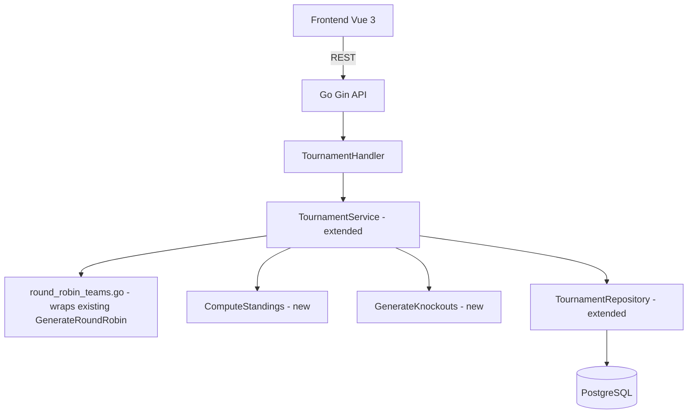

# System Design & Architecture

## Architecture Overview



The new format is a **pure extension** of the existing tournament system. No new service is introduced — `TournamentService` gains three new methods. The discriminator is a `format` field on the `Tournament` record.

---

## Data Models

### Modified: `tournaments` table

```go
type Tournament struct {
    // ... all existing fields unchanged ...
    Format          string     `gorm:"type:varchar(30);default:'classic'" json:"format"` // "classic" | "round_robin_top4"
    ChampionTeamID  *uuid.UUID `gorm:"type:uuid" json:"champion_team_id,omitempty"`      // set when Final result recorded
    ChampionTeam    *TournamentTeam `gorm:"foreignKey:ChampionTeamID" json:"champion_team,omitempty"`
}
```

```sql
ALTER TABLE tournaments ADD COLUMN format VARCHAR(30) NOT NULL DEFAULT 'classic';
ALTER TABLE tournaments ADD COLUMN champion_team_id UUID REFERENCES tournament_teams(id);
```

> `champion_team_id` is set by `RecordResult` when `stage="final"` is completed. Frontend reads this field directly — no computation needed.

---

### New: `tournament_teams` table

Stores fixed team compositions **with handicap snapshots** taken at tournament creation time.

```go
type TournamentTeam struct {
    ID                      uuid.UUID `gorm:"type:uuid;primary_key;default:gen_random_uuid()" json:"id"`
    TournamentID            uuid.UUID `gorm:"type:uuid;not null" json:"tournament_id"`
    Player1ID               uuid.UUID `gorm:"type:uuid;not null" json:"player1_id"`
    Player2ID               uuid.UUID `gorm:"type:uuid;not null" json:"player2_id"`
    Player1HandicapSnapshot float64   `gorm:"default:0.0" json:"player1_handicap_snapshot"` // snapshotted at creation
    Player2HandicapSnapshot float64   `gorm:"default:0.0" json:"player2_handicap_snapshot"` // snapshotted at creation
    Player1                 User      `gorm:"foreignKey:Player1ID" json:"player1,omitempty"`
    Player2                 User      `gorm:"foreignKey:Player2ID" json:"player2,omitempty"`
    CreatedAt               time.Time `json:"created_at"`
}
```

```sql
CREATE TABLE tournament_teams (
    id                        UUID PRIMARY KEY DEFAULT gen_random_uuid(),
    tournament_id             UUID NOT NULL REFERENCES tournaments(id) ON DELETE CASCADE,
    player1_id                UUID NOT NULL REFERENCES users(id),
    player2_id                UUID NOT NULL REFERENCES users(id),
    player1_handicap_snapshot FLOAT NOT NULL DEFAULT 0.0,
    player2_handicap_snapshot FLOAT NOT NULL DEFAULT 0.0,
    created_at                TIMESTAMPTZ DEFAULT now()
);
```

> Handicap snapshots replace the need to create `TournamentParticipant` records for this format. `RecordResult` reads handicap from `TournamentTeam` (via `Team1TeamID`/`Team2TeamID`) instead of from participants.

---

### Modified: `tournament_matches` table

```go
// New fields appended to TournamentMatch struct:
Stage       string     `gorm:"type:varchar(20);default:'group'" json:"stage"`    // "group" | "semi" | "final" | "third_place"
Team1TeamID *uuid.UUID `gorm:"type:uuid" json:"team1_team_id,omitempty"`         // FK → tournament_teams
Team2TeamID *uuid.UUID `gorm:"type:uuid" json:"team2_team_id,omitempty"`         // FK → tournament_teams
```

```sql
ALTER TABLE tournament_matches ADD COLUMN stage VARCHAR(20) NOT NULL DEFAULT 'group';
ALTER TABLE tournament_matches ADD COLUMN team1_team_id UUID REFERENCES tournament_teams(id);
ALTER TABLE tournament_matches ADD COLUMN team2_team_id UUID REFERENCES tournament_teams(id);
```

> `Team1Player1ID` / `Team1Player2ID` are still populated (denormalized) so the existing result-recording and match-creation logic works with minimal changes.
>
> **Handicap for `round_robin_top4` matches**: `HandicapTeam1` = sum of player handicap snapshots for team1 (from `TournamentTeam`); same for team2. Set at schedule generation time.

---

### Standings DTO (computed, never stored)

> `TournamentStanding` already exists in `frontend/src/types/tournament.ts` — extend rather than recreate. Backend counterpart is new.

```go
type TeamStanding struct {
    TeamID  uuid.UUID `json:"team_id"`
    Player1 User      `json:"player1"`
    Player2 User      `json:"player2"`
    Played  int       `json:"played"`
    Won     int       `json:"won"`
    Drawn   int       `json:"drawn"`
    Lost    int       `json:"lost"`
    GF      int       `json:"gf"`     // goals for (actual score, pre-handicap)
    GA      int       `json:"ga"`     // goals against
    GD      int       `json:"gd"`     // goal difference
    Points  int       `json:"points"`
    Seed    int       `json:"seed"`   // 1–4 for top 4; 0 = not qualified
}
```

Computed on-the-fly in `GET /tournaments/:id` from completed group-stage matches. Never stored.

**Sort order**: `points DESC` → `gd DESC` → `gf DESC`.

---

## API Design

### `POST /api/v1/tournaments` — Extended request for `round_robin_top4`

```json
{
  "name": "League Night #3",
  "format": "round_robin_top4",
  "teams": [
    { "player1_id": "u1", "player2_id": "u2" },
    { "player1_id": "u3", "player2_id": "u4" },
    { "player1_id": "u5", "player2_id": "u6" },
    { "player1_id": "u7", "player2_id": "u8" },
    { "player1_id": "u9", "player2_id": "u10" }
  ],
  "affects_score": true,
  "entry_fee": 0
}
```

- `player_ids` is **not used** for `round_robin_top4` — all player IDs are derived from `teams`.
- If `teams` is omitted, backend auto-assigns using existing tier-balanced pairing (reads all 10 `player_ids` in that case only).
- `match_type` is always `"2v2"` for this format and can be omitted — backend sets it automatically.
- Classic format request is unchanged.

**Validation:**
- `format = "round_robin_top4"` → exactly 5 teams required
- Each player ID must appear in exactly one team (no duplicates across teams)
- All player IDs must reference existing users

---

### `GET /api/v1/tournaments/:id` — Extended response

```json
{
  "id": "...",
  "name": "League Night #3",
  "format": "round_robin_top4",
  "status": "active",
  "affects_score": true,
  "champion_team_id": null,
  "champion_team": null,
  "teams": [
    {
      "id": "t1",
      "player1": { "id": "u1", "name": "Duy" },
      "player2": { "id": "u2", "name": "Nam" },
      "player1_handicap_snapshot": 0.5,
      "player2_handicap_snapshot": 0.0
    }
  ],
  "standings": [
    {
      "team_id": "t1", "player1": {...}, "player2": {...},
      "played": 3, "won": 2, "drawn": 1, "lost": 0,
      "gf": 8, "ga": 3, "gd": 5, "points": 7, "seed": 1
    }
  ],
  "matches": [
    { "stage": "group", "round": 1, "match_order": 1, "team1_team_id": "t1", "team2_team_id": "t2", "status": "completed", ... },
    { "stage": "semi",  "round": 6, "match_order": 1, "team1_team_id": "t1", "team2_team_id": "t4", "status": "pending", ... }
  ]
}
```

- `teams`, `standings`, `champion_team_id`, `champion_team` only populated when `format = "round_robin_top4"`.
- `standings` always recomputed from match data on every GET.

---

### New: `POST /api/v1/tournaments/:id/generate-knockouts`

**Preconditions (validated server-side):**
1. Tournament `format` is `round_robin_top4`
2. All 10 group-stage matches are `status = "completed"`
3. No knockout matches exist yet for this tournament
4. **No tie on top-4 boundary**: standings[3] and standings[4] must differ on at least one of pts / GD / GF — otherwise return 409 with message: `"Teams '{name1}' and '{name2}' are tied — resolve manually before generating knockouts"`

**Effect:**
1. Compute standings
2. Create semi1: `stage="semi"`, seed1 vs seed4, `round=6`, `match_order=1`; populate `Team1Player1ID` etc. from team members; set `HandicapTeam1`/`HandicapTeam2` from snapshots
3. Create semi2: `stage="semi"`, seed2 vs seed3, `round=6`, `match_order=2`; same handicap population

**Response:** Updated full tournament detail (same shape as GET).

---

### `RecordResult` — Extended behaviour for `round_robin_top4`

**Guard — group result lock:**
- If `match.Stage == "group"` AND knockout matches exist for this tournament → return 400: `"Group stage results are locked after knockout generation"`

**Auto-create Final & 3rd-place:**
- After recording a `stage="semi"` result, call `maybeCreateFinalMatches(tx, tournamentID)`:
  - Check if both semis are `status="completed"`
  - If yes: create `stage="final"` (winner semi1 vs winner semi2) and `stage="third_place"` (loser semi1 vs loser semi2), both `round=7`
  - Winner/loser determined by `effective_winner` field on each semi match
  - Guard: check `count(*) WHERE stage IN ('final','third_place')` before inserting — idempotent

**Set champion:**
- After recording a `stage="final"` result:
  - Determine winning team from `effective_winner`
  - Set `tournament.ChampionTeamID = winningTeamID`
  - Save tournament

---

## Component Breakdown

### Backend

```
internal/
  model/
    tournament.go                  ← add Format, ChampionTeamID, ChampionTeam to Tournament
                                     add Stage, Team1TeamID, Team2TeamID to TournamentMatch
                                     add TournamentTeam struct with handicap snapshots
  repository/
    tournament_repository.go       ← add CreateTeams, GetTeamsByTournament, GetMatchesByStage,
                                       HasKnockoutMatches (for lock check)
  service/
    tournament_service.go          ← add CreateRoundRobinTop4, ComputeStandings,
                                       GenerateKnockouts (with tie-check), maybeCreateFinalMatches,
                                       setChampion; extend RecordMatchResult with lock guard
    round_robin_teams.go           ← thin wrapper: calls existing GenerateRoundRobin(5) from
                                       round_robin.go, maps index pairs → TournamentTeam pairs
  api/
    tournament_handler.go          ← add GenerateKnockoutsHandler; extend CreateTournament, GetTournament
    router.go                      ← wire POST /tournaments/:id/generate-knockouts
  database/
    migrations/
      YYYYMMDD_add_tournament_format.go       ← format + champion_team_id on tournaments
      YYYYMMDD_add_tournament_teams.go        ← tournament_teams table
      YYYYMMDD_add_tournament_match_stage.go  ← stage + team_id columns on tournament_matches
```

### Frontend

```
src/
  types/
    tournament.ts               ← add TournamentTeam (with snapshots), extend TournamentStanding
                                   add stage field + team_id fields to TournamentMatch
                                   add champion_team_id + champion_team + teams + standings to Tournament
  services/
    tournamentService.ts        ← add generateKnockouts(); extend createTournament() with format + teams
  views/
    CreateTournamentView.vue    ← add format selector; add team-assignment step for round_robin_top4
    TournamentDetailView.vue    ← add standings panel + knockout section + champion banner
                                   "Generate Knockouts" button; group result lock (disable input)
  components/
    TournamentStandingsTable.vue    ← new: Pos/Team/P/W/D/L/GF/GA/GD/Pts; top-4 rows highlighted
    TournamentKnockoutBracket.vue   ← new: 4-slot bracket (Semi1, Semi2, Final, 3rd-place)
    TournamentFormatBadge.vue       ← new: inline chip ("Round Robin + Top 4" vs "Classic")
  router/index.ts               ← no new routes
```

---

## Key Algorithms

### Group-Stage Schedule: Wrapper over existing `GenerateRoundRobin`

`round_robin.go` already implements polygon rotation via `GenerateRoundRobin(n int) [][]MatchPair`. `round_robin_teams.go` is a thin wrapper:

```go
// round_robin_teams.go
func GenerateTeamSchedule(teams []TournamentTeam) []MatchSlot {
    // GenerateRoundRobin returns [][]MatchPair; each MatchPair has A, B int (indices); -1 = bye
    rounds := GenerateRoundRobin(len(teams)) // len = 5 → 5 rounds, 2 real matches each
    var schedule []MatchSlot
    for roundIdx, pairs := range rounds {
        order := 1
        for _, pair := range pairs {
            if pair.A == -1 || pair.B == -1 {
                continue // skip bye
            }
            schedule = append(schedule, MatchSlot{
                Team1:  teams[pair.A],
                Team2:  teams[pair.B],
                Round:  roundIdx + 1,
                Order:  order,
            })
            order++
        }
    }
    return schedule // 10 slots for 5 teams
}
```

Verified output for 5 teams: 5 rounds × 2 matches = 10 matches; each team appears exactly 4 times; all C(5,2)=10 pairs covered exactly once.

---

### Standings Computation

```go
func ComputeStandings(teams []TournamentTeam, matches []TournamentMatch) []TeamStanding {
    m := map[uuid.UUID]*TeamStanding{}
    for _, t := range teams {
        m[t.ID] = &TeamStanding{TeamID: t.ID, Player1: t.Player1, Player2: t.Player2}
    }
    for _, match := range matches {
        if match.Stage != "group" || match.Status != "completed" {
            continue
        }
        s1 := m[*match.Team1TeamID]
        s2 := m[*match.Team2TeamID]
        s1.GF += *match.ActualScore1; s1.GA += *match.ActualScore2
        s2.GF += *match.ActualScore2; s2.GA += *match.ActualScore1
        s1.Played++; s2.Played++
        switch *match.EffectiveWinner {
        case 1: s1.Won++; s2.Lost++; s1.Points += 3
        case 2: s2.Won++; s1.Lost++; s2.Points += 3
        default: s1.Drawn++; s2.Drawn++; s1.Points++; s2.Points++
        }
    }
    result := make([]TeamStanding, 0, len(teams))
    for _, s := range m {
        s.GD = s.GF - s.GA
        result = append(result, *s)
    }
    sort.Slice(result, func(i, j int) bool {
        if result[i].Points != result[j].Points { return result[i].Points > result[j].Points }
        if result[i].GD != result[j].GD { return result[i].GD > result[j].GD }
        return result[i].GF > result[j].GF
    })
    for i := range result {
        if i < 4 { result[i].Seed = i + 1 }
    }
    return result
}
```

### Tie Detection (in `GenerateKnockouts`)

```go
// After sorting standings:
if len(standings) == 5 {
    s4 := standings[3] // rank 4 (last qualifier)
    s5 := standings[4] // rank 5 (first eliminated)
    if s4.Points == s5.Points && s4.GD == s5.GD && s4.GF == s5.GF {
        return ErrTieBoundary{Team4: s4, Team5: s5}
    }
}
```

---

## Design Decisions

| Decision | Choice | Rationale |
|----------|--------|-----------|
| `format` discriminator | String field on `Tournament` | Additive; all existing classic tournaments keep `format='classic'` with no data change |
| `champion_team_id` on Tournament | Set by backend on Final RecordResult | Frontend reads one field — no computation; authoritative source of truth |
| Fixed teams in own table | `tournament_teams` | Teams referenced across multiple matches; normalisation avoids per-match duplication |
| Handicap snapshot in `TournamentTeam` | `player1/2_handicap_snapshot` fields | Cleaner than creating `TournamentParticipant` records alongside; team is the unit of this format |
| `player_ids` removed for `round_robin_top4` | Backend derives from `teams` | Eliminates redundancy and potential mismatch between two fields |
| `match_type` auto-set to "2v2" | Backend sets it; not required in request | Format is always 2v2 by definition |
| Standings computed on GET | Not stored | 10 group matches is trivial to aggregate; avoids write-sync complexity |
| Knockout trigger | Explicit `POST .../generate-knockouts` | Admin reviews standings before generating; no accidental trigger |
| Tie on top-4 boundary | 409 error blocking knockout generation | Admin manually resolves; head-to-head deferred to v2 |
| Group result lock | Guard in `RecordResult` once knockouts exist | Prevents standings/seeding inconsistency without complex rollback logic |
| Final + 3rd-place auto-create | Inside `RecordResult` once both semis done | Reduces manual steps; idempotent guard prevents duplication |
| `round_robin_teams.go` | Thin wrapper over existing `GenerateRoundRobin` | Reuses proven algorithm; no reimplementation needed |

## Non-Functional Requirements

- Schedule generation: O(n) for 5 teams — negligible
- Standings computation: O(10 rows) on every GET — negligible
- Migration is purely additive (new columns with defaults, new table) — no existing data affected
- No new authentication requirements
