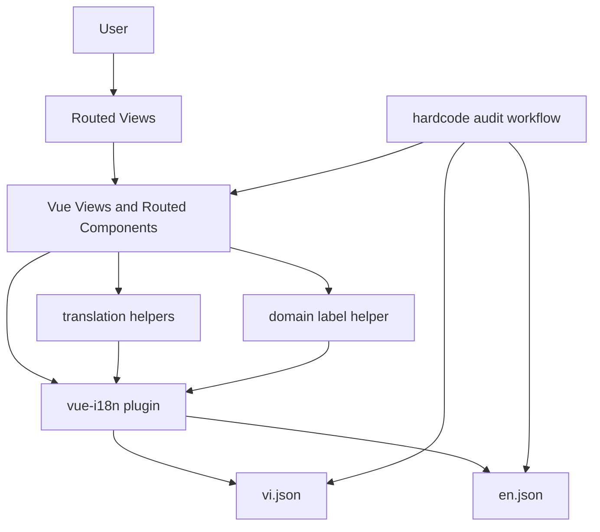

# System Design & Architecture

## Architecture Overview
**What is the high-level system structure?**

- Key components and responsibilities:
- `frontend/src/plugins/i18n.ts` remains the single localization entry point.
- `frontend/src/locales/vi.json` and `frontend/src/locales/en.json` remain the canonical source for user-facing copy.
- Vue views/components should access copy through `t(...)`, `$t(...)`, or shared helpers only.
- Repeated enum-like display values should be resolved through a small domain-specific label helper rather than copied into each view.
- Audit commands or grep-based checks identify hardcoded visible strings before or during review.

- Technology choices and rationale:
- Reuse `vue-i18n` rather than introducing another localization layer.
- Keep locale files as JSON to match current project structure and existing imports.
- Prefer targeted refactors over a large abstraction layer because the current issue is mostly coverage and discipline, not framework limitations.

## Data Models
**What data do we need to manage?**

- Core entities:
- Locale dictionaries grouped by domain: `common`, `nav`, `dashboard`, `users`, `matches`, `tournaments`, `settlements`, `fund`, `config`, `validation`, `errors`, `toast`.
- View-level display labels for tournament statuses, match types, standings columns, empty states, and confirmation dialogs.
- Domain label mappings for repeated backend-facing values such as tournament status, match type, and score-affect state.

- Data structures:
- Continue using flat nested JSON objects keyed by domain and feature.
- Introduce a richer `tournaments` subtree to cover list, detail, create, dialog, badge, standings, and result-entry copy.
- Keep domain label helper inputs aligned to existing backend values and map them to locale keys rather than literal strings.

- Data flow:
- Route/view renders request a key from `vue-i18n`.
- `vue-i18n` resolves current locale, falls back to `vi`, and logs missing keys in development.
- Manual audit cross-checks source templates against locale dictionaries.

## API Design
**How do components communicate?**

- No backend API changes are required.
- Internal interfaces remain unchanged for data fetching and mutations.
- Display-only mappings should be introduced in a dedicated frontend helper for values such as tournament status, match type, and score-affect flags.
- Authentication and authorization remain unchanged.

## Component Breakdown
**What are the major building blocks?**

- Routed views in scope:
- `frontend/src/views/DashboardView.vue`
- `frontend/src/views/UsersView.vue`
- `frontend/src/views/MatchesView.vue`
- `frontend/src/views/SettlementsView.vue`
- `frontend/src/views/FundView.vue`
- `frontend/src/views/ConfigView.vue`
- `frontend/src/views/TournamentsView.vue`
- `frontend/src/views/TournamentDetailView.vue`
- `frontend/src/views/CreateTournamentView.vue`

- Routed view support components with likely visible copy gaps:
- `frontend/src/components/user/UserTable.vue`
- `frontend/src/components/match/MatchForm.vue`
- `frontend/src/components/match/MatchList.vue`
- `frontend/src/components/match/RecentMatches.vue`
- `frontend/src/components/settlement/SettlementList.vue`
- `frontend/src/components/settlement/SettlementDetails.vue`
- `frontend/src/components/settlement/SettlementTriggerDialog.vue`
- `frontend/src/components/fund/FundForm.vue`
- `frontend/src/components/fund/FundTransactionList.vue`

- Shared layers involved:
- `frontend/src/locales/vi.json`
- `frontend/src/locales/en.json`
- `frontend/src/locales/README.md`
- `frontend/src/utils/i18n.ts`
- `frontend/src/plugins/i18n.ts`
- `frontend/src/router/index.ts`
- `frontend/src/utils` or a new domain label helper file for enum-like display mapping

## Design Decisions
**Why did we choose this approach?**

- Decision: Keep existing locale key structure and extend it by domain.
- Reason: Locale README already defines conventions and stable keys reduce refactor cost.

- Decision: Match implementation scope to actual routed views in the router.
- Reason: Requirements now cover all reachable frontend pages, so design must align to concrete route coverage rather than an informal high-priority subset.

- Decision: Execute tournament views first within the broader routed-view scope.
- Reason: They currently contain the densest visible hardcoded English copy and provide the fastest validation of the chosen localization approach.

- Decision: Map user-facing enum-like values to translations instead of rendering raw backend values directly.
- Reason: Raw values such as `active`, `completed`, or `1v1` are implementation-oriented and do not guarantee natural display copy.

- Decision: Put repeated enum-like label mapping in a dedicated domain helper instead of generic i18n utilities or per-view duplication.
- Reason: This keeps domain presentation logic reusable without bloating global translation helpers.

- Alternatives considered:
- A code-generation approach for locale types. Rejected for now because the immediate problem is copy coverage, not type safety.
- A global wrapper component for all labels. Rejected because it adds indirection without solving missing-key coverage.

## Non-Functional Requirements
**How should the system perform?**

- Performance:
- No meaningful runtime impact beyond additional dictionary lookups already handled by `vue-i18n`.

- Scalability:
- New locale keys should be grouped by feature so additional languages can reuse the same structure later.

- Security:
- No new security surface is introduced.
- Interpolated values in translated strings must remain plain text and avoid unsafe HTML rendering.

- Reliability:
- Missing-key warnings in development should remain enabled.
- Implementation should avoid partial key additions across locales.
- The documented hardcode-audit command should live in feature documentation during implementation and be a candidate for inclusion in contributor-facing locale docs after the feature lands.