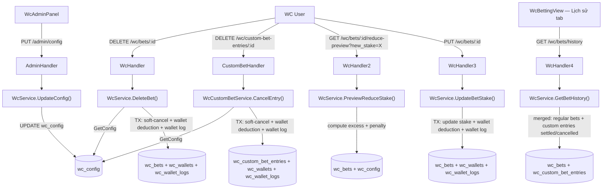

# System Design & Architecture

## Architecture Overview



---

## Data Models

### Migration 1: `wc_bets` — add `cancelled_at`, `cancel_penalty`, `original_stake`

```sql
ALTER TABLE wc_bets
  ADD COLUMN cancelled_at    TIMESTAMPTZ NULL,
  ADD COLUMN cancel_penalty  INT         NULL,
  ADD COLUMN original_stake  INT         NULL;
```

`original_stake` is set once at placement and never updated. `cancel_penalty` is set on soft-cancel.

### Migration 2: `wc_custom_bet_entries` — add `cancelled_at`, `cancel_penalty`, `original_stake`

```sql
ALTER TABLE wc_custom_bet_entries
  ADD COLUMN cancelled_at    TIMESTAMPTZ NULL,
  ADD COLUMN cancel_penalty  INT         NULL,
  ADD COLUMN original_stake  INT         NULL;
```

### Migration 3: `wc_config` — add 4 penalty fields

```sql
ALTER TABLE wc_config
  ADD COLUMN cancel_penalty_enabled   BOOLEAN NOT NULL DEFAULT FALSE,
  ADD COLUMN cancel_penalty_percent   INT     NOT NULL DEFAULT 20,
  ADD COLUMN bet_reduce_max_percent   INT     NOT NULL DEFAULT 50,
  ADD COLUMN bet_reduce_penalty_percent INT   NOT NULL DEFAULT 20;
```

`bet_reduce_max_percent = 0` means no limit (all reductions free).

### Migration 4: `wc_wallet_logs` — make `admin_id` nullable

```sql
ALTER TABLE wc_wallet_logs ALTER COLUMN admin_id DROP NOT NULL;
```

`admin_id = NULL` = system/user-initiated deduction (cancel penalty, reduce penalty).  
`admin_id IS NOT NULL` = admin manual adjustment (existing behavior).

---

### Go Model Changes

#### `internal/model/wc_match.go` — `WcBet`

```go
CancelledAt   *time.Time `gorm:"type:timestamptz"        json:"cancelled_at,omitempty"`
CancelPenalty *int       `gorm:"type:int"                json:"cancel_penalty,omitempty"`
OriginalStake *int       `gorm:"type:int"                json:"original_stake,omitempty"`
```

#### `internal/model/wc_custom_bet.go` — `WcCustomBetEntry`

```go
CancelledAt   *time.Time `gorm:"type:timestamptz"        json:"cancelled_at,omitempty"`
CancelPenalty *int       `gorm:"type:int"                json:"cancel_penalty,omitempty"`
OriginalStake *int       `gorm:"type:int"                json:"original_stake,omitempty"`
```

#### `internal/model/wc_user.go` — `WcConfig`

```go
CancelPenaltyEnabled      bool `gorm:"not null;default:false" json:"cancel_penalty_enabled"`
CancelPenaltyPercent      int  `gorm:"not null;default:20"    json:"cancel_penalty_percent"`
BetReduceMaxPercent       int  `gorm:"not null;default:50"    json:"bet_reduce_max_percent"`
BetReducePenaltyPercent   int  `gorm:"not null;default:20"    json:"bet_reduce_penalty_percent"`
```

#### `internal/model/wc_match.go` — `WcWalletLog`

```go
AdminID *uuid.UUID `gorm:"type:uuid" json:"admin_id,omitempty"`
```

---

## API Design

### `DELETE /api/v1/wc/bets/:id` — cancel regular bet

**Auth:** WcAuthMiddleware  
**Existing guards (unchanged):** ownership, `result IS NULL`, `cancelled_at IS NULL`, match not locked.

**Logic:**
1. Load `wc_config`
2. Compute `penalty = floor(stake × cancel_penalty_percent / 100)` using `shopspring/decimal`
3. DB transaction:
   a. `SoftCancelBet`: set `cancelled_at = NOW()`, `cancel_penalty = penalty`
   b. If `cancel_penalty_enabled AND penalty > 0`: deduct from wallet + create wallet log
4. Broadcast WebSocket cancel event (unchanged)
5. Return `200 {"ok": true, "penalty": penalty}`

Frontend uses `penalty` from response to show a post-cancel notification if needed.

---

### `DELETE /api/v1/wc/custom-bet-entries/:id` — cancel custom bet entry

**Auth:** WcAuthMiddleware  
**Existing guards:** ownership, entry `status = pending`, bet `status = open`.

**Same penalty logic as regular bet cancel** — uses same `wc_config` fields.

---

### `GET /api/v1/wc/bets/:id/reduce-preview` — dry-run preview

**Auth:** WcAuthMiddleware  
**Query param:** `new_stake=N` (integer)

**Logic:**
1. Load bet → verify ownership + pending + not locked
2. Load config → `bet_reduce_max_percent`, `bet_reduce_penalty_percent`
3. `original_stake` from bet record
4. Compute:
   ```
   allowed_min = ceil(original_stake × (1 - bet_reduce_max_percent/100))
   excess      = max(0, (original_stake - new_stake) - (original_stake - allowed_min))
   penalty     = floor(excess × bet_reduce_penalty_percent / 100)
   ```
5. Return `{"penalty": N, "excess": N, "allowed_min_stake": N}`

Frontend: if `penalty > 0`, show confirmation popup before calling `PUT /wc/bets/:id`.

---

### `PUT /api/v1/wc/bets/:id` — update stake (existing endpoint, updated logic)

**Auth:** WcAuthMiddleware  
**Body:** `{"stake": N}`

**Updated logic:**
1. Load bet → verify ownership + pending + not locked
2. If `new_stake > current_stake` → allow freely (no penalty check)
3. If `new_stake < current_stake`:
   a. Compute excess and penalty (same formula as preview)
   b. DB transaction: update stake + if penalty > 0, deduct wallet + wallet log (`note = "Giảm cược vượt giới hạn - phạt X%"`)
4. Return `200 {"ok": true, "penalty_applied": N}`

---

### `GET /api/v1/wc/config` — updated response

Returns all 4 new fields: `cancel_penalty_enabled`, `cancel_penalty_percent`, `bet_reduce_max_percent`, `bet_reduce_penalty_percent`.

---

### `PUT /api/v1/wc/admin/config` — updated request body

```json
{
  "is_enabled": true,
  "min_points": 1,
  "max_points": 10,
  "cancel_penalty_enabled": true,
  "cancel_penalty_percent": 20,
  "bet_reduce_max_percent": 50,
  "bet_reduce_penalty_percent": 20
}
```

**Validation:**
- `cancel_penalty_percent`: 1–100
- `bet_reduce_max_percent`: 0–100 (0 = disabled)
- `bet_reduce_penalty_percent`: 1–100

---

### `GET /api/v1/wc/bets/history` — merged history (new endpoint)

**Auth:** WcAuthMiddleware  
**Returns:** Combined + sorted list of:
- `wc_bets` where `result IS NOT NULL OR cancelled_at IS NOT NULL`
- `wc_custom_bet_entries` where `status IN ('won','lost','void') OR cancelled_at IS NOT NULL`

Ordered by `created_at DESC` across both sets.

**Response shape** — unified `BetHistoryItem`:
```json
{
  "id": "...",
  "kind": "regular",           // "regular" | "custom"
  "match_id": "...",
  "home_team": "Brazil",
  "away_team": "France",
  "match_date": "...",
  "bet_type": "handicap",       // null for custom
  "bet_title": null,            // custom bet title, null for regular
  "stake": 10,
  "original_stake": 10,
  "odds_snapshot": 1.9,
  "result": null,               // null if cancelled
  "payout": null,
  "cancelled_at": "2026-06-30T10:00:00Z",
  "cancel_penalty": 2,
  "created_at": "..."
}
```

---

## Component Breakdown

### Backend

#### `internal/model/`
- `wc_match.go`: add `CancelledAt`, `CancelPenalty`, `OriginalStake` to `WcBet`; nullable `AdminID` on `WcWalletLog`
- `wc_custom_bet.go`: add `CancelledAt`, `CancelPenalty`, `OriginalStake` to `WcCustomBetEntry`
- `wc_user.go`: add 4 new fields to `WcConfig`

#### `internal/repository/wc_repository.go` — new/updated methods

```go
// SoftCancelBet sets cancelled_at + cancel_penalty on a wc_bet.
func (r *WcRepository) SoftCancelBet(tx *gorm.DB, id, wcUserID uuid.UUID, penalty int) error

// CreateWalletLogSystem creates a wallet_log with admin_id = NULL.
func (r *WcRepository) CreateWalletLogSystem(tx *gorm.DB, log *model.WcWalletLog) error

// GetWalletTx returns wallet inside a transaction.
func (r *WcRepository) GetWalletTx(tx *gorm.DB, wcUserID uuid.UUID) (*model.WcWallet, error)

// ListBetHistoryForUser returns settled + cancelled wc_bets for a user.
func (r *WcRepository) ListBetHistoryForUser(wcUserID uuid.UUID) ([]*model.WcBet, error)

// SetOriginalStake sets original_stake at placement (if not already set).
func (r *WcRepository) SetOriginalStake(tx *gorm.DB, betID uuid.UUID, stake int) error
```

Also update `PlaceBet` to set `original_stake = stake` at creation.  
Also update pending-bet queries to add `AND cancelled_at IS NULL` guard.

#### `internal/repository/wc_custom_bet_repository.go` — new methods

```go
// SoftCancelEntry sets cancelled_at + cancel_penalty on a wc_custom_bet_entry.
func (r *WcCustomBetRepository) SoftCancelEntry(tx *gorm.DB, id, wcUserID uuid.UUID, penalty int) error

// ListCancelledEntriesForUser returns cancelled custom bet entries for history.
func (r *WcCustomBetRepository) ListCancelledOrSettledEntriesForUser(wcUserID uuid.UUID) ([]*model.WcCustomBetEntry, error)
```

Also update `PlaceEntry` to set `original_stake = stake` at creation.

#### `internal/service/wc_service.go` — updated methods

```go
// DeleteBet: soft-cancel + conditional wallet penalty (cancel_penalty_enabled + penalty > 0)
func (s *WcService) DeleteBet(wcUserID, betID uuid.UUID) error

// PreviewReduceStake: compute penalty without writing anything
func (s *WcService) PreviewReduceStake(wcUserID, betID uuid.UUID, newStake int) (penalty, excess, allowedMin int, err error)

// UpdateBetStake: update stake + conditional wallet penalty for over-limit reduction
func (s *WcService) UpdateBetStake(wcUserID, betID uuid.UUID, newStake int) (penaltyApplied int, err error)

// GetBetHistory: merged regular + custom history
func (s *WcService) GetBetHistory(wcUserID uuid.UUID) ([]BetHistoryItem, error)
```

**Penalty helper (shared by DeleteBet and CancelEntry):**
```go
func applyPenaltyToWallet(tx *gorm.DB, repo WcRepo, wcUserID uuid.UUID, penalty int, note string) (actualDeduction float64, err error)
```

#### `internal/service/wc_custom_bet_service.go` — updated

```go
// CancelEntry: soft-cancel + conditional wallet penalty
func (s *WcCustomBetService) CancelEntry(wcUserID, entryID uuid.UUID) error
```

#### `internal/api/wc_handler.go` — new handlers

```go
func (h *WcHandler) PreviewReduceStake(c *gin.Context)  // GET /wc/bets/:id/reduce-preview
func (h *WcHandler) GetBetHistory(c *gin.Context)        // GET /wc/bets/history
```

#### `internal/api/router.go`

```go
wcAuth.GET("/bets/history", wcHandler.GetBetHistory)
wcAuth.GET("/bets/:id/reduce-preview", wcHandler.PreviewReduceStake)
```

---

### Frontend

#### `frontend/src/types/wc.ts`

```ts
interface WcConfig {
  // ...existing...
  cancel_penalty_enabled: boolean
  cancel_penalty_percent: number
  bet_reduce_max_percent: number
  bet_reduce_penalty_percent: number
}

interface WcBet {
  // ...existing...
  cancelled_at?: string | null
  cancel_penalty?: number | null
  original_stake?: number | null
}

interface BetHistoryItem {
  id: string
  kind: 'regular' | 'custom'
  match_id: string
  home_team: string
  away_team: string
  match_date: string
  bet_type?: string
  bet_title?: string
  stake: number
  original_stake: number
  odds_snapshot: number
  result?: string | null
  payout?: number | null
  cancelled_at?: string | null
  cancel_penalty?: number | null
  created_at: string
}
```

#### `frontend/src/services/wcService.ts`

```ts
async getBetHistory(): Promise<BetHistoryItem[]>
async previewReduceStake(betId: string, newStake: number): Promise<{ penalty: number, excess: number, allowed_min_stake: number }>
```

#### `frontend/src/views/WcBettingView.vue`

- Lịch sử tab: call `wcService.getBetHistory()` instead of aggregating per-match data
- Cancel flow:
  ```ts
  async function handleCancelBet(bet: WcBet) {
    const cfg = store.config
    const penalty = Math.floor(bet.stake * cfg.cancel_penalty_percent / 100)
    if (cfg.cancel_penalty_enabled && penalty > 0) {
      await ElMessageBox.confirm(
        t('wc.cancelPenaltyWarning', { penalty, percent: cfg.cancel_penalty_percent }),
        t('wc.cancelBetTitle'),
        { type: 'warning' }
      )
    }
    await wcService.deleteBet(bet.id)
    await refreshBets()
  }
  ```

#### Reduce stake flow (in bet edit component)

```ts
async function handleUpdateStake(bet: WcBet, newStake: number) {
  if (newStake < bet.stake) {
    const preview = await wcService.previewReduceStake(bet.id, newStake)
    if (preview.penalty > 0) {
      await ElMessageBox.confirm(
        t('wc.reducePenaltyWarning', { penalty: preview.penalty }),
        t('wc.reduceStakeTitle'),
        { type: 'warning' }
      )
    }
  }
  await wcService.updateBetStake(bet.id, newStake)
  await refreshBets()
}
```

#### `frontend/src/components/wc/WcBetHistoryList.vue`

- Accept `BetHistoryItem[]` instead of `WcBet[]`
- Render `[Đã hủy]` badge + penalty info for cancelled items:
  ```html
  <template v-if="bet.cancelled_at">
    <el-tag type="info" size="small">Đã hủy</el-tag>
    <span class="wc-penalty-text">Phạt: {{ bet.cancel_penalty ?? 0 }} điểm</span>
  </template>
  ```

#### `frontend/src/components/wc/WcAdminPanel.vue`

```html
<!-- Cancel Penalty -->
<el-form-item :label="t('wc.cancelPenaltyLabel')">
  <el-switch v-model="configForm.cancel_penalty_enabled" />
</el-form-item>
<el-form-item :label="t('wc.cancelPenaltyPercentLabel')">
  <el-input-number v-model="configForm.cancel_penalty_percent"
    :min="1" :max="100" :step="5"
    :disabled="!configForm.cancel_penalty_enabled" />
</el-form-item>

<!-- Reduce Stake Penalty -->
<el-form-item :label="t('wc.reduceMaxPercentLabel')">
  <el-input-number v-model="configForm.bet_reduce_max_percent"
    :min="0" :max="100" :step="5" />
  <span class="wc-config-hint">0 = không giới hạn</span>
</el-form-item>
<el-form-item :label="t('wc.reducePenaltyPercentLabel')">
  <el-input-number v-model="configForm.bet_reduce_penalty_percent"
    :min="1" :max="100" :step="5"
    :disabled="configForm.bet_reduce_max_percent === 0" />
</el-form-item>
```

#### `frontend/src/locales/vi.json` + `en.json`

```json
// vi.json additions
"cancelBetTitle": "Xác nhận hủy cược",
"cancelPenaltyWarning": "Hủy cược sẽ bị phạt {percent}% = {penalty} điểm trừ vào ví. Bạn có chắc?",
"reduceStakeTitle": "Xác nhận giảm cược",
"reducePenaltyWarning": "Giảm vượt giới hạn, bị phạt {penalty} điểm. Bạn có chắc?",
"betCancelledBadge": "Đã hủy",
"cancelPenaltyLabel": "Phạt hủy cược",
"cancelPenaltyPercentLabel": "% phạt hủy",
"reduceMaxPercentLabel": "Giới hạn giảm tối đa",
"reducePenaltyPercentLabel": "% phạt giảm vượt giới hạn"
```

---

## Design Decisions

| Decision | Choice | Rationale |
|---|---|---|
| Soft-delete via `cancelled_at` | Instead of hard-delete | Preserves history record in Lịch sử tab |
| `cancel_penalty` on bet record | Instead of deriving from wallet logs | Direct read for history display; wallet log note is secondary audit |
| `original_stake` on bet record | Immutable after placement | Reduce limit always measured from original, not current stake |
| `admin_id` nullable on `wc_wallet_logs` | NULL = system-initiated | No separate audit table needed |
| Dry-run preview endpoint | Before `PUT /wc/bets/:id` | Accurate penalty before user commits; avoids surprises |
| Merged `GET /wc/bets/history` | Regular + custom entries combined | Single endpoint; unified Lịch sử tab; consistent UX |
| `BetHistoryItem` unified shape | `kind: "regular" | "custom"` | Frontend renders one component for both types |
| Floor (not round) for penalty | `floor(x)` | Favors user; avoids charging more than intended |
| Penalty capped at wallet balance | No negative wallets | Users can't go into debt |
| `bet_reduce_max_percent = 0` = disabled | No separate toggle | Fewer admin controls; 0 is intuitive "no limit" |
| Cancel dialog: only when enabled AND penalty > 0 | Skip dialog if penalty = 0 | No value in confirming a consequence-free action |

---

## Non-Functional Requirements

- **Atomicity:** Every write (soft-cancel + wallet deduction + wallet log) in one DB transaction
- **Security:** Ownership enforced at service layer for cancel and reduce
- **Data integrity:** `cancelled_at IS NULL` guard on all pending-bet queries (settlement, block-user void, open-bet listing)
- **Backward compatibility:** `original_stake` backfilled as NULL for existing bets — reduce-penalty logic treats NULL original_stake as "no limit applies" (safe default)
- **No negative wallets:** Penalty deduction always capped at `min(penalty, current_balance)`
