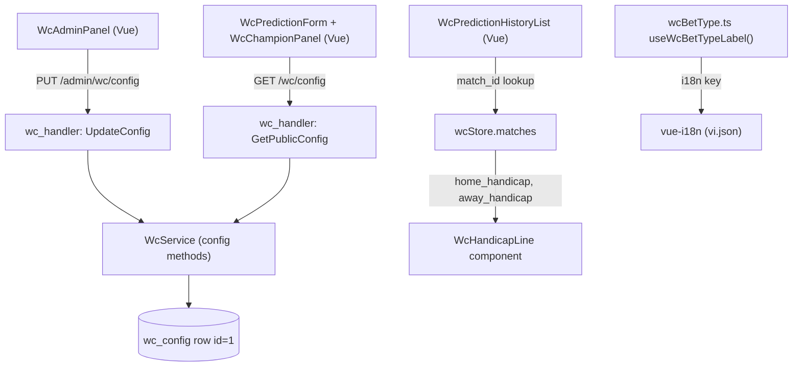

# System Design & Architecture

## Architecture Overview



## Data Models

### `wc_config` table — add two columns

```sql
ALTER TABLE wc_config
  ADD COLUMN min_points INTEGER NOT NULL DEFAULT 1,
  ADD COLUMN max_points INTEGER NOT NULL DEFAULT 5;
```

Go model update in `backend/internal/model/wc_user.go` (WcConfig is defined here, not a separate file):
```go
type WcConfig struct {
    ID        int        `gorm:"primaryKey;autoIncrement:false" json:"id"`
    IsEnabled bool       `gorm:"default:false" json:"is_enabled"`
    MinPoints int        `gorm:"not null;default:1" json:"min_points"`
    MaxPoints int        `gorm:"not null;default:5" json:"max_points"`
    UpdatedAt time.Time  `json:"updated_at"`
    UpdatedBy *uuid.UUID `gorm:"type:uuid" json:"updated_by,omitempty"`
}
```

No new table needed — `wc_config` is already a single-row settings record.

## API Design

### GET /api/v1/wc/config (extend existing `GetPublicConfig` response)

There are two config endpoints. Extend `GetPublicConfig` (the public one, no auth required) to also return limits:
```json
{
  "is_enabled": true,
  "min_points": 1,
  "max_points": 5
}
```

`GetConfig` (admin, returns full model) already returns the new fields automatically once the model is updated.

### PUT /api/v1/wc/admin/config (extend existing endpoint)

Accept additional optional fields:
```json
{
  "is_enabled": true,
  "min_points": 2,
  "max_points": 10
}
```

Validation rules (service layer, not Gin binding):
- `min_points >= 1`
- `max_points >= min_points`
- Both are integers

### Prediction placement — dynamic validation

In `WcService.PlacePrediction()` and `WcService.PlaceBet()` and `WcService.UpdateBetStake()` — all three currently hardcode `max=5`:
```go
cfg, err := s.repo.GetConfig()
if err != nil { return nil, err }
if points < cfg.MinPoints || points > cfg.MaxPoints {
    return nil, fmt.Errorf("điểm cược phải từ %d đến %d", cfg.MinPoints, cfg.MaxPoints)
}
```

Remove the hardcoded `req.Stake > 5` checks in `PlaceBet` and `UpdateBetStake`. Remove the Gin binding `max=5` tag from prediction request structs.

## Component Breakdown

### 1. Configurable Limits

**Backend:**
- `backend/internal/model/wc_user.go`: add `MinPoints int`, `MaxPoints int` to `WcConfig` struct.
- `backend/internal/repository/wc_repository.go`: `GetConfig()` already returns the full row; no new method needed.
- `backend/internal/service/wc_service.go`: replace hardcoded `Stake > 5` in `PlaceBet()` and `UpdateBetStake()` with dynamic config check via `s.repo.GetConfig()`.
- `backend/internal/service/wc_champion_service.go`: same — replace hardcoded points check.
- `backend/internal/api/wc_handler.go`: extend `UpdateConfig` request struct to accept `min_points`/`max_points`; extend `GetPublicConfig` response to include them.

**Frontend:**
- `wcStore` (Pinia, `frontend/src/stores/wcStore.ts`): add `minPoints: number` and `maxPoints: number` to state; populate from `GET /wc/config` alongside `isEnabled`.
- `WcPredictionForm.vue`: bind `:min="wcStore.minPoints"` and `:max="wcStore.maxPoints"` on all three `<el-input-number>` inputs (handicap, over/under, exact score).
- `WcChampionPanel.vue`: same bindings on the champion prediction points input (currently `:min="1" :max="5"`).
- `WcAdminPanel.vue`: add a "Giới hạn dự đoán" section with two `<el-input-number>` fields (min/max) and a save button.

### 2. Handicap Display in Predict Tabs

**Data flow:** `WcPredictionHistoryList` receives `WcPredictionWithMatch[]` as props. The type does NOT currently include handicap fields. However, `wcStore` already holds the full match list (including `home_handicap`, `away_handicap`). The component can look up the match client-side by `prediction.match_id`.

**No backend change required.** Client-side join:
```ts
// inside WcPredictionHistoryList.vue
const match = wcStore.matches.find(m => m.id === prediction.match_id)
// pass match.home_handicap / match.away_handicap to WcHandicapLine
```

**New component:** `WcHandicapLine.vue`

```vue
<!-- Props: homeTeam, awayTeam, homeHandicap: number|null, awayHandicap: number|null -->
<!-- Renders: muted subtitle line "Vietnam chấp Morocco 0.5 trái" or nothing -->
```

**Visual placement:** Subtitle line directly under the match name, above the bet type badge. Small muted text (e.g. `text-sm text-gray-400`).

```
┌─────────────────────────────────────────┐
│ Vietnam vs Morocco          23/06 21:00 │
│ Vietnam chấp Morocco 0.5 trái           │  ← WcHandicapLine (small, muted)
│                                         │
│ [Kèo Handicap]  Chọn: Chủ nhà  3 điểm  │
│                               ⏳ Chờ    │
└─────────────────────────────────────────┘
```

Logic:
- If `homeHandicap > 0` → home gives handicap: `"[homeTeam] chấp [awayTeam] [homeHandicap] trái"`
- If `awayHandicap > 0` → away gives handicap: `"[awayTeam] chấp [homeTeam] [awayHandicap] trái"`
- Otherwise → render nothing (level match or handicap not yet configured)

Display location in `WcPredictionHistoryList.vue`:
- For each prediction where `type === 'handicap'`, render `<WcHandicapLine>` directly under the match title line.

### 3. Consistent Bet-Type Labels (Extensible Utility)

**Problem with ad-hoc approach:** "Kèo góc" (corner kick bet) is planned as a future type. If label strings are scattered across components, every new type requires hunting down all usages. We need a single file to change.

**Design: `frontend/src/utils/wcBetType.ts`** — a dedicated module (not buried in a generic `wc.ts`) that owns all bet-type knowledge:

```ts
// frontend/src/utils/wcBetType.ts

export const WC_BET_TYPES = ['handicap', 'exact_score', 'over_under', 'corner'] as const
export type WcBetType = typeof WC_BET_TYPES[number]

// Maps type → i18n key. Adding a new type = add one line here + one key in vi.json.
export const BET_TYPE_I18N_KEYS: Record<WcBetType, string> = {
  handicap:    'betTypeHandicap',
  exact_score: 'betTypeExactScore',
  over_under:  'betTypeOverUnder',
  corner:      'betTypeCorner',       // ready when "Kèo góc" ships
}

// Composable for use in templates — avoids double t() calls at call site
export function useWcBetTypeLabel() {
  const { t } = useI18n()
  return (type: WcBetType) => t(BET_TYPE_I18N_KEYS[type] ?? type)
}
```

**`vi.json` additions:**
```json
"betTypeHandicap":    "Kèo Handicap",
"betTypeExactScore":  "Kèo tỉ số",
"betTypeOverUnder":   "Kèo tài xỉu",
"betTypeCorner":      "Kèo góc"
```

> Note: rename keys from `predictionTypeHandicap` → `betTypeHandicap` for clarity and to signal this is the canonical set. Update all existing usages of the old keys at the same time.

**Usage in any component:**
```vue
<script setup>
const betTypeLabel = useWcBetTypeLabel()
</script>
<template>
  <span>{{ betTypeLabel(prediction.type) }}</span>
</template>
```

**Adding a new type in the future (e.g., "Kèo góc"):**
1. Add `'corner'` to `WC_BET_TYPES` and `BET_TYPE_I18N_KEYS` in `wcBetType.ts`.
2. Add `"betTypeCorner": "Kèo góc"` to `vi.json`.
3. Add the backend constant in `wc_match.go`.
4. Zero component changes — TypeScript will surface any exhaustiveness gaps at compile time.

**All 6 files to fix — verified from codebase audit:**

| File | Current rendering | Problem |
|------|------------------|---------|
| `WcPredictionForm.vue` | `t('predictionTypeHandicap')`, **hardcoded `"Tài Xỉu"`**, `t('predictionTypeExactScore')` | Over/Under tab not via i18n |
| `WcBetForm.vue` | `t('betTypeHandicap')` → "Chấp", `t('betTypeExactScore')` → "Tỉ số" | Different wording from predictions |
| `WcPredictionHistoryList.vue` | Ternary 3-branch using `predictionType*` keys | Not using shared utility |
| `WcMatchPredictionList.vue` | Ternary 2-branch — **missing `over_under`** branch (falls through to "Kèo tỉ số") | Bug + not using shared utility |
| `WcMatchBetList.vue` | `t('betTypeHandicap')` → "Chấp", `t('betTypeExactScore')` → "Tỉ số" | Different wording |
| `WcBetHistoryList.vue` | `t('betTypeHandicap')` → "Chấp", `t('betTypeExactScore')` → "Tỉ số" | Different wording |

**After fix — all 6 files use `betTypeLabel(type)` from `useWcBetTypeLabel()`:**
- "Kèo Handicap" everywhere (tab labels, badges, history rows)
- "Kèo tỉ số" everywhere
- "Kèo tài xỉu" everywhere

**i18n cleanup:** Remove old `betTypeHandicap: "Chấp"` and `betTypeExactScore: "Tỉ số"` keys from `vi.json` after migration. The old `predictionType*` keys are also replaced by the new `betType*` canonical set.

## Design Decisions

| Decision | Rationale |
|----------|-----------|
| Extend `wc_config` row rather than new table | Single-row config pattern already established; no join needed |
| Dynamic validation in service layer (not Gin binding) | Gin binding tags are compile-time constants; service can query DB |
| `WcHandicapLine` as separate component | Reusable in bet form, history, and any future match-level summary |
| Dedicated `wcBetType.ts` module (not generic `wc.ts`) | Bet types will grow ("Kèo góc" next); isolating them makes `as const` + exhaustiveness checks work cleanly |
| `useWcBetTypeLabel()` composable over bare map | Composable hides the `t()` call — components don't need to import both the map and i18n |
| Rename i18n keys to `betType*` prefix | `predictionType*` was ambiguous; `betType*` is the canonical term for all kèo labels |

## Non-Functional Requirements

- **Performance:** `GET /wc/config` is cached in Pinia store; no per-bet config fetch.
- **Security:** Config update requires `is_admin = true` (existing `WcAdminMiddleware`).
- **Backwards compatibility:** Default values (min=1, max=5) in migration ensure no existing config row breaks.
