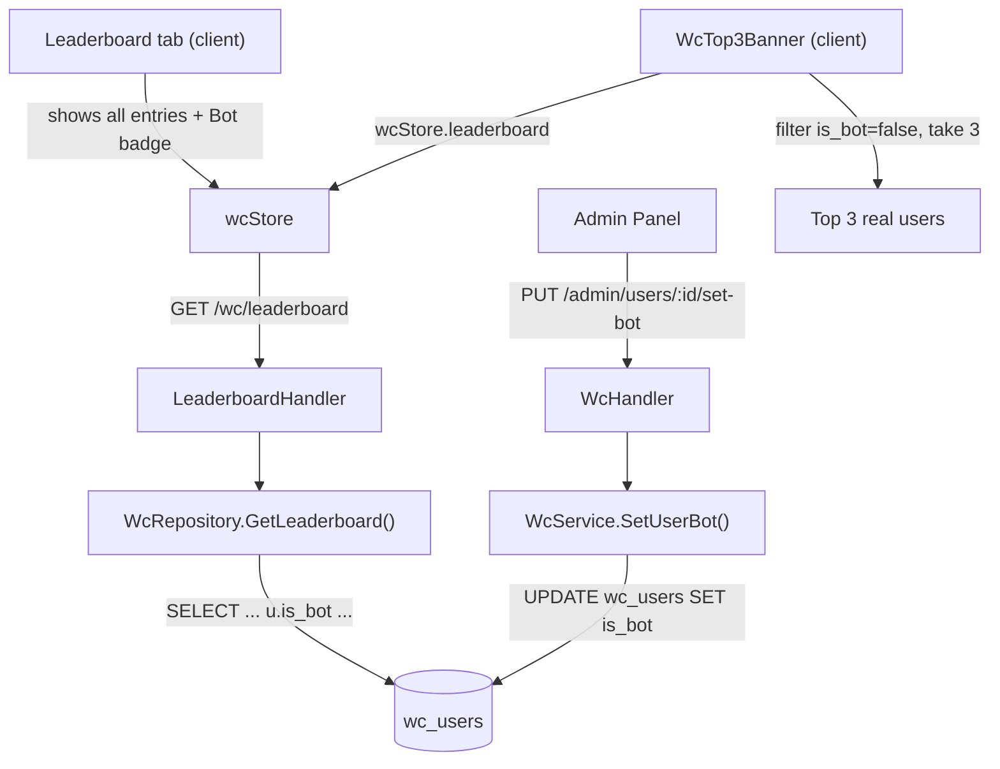

# System Design & Architecture

## Architecture Overview



---

## Data Models

### Migration — `wc_users`

```sql
ALTER TABLE wc_users ADD COLUMN IF NOT EXISTS is_bot BOOLEAN NOT NULL DEFAULT FALSE;
```

### `WcUser` model

```go
IsBot bool `gorm:"not null;default:false" json:"is_bot"`
```

### `WcLeaderboardEntry` model

Add `IsBot` to the projection so the frontend can use it:

```go
type WcLeaderboardEntry struct {
    WcUserID         uuid.UUID `json:"wc_user_id"`
    Name             string    `json:"name"`
    AvatarURL        *string   `json:"avatar_url"`
    IsBot            bool      `json:"is_bot"`           // NEW
    NetPoints        float64   `json:"net_points"`
    TotalPredictions int       `json:"total_predictions"`
    Correct          int       `json:"correct"`
    WinHalf          int       `json:"win_half"`
    LoseHalf         int       `json:"lose_half"`
    Incorrect        int       `json:"incorrect"`
    Rank             int       `json:"rank"`
}
```

---

## API Design

### `PUT /api/v1/wc/admin/users/:wc_user_id/bot`

Admin-only (requires `WcAdminMiddleware`). Follows the existing `/:wc_user_id/role`, `/:wc_user_id/block`, `/:wc_user_id/unblock` pattern.

**Request body**
```json
{ "is_bot": true }
```

**Response**
```json
{ "ok": true }
```

**Errors**
- `400` — invalid user ID or body
- `500` — DB error

### `GET /api/v1/wc/leaderboard` (modified)

No change to URL or query params. Response entries now include `is_bot: bool`. Backward compatible.

---

## Component Breakdown

### Backend

| File | Change |
|---|---|
| `backend/internal/model/wc_user.go` | Add `IsBot bool` to `WcUser` |
| `backend/internal/model/wc_match.go` (or separate file) | Add `IsBot bool` to `WcLeaderboardEntry` |
| `backend/internal/database/database.go` | Add migration SQL |
| `backend/internal/repository/wc_repository.go` | Add `u.is_bot` to `GetLeaderboard` SELECT; add `SetUserBot` method |
| `backend/internal/service/wc_service.go` | Add `SetUserBot(userID uuid.UUID, isBot bool) error` |
| `backend/internal/api/wc_handler.go` | Add `SetUserBot` handler |
| `backend/internal/api/router.go` | Wire `PUT /admin/users/:wc_user_id/bot` |

### Frontend

| File | Change |
|---|---|
| `frontend/src/types/wc.ts` | Add `is_bot?: boolean` to `WcLeaderboardEntry` and `WcUser` |
| `frontend/src/components/wc/WcTop3Banner.vue` | Change `top3` computed: filter `!e.is_bot`, take first 3 |
| `frontend/src/components/wc/WcTop3BannerCard.vue` | No change needed (bot entries won't appear) |
| `frontend/src/components/wc/WcLeaderboard.vue` | Show "Bot" badge next to name when `entry.is_bot` |
| `frontend/src/components/wc/WcAdminPanel.vue` | Add bot toggle button in user list |
| `frontend/src/services/wcService.ts` | Add `setUserBot(userId, isBot)` |
| `frontend/src/stores/wcStore.ts` | Add `setUserBot` action |

---

## Design Decisions

**Client-side filtering for the banner (not a separate API)**
The full leaderboard is already in `wcStore.leaderboard`. Filtering `is_bot = false` for the top-3 slice is O(n) over a small list and requires zero extra network calls. A dedicated `/leaderboard/top3-real` endpoint would be over-engineering.

**`is_bot` on leaderboard entry, not fetched separately**
The leaderboard query already joins `wc_users`; adding `u.is_bot` to the SELECT is free.

**Separate endpoint `set-bot` vs extending `set-role`**
Keeps concerns separate — role (admin/user) vs nature (bot/real). Both follow the same handler pattern.

---

## Non-Functional Requirements

- Migration is idempotent (`ADD COLUMN IF NOT EXISTS`).
- No performance impact — `is_bot` is a boolean column on a small table.
- Existing leaderboard API consumers receive `is_bot: false` for all current entries (safe default).
