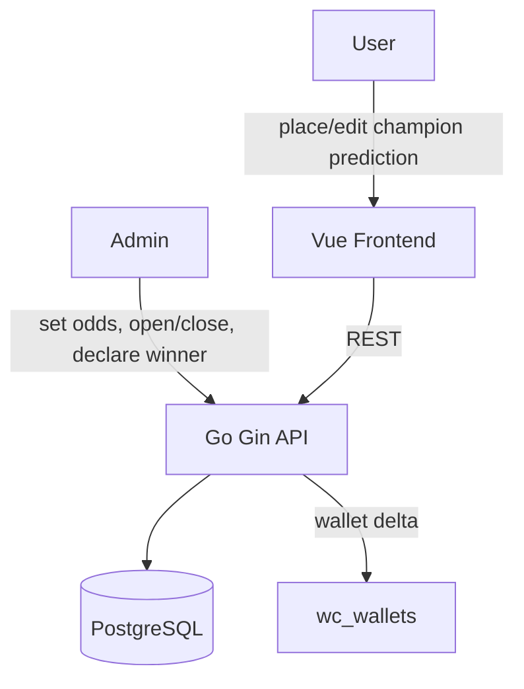

# System Design & Architecture

## Architecture Overview



Champion prediction là tournament-level, **tách biệt hoàn toàn** khỏi match-level predictions. Dùng chung `wc_wallets` để quản lý điểm.

---

## Data Models

### `wc_champion_teams`
Danh sách đội + odds do admin set. Seed sẵn khi feature được bật.

```sql
CREATE TABLE wc_champion_teams (
  id         UUID PRIMARY KEY DEFAULT gen_random_uuid(),
  name       VARCHAR(100) NOT NULL UNIQUE,  -- "Argentina", "France", ...
  code       VARCHAR(10)  NOT NULL,         -- "ARG", "FRA", ...
  flag_emoji VARCHAR(10),                   -- "🇦🇷", "🇫🇷", ...
  odds       NUMERIC(6,2) NOT NULL,         -- 3.50, 4.00, ...
  created_at TIMESTAMPTZ NOT NULL DEFAULT NOW(),
  updated_at TIMESTAMPTZ NOT NULL DEFAULT NOW()
);
```

### `wc_champion_config`
Trạng thái toàn cục của feature champion prediction.

```sql
CREATE TABLE wc_champion_config (
  id           UUID PRIMARY KEY DEFAULT gen_random_uuid(),
  is_open      BOOLEAN NOT NULL DEFAULT false,  -- cửa sổ dự đoán có mở không
  winner_id    UUID REFERENCES wc_champion_teams(id),  -- NULL cho đến khi admin công bố
  settled_at   TIMESTAMPTZ,                            -- NULL cho đến khi đã settle
  created_at   TIMESTAMPTZ NOT NULL DEFAULT NOW(),
  updated_at   TIMESTAMPTZ NOT NULL DEFAULT NOW()
);
-- Luôn chỉ có đúng 1 row (singleton config)
```

### `wc_champion_predictions`
Mỗi user chỉ có tối đa 1 row.

```sql
CREATE TABLE wc_champion_predictions (
  id           UUID PRIMARY KEY DEFAULT gen_random_uuid(),
  wc_user_id   UUID NOT NULL REFERENCES wc_users(id),
  team_id      UUID NOT NULL REFERENCES wc_champion_teams(id),
  points       INT  NOT NULL CHECK (points >= 1 AND points <= 5),
  odds_snapshot NUMERIC(6,2) NOT NULL,  -- odds tại thời điểm đặt
  result       VARCHAR(20),             -- NULL | 'correct' | 'incorrect'
  points_earned INT,                    -- NULL until settled
  created_at   TIMESTAMPTZ NOT NULL DEFAULT NOW(),
  updated_at   TIMESTAMPTZ NOT NULL DEFAULT NOW(),
  UNIQUE (wc_user_id)  -- mỗi user chỉ 1 prediction
);
```

---

## API Design

### Public endpoints (feature-enabled, no auth required)
> Đặt trong `wcFeature` group (cùng với `GET /leaderboard`, `GET /matches`)

| Method | Path | Description |
|--------|------|-------------|
| GET | `/api/v1/wc/champion/teams` | Danh sách đội + odds |
| GET | `/api/v1/wc/champion/config` | Trạng thái (is_open, winner_team nếu đã settle) |
| GET | `/api/v1/wc/champion/predictions` | Tất cả predictions — public leaderboard |

**GET /champion/predictions response:**
```json
[
  {
    "user_name": "Dennis",
    "team_name": "Argentina",
    "team_code": "ARG",
    "flag_emoji": "🇦🇷",
    "points": 3,
    "odds_snapshot": 3.50,
    "payout_if_correct": 10,
    "result": null
  }
]
```

### User endpoints (JWT required, feature must be enabled)

| Method | Path | Description |
|--------|------|-------------|
| GET | `/api/v1/wc/champion/my-prediction` | Prediction của user hiện tại |
| POST | `/api/v1/wc/champion/predict` | Đặt hoặc cập nhật prediction |
| DELETE | `/api/v1/wc/champion/predict` | Xóa prediction (khi còn mở) |

**POST /predict request:**
```json
{ "team_id": "<uuid>", "points": 3 }
```

**POST /predict response:**
```json
{
  "id": "<uuid>",
  "team_name": "Argentina",
  "team_code": "ARG",
  "flag_emoji": "🇦🇷",
  "points": 3,
  "odds_snapshot": 3.50,
  "payout_if_correct": 10
}
```

### Admin endpoints (JWT + isAdmin required)

| Method | Path | Description |
|--------|------|-------------|
| POST | `/api/v1/wc/admin/champion/teams` | Thêm đội |
| PUT | `/api/v1/wc/admin/champion/teams/:id` | Cập nhật odds |
| PUT | `/api/v1/wc/admin/champion/config` | Mở/đóng cửa sổ |
| POST | `/api/v1/wc/admin/champion/settle` | Công bố vô địch + settle tất cả |

**PUT /config request:**
```json
{ "is_open": true }
```

**POST /settle request:**
```json
{ "winner_team_id": "<uuid>" }
```

**POST /settle response:**
```json
{
  "winner": "Argentina",
  "settled_count": 24,
  "correct_count": 5,
  "total_points_awarded": 87
}
```

---

## Seed Data — Odds mẫu WC2026

Dựa theo sức mạnh thực tế, đây là odds khởi điểm (admin có thể chỉnh):

| Đội | Code | Flag | Odds | Ghi chú |
|-----|------|------|------|---------|
| Argentina | ARG | 🇦🇷 | 3.50 | ĐKVĐ, Messi era |
| France | FRA | 🇫🇷 | 4.00 | Mbappé, squad mạnh |
| England | ENG | 🏴󠁧󠁢󠁥󠁮󠁧󠁿 | 5.00 | Kane, đang lên |
| Brazil | BRA | 🇧🇷 | 5.00 | Vinicius Jr |
| Spain | ESP | 🇪🇸 | 5.50 | ĐKVĐ Euro 2024 |
| Germany | GER | 🇩🇪 | 7.00 | Rebuildng |
| Portugal | POR | 🇵🇹 | 8.00 | Ronaldo era cuối |
| Netherlands | NED | 🇳🇱 | 9.00 | Van Dijk, Gakpo |
| USA | USA | 🇺🇸 | 15.00 | Host, nhưng yếu |
| Morocco | MAR | 🇲🇦 | 18.00 | Surprise team |
| Japan | JPN | 🇯🇵 | 20.00 | Châu Á mạnh nhất |
| Mexico | MEX | 🇲🇽 | 20.00 | Host, trung bình |

---

## Component Breakdown

### Backend (Go)
- `wc_champion_handler.go` — HTTP handlers
- `wc_champion_service.go` — business logic (place, settle)
- Extend `wc_repository.go` hoặc tạo `wc_champion_repository.go`
- Migration: 3 bảng mới + seed data

### Frontend (Vue)
- `WcChampionPanel.vue` — section trong `WcPredictView`, gồm:
  - Bảng odds các đội
  - Form chọn đội + số điểm
  - Preview payout
  - Hiện prediction hiện tại của user (nếu đã đặt)
- `WcChampionPublicView.vue` (optional) — bảng ai đặt đội nào, public

---

## Design Decisions

| Quyết định | Lý do |
|-----------|-------|
| Tách bảng riêng (không reuse `wc_predictions`) | `wc_predictions` có FK `match_id NOT NULL` — không phù hợp cho tournament-level |
| Singleton `wc_champion_config` | Chỉ có 1 giải WC2026; không cần multi-config |
| `UNIQUE (wc_user_id)` trong predictions | Enforce 1 user 1 prediction ở DB level, không chỉ app level |
| `odds_snapshot` | Lưu odds lúc đặt cược để tránh sai lệch khi admin thay đổi odds sau |
| Settle ghi thẳng vào `wc_wallets` | Dùng chung wallet, điểm champion tự động tính vào settlement cuối giải |

---

## Non-Functional Requirements

- **Settle idempotent-safe:** nếu gọi 2 lần, lần 2 là no-op (check `settled_at IS NOT NULL`)
- **Settle requires closed window:** service kiểm tra `is_open = false` trước khi settle; nếu `is_open = true` → return lỗi `"close the prediction window before settling"`
- **Prediction chỉ accept khi `is_open = true`** (check ở service layer)
- **Max 5 điểm / min 1 điểm** — validate ở cả frontend và backend
- **Wallet log:** mỗi lần settle cập nhật wallet, phải gọi `LogWalletChange` vào `wc_wallet_logs` (cùng pattern với match predictions) — source = `"champion"`
- **`odds_snapshot` khi update prediction:** nếu user đổi đội, `odds_snapshot` được lấy theo odds hiện tại của đội mới tại thời điểm update (không giữ odds cũ)
- **`wc_champion_config` singleton:** được seed tại startup trong `database.go` (cùng pattern `seedWcConfig`) với `is_open = false`, `winner_id = NULL`
