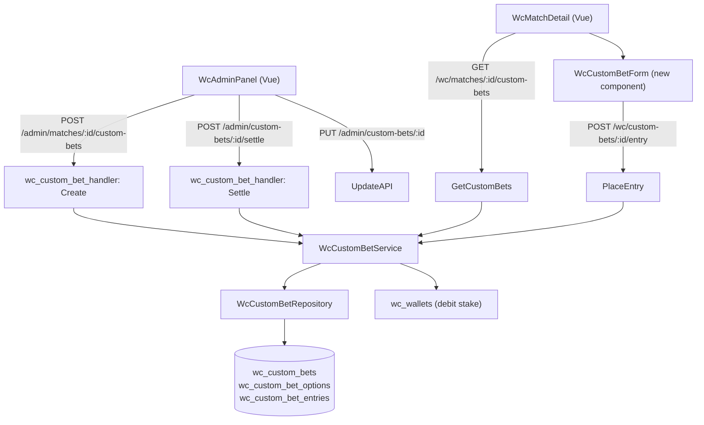

# System Design & Architecture

## Architecture Overview



## Data Models

### `wc_custom_bets` — one row per proposition

```sql
CREATE TABLE wc_custom_bets (
  id         UUID PRIMARY KEY DEFAULT gen_random_uuid(),
  match_id   UUID NOT NULL REFERENCES wc_matches(id),
  title      VARCHAR(300) NOT NULL,
  status     VARCHAR(20) NOT NULL DEFAULT 'open',  -- open | closed | settled | void
  created_by UUID REFERENCES wc_users(id),
  created_at TIMESTAMPTZ NOT NULL DEFAULT NOW(),
  settled_at TIMESTAMPTZ,
  settled_by UUID REFERENCES wc_users(id)
);
```

### `wc_custom_bet_options` — N options per bet

```sql
CREATE TABLE wc_custom_bet_options (
  id             UUID PRIMARY KEY DEFAULT gen_random_uuid(),
  custom_bet_id  UUID NOT NULL REFERENCES wc_custom_bets(id) ON DELETE CASCADE,
  label          VARCHAR(200) NOT NULL,
  odds           NUMERIC(6,2) NOT NULL,
  is_winner      BOOLEAN NOT NULL DEFAULT FALSE,
  display_order  INT NOT NULL DEFAULT 0
);
```

### `wc_custom_bet_entries` — one entry per player per bet

```sql
CREATE TABLE wc_custom_bet_entries (
  id             UUID PRIMARY KEY DEFAULT gen_random_uuid(),
  custom_bet_id  UUID NOT NULL REFERENCES wc_custom_bets(id),
  option_id      UUID NOT NULL REFERENCES wc_custom_bet_options(id),
  wc_user_id     UUID NOT NULL REFERENCES wc_users(id),
  stake          INT NOT NULL,
  odds_snapshot  NUMERIC(6,2) NOT NULL,   -- locked at bet time
  payout         NUMERIC(10,2),           -- set on settlement
  status         VARCHAR(20) NOT NULL DEFAULT 'pending',  -- pending | won | lost | void
  created_at     TIMESTAMPTZ NOT NULL DEFAULT NOW(),
  UNIQUE (custom_bet_id, wc_user_id)      -- one entry per player per bet
);
```

### Go models (`backend/internal/model/wc_custom_bet.go`)

```go
type WcCustomBet struct {
    ID        uuid.UUID  `gorm:"type:uuid;primaryKey;default:gen_random_uuid()"`
    MatchID   uuid.UUID  `gorm:"type:uuid;not null"`
    Title     string     `gorm:"type:varchar(300);not null"`
    Status    string     `gorm:"type:varchar(20);not null;default:'open'"`
    CreatedBy *uuid.UUID `gorm:"type:uuid"`
    CreatedAt time.Time
    SettledAt *time.Time
    SettledBy *uuid.UUID `gorm:"type:uuid"`
}

type WcCustomBetOption struct {
    ID           uuid.UUID `gorm:"type:uuid;primaryKey;default:gen_random_uuid()"`
    CustomBetID  uuid.UUID `gorm:"type:uuid;not null"`
    Label        string    `gorm:"type:varchar(200);not null"`
    Odds         float64   `gorm:"type:numeric(6,2);not null"`
    IsWinner     bool      `gorm:"default:false"`
    DisplayOrder int       `gorm:"default:0"`
}

type WcCustomBetEntry struct {
    ID          uuid.UUID  `gorm:"type:uuid;primaryKey;default:gen_random_uuid()"`
    CustomBetID uuid.UUID  `gorm:"type:uuid;not null"`
    OptionID    uuid.UUID  `gorm:"type:uuid;not null"`
    WcUserID    uuid.UUID  `gorm:"type:uuid;not null"`
    Stake       int        `gorm:"not null"`
    OddsSnapshot float64   `gorm:"type:numeric(6,2);not null"`
    Payout      *float64   `gorm:"type:numeric(10,2)"`
    Status      string     `gorm:"type:varchar(20);not null;default:'pending'"`
    CreatedAt   time.Time
}

// View model for API responses
type WcCustomBetWithOptions struct {
    WcCustomBet
    Options     []WcCustomBetOption     `json:"options"`
    MyEntry     *WcCustomBetEntry       `json:"my_entry,omitempty"`
}
```

## API Design

### Admin endpoints

```
POST /api/v1/wc/admin/matches/:id/custom-bets
  Body: { title, options: [{ label, odds, display_order }] }
  → Creates bet + options, status=open

PUT  /api/v1/wc/admin/custom-bets/:id
  Body: { title?, status?, options?: [{ id?, label, odds }] }
  → Update title/status (open↔closed), update option odds if no entries yet

POST /api/v1/wc/admin/custom-bets/:id/settle
  Body: { winning_option_id }
  → Sets is_winner=true, calculates payouts, updates wallets, status=settled

PUT  /api/v1/wc/admin/custom-bets/:id/void
  → Refunds all pending/won entries, status=void

GET  /api/v1/wc/admin/matches/:id/custom-bets
  → All custom bets for a match including entries (admin view)
```

### Player endpoints

```
GET  /api/v1/wc/matches/:id/custom-bets
  → All open+closed+settled custom bets for a match; includes my_entry per bet

POST /api/v1/wc/custom-bets/:id/entry
  Body: { option_id, stake }
  → Place entry; deducts stake from wallet; enforces min/max points & unique constraint

DELETE /api/v1/wc/custom-bet-entries/:entry_id
  → Cancel pending entry; refunds stake to wallet
```

## Settlement Logic

```go
func (s *WcCustomBetService) Settle(betID, winningOptionID, adminID uuid.UUID) error {
    // 1. Load bet + all entries
    // 2. Validate: status == open|closed, winningOptionID is a valid option
    // 3. Mark winning option: is_winner = true
    // 4. For each entry:
    //    - if option_id == winningOptionID: payout = stake × odds_snapshot, status = "won"
    //      → credit wallet, write wc_wallet_log
    //    - else: payout = 0, status = "lost"
    // 5. Update custom bet: status = "settled", settled_at = now, settled_by = adminID
    // All in one DB transaction
}
```

**Void logic:**
- For each entry with status `pending`: refund stake → wallet, status = "void"
- Custom bet status = "void"

## Component Breakdown

### Backend (new files)
- `backend/internal/model/wc_custom_bet.go` — 3 models + view model
- `backend/internal/repository/wc_custom_bet_repository.go`
- `backend/internal/service/wc_custom_bet_service.go`
- `backend/internal/api/wc_custom_bet_handler.go`
- Routes wired in `backend/internal/api/router.go`
- GORM AutoMigrate in `backend/internal/database/database.go`

### Frontend (new components)
- `frontend/src/types/wc.ts` — add `WcCustomBet`, `WcCustomBetOption`, `WcCustomBetEntry` types
- `frontend/src/components/wc/WcCustomBetCard.vue` — player-facing: shows title, options, odds, stake input, place/cancel button
- `frontend/src/components/wc/WcAdminCustomBetPanel.vue` — admin: create/edit/settle/void custom bets for a match
- `WcMatchDetail.vue` / match detail page — render `WcCustomBetCard` list for the match
- `WcAdminPanel.vue` match row — link to `WcAdminCustomBetPanel`
- Bet history: extend `WcBetHistoryList.vue` or add `WcCustomBetHistoryList.vue`

### i18n
- Add `"betTypeCustom": "Kèo phụ"` to `vi.json` and register `'custom'` in `wcBetType.ts`

## Design Decisions

| Decision | Rationale |
|----------|-----------|
| Separate tables (not extending `wc_bets`) | `wc_bets` has a fixed schema (handicap/score-specific columns). Custom bets have dynamic options — fundamentally different structure |
| `odds_snapshot` in entry | Same pattern as `wc_bets` — admin can change future odds without invalidating existing entries |
| One entry per player per bet (UNIQUE constraint) | Prevents double-betting. Player cancels and re-bets to change option |
| Settlement in DB transaction | Atomic: all payouts + wallet updates succeed or all roll back |
| `display_order` on options | Admin controls option order in UI |
| Status flow: open → closed → settled / void | Separates "no new bets" from "result entered" — admin can close early then settle later |

## Non-Functional Requirements

- **Atomicity:** Settlement must be a single transaction; partial settlement is not acceptable.
- **Security:** Create/settle/void/update endpoints require `WcAdminMiddleware`. Place/cancel require `WcAuthMiddleware`.
- **Performance:** `GET /wc/matches/:id/custom-bets` joins options + my_entry in one query. Expected < 10 custom bets per match.
- **Backwards compatibility:** New tables only; no changes to existing `wc_bets` or `wc_predictions`.
