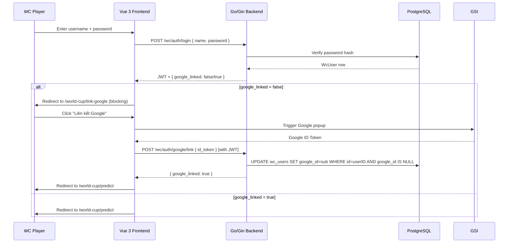
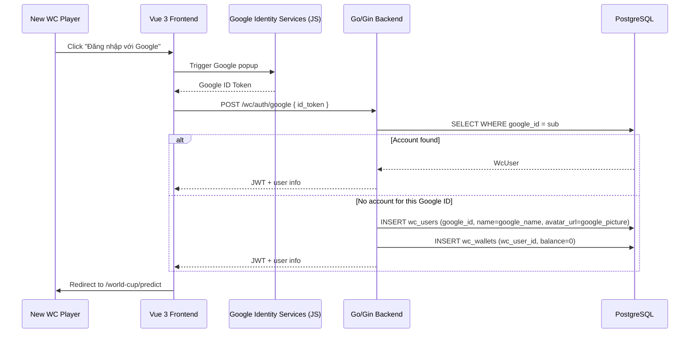

# System Design & Architecture

## Architecture Overview

There are **two distinct auth flows** after this feature ships:

### Flow A — Existing player (password login + Google link gate)



### Flow B — New player (Google login → auto-create)



## Data Models

### Schema changes to `wc_users`

```sql
-- Migration up
ALTER TABLE wc_users
  ADD COLUMN IF NOT EXISTS google_id  VARCHAR(100),
  ADD COLUMN IF NOT EXISTS avatar_url VARCHAR(500);
  -- password_hash stays NOT NULL — existing players keep their password

CREATE UNIQUE INDEX IF NOT EXISTS idx_wc_users_google_id
  ON wc_users (google_id)
  WHERE google_id IS NOT NULL;
```

**No data is altered.** All existing rows get `google_id = NULL` and `avatar_url = NULL`.

### Updated WcUser Go struct

```go
type WcUser struct {
  ID           uuid.UUID `gorm:"type:uuid;primaryKey;default:gen_random_uuid()"`
  Name         string    `gorm:"size:100;not null;uniqueIndex"`
  PasswordHash *string   `gorm:"size:255"`              // nullable for Google-only new accounts
  GoogleID     *string   `gorm:"size:100;uniqueIndex"`  // Google sub; NULL = not yet linked
  AvatarURL    *string   `gorm:"size:500"`
  IsAdmin      bool      `gorm:"default:false"`
  CreatedAt    time.Time
  UpdatedAt    time.Time
}
```

`PasswordHash` is now a pointer (nullable) to support new Google-only accounts which have no password.

### WC JWT Claims (unchanged)

```go
type WcClaims struct {
  WcUserID uuid.UUID
  Name     string
  IsAdmin  bool
  jwt.RegisteredClaims
}
```

The login response adds a `google_linked` boolean field alongside the token — this is **not** in the JWT, just in the HTTP response body.

## API Design

### Kept endpoints

#### `POST /api/v1/wc/auth/login` _(unchanged behaviour)_
Username/password login. Response gains one new field: `google_linked`.

**Request:** `{ "name": "...", "password": "..." }` _(unchanged)_

**Response 200:**
```json
{
  "token": "<WC JWT>",
  "user_id": "<uuid>",
  "name": "TigerFC",
  "is_admin": false,
  "google_linked": false
}
```

`google_linked: false` → frontend MUST redirect to `/world-cup/link-google` before any other route.

---

### New endpoints

#### `POST /api/v1/wc/auth/google` _(no auth required)_
Login or auto-create via Google. Used by new players only (and by already-linked players who prefer Google login).

**Request:** `{ "id_token": "<Google ID Token>" }`

**Response 200 — account found or just created:**
```json
{
  "token": "<WC JWT>",
  "user_id": "<uuid>",
  "name": "Nguyễn Văn A",
  "avatar_url": "https://lh3.googleusercontent.com/...",
  "is_admin": false,
  "google_linked": true
}
```

**Response 400:** Invalid or expired Google token.
**Response 409:** Google account is already linked to a different WC account (edge case — shouldn't happen in normal use).

---

#### `POST /api/v1/wc/auth/google/link` _(requires WcJWT)_
Links the authenticated player's account to a Google identity. Called from the `/world-cup/link-google` blocking page.

**Request:** `{ "id_token": "<Google ID Token>" }` _(Authorization: Bearer <JWT> header required)_

**Response 200:**
```json
{ "google_linked": true, "avatar_url": "https://..." }
```

**Response 409:** This Google account is already linked to a different WC player.
**Response 400:** Invalid token.

---

#### `GET /api/v1/wc/profile` _(requires WcJWT + google_linked)_
Return current player's profile.

**Response 200:**
```json
{
  "id": "<uuid>",
  "name": "TigerFC",
  "avatar_url": "https://...",
  "is_admin": false,
  "google_linked": true,
  "created_at": "2025-06-01T00:00:00Z"
}
```

---

#### `PUT /api/v1/wc/profile` _(requires WcJWT + google_linked)_
Update display name and/or avatar URL.

**Request:**
```json
{
  "name": "Tên Mới",
  "avatar_url": "https://..."
}
```

**Response 200:** Updated profile (same shape as GET).
**Response 409:** Name taken. **Response 422:** Validation error.

---

### Removed endpoints

| Endpoint | Action | Reason |
|---|---|---|
| `POST /wc/auth/register` | **Remove** | New players use Google; existing players already have accounts |
| `POST /wc/auth/reset-password` | **Remove** | No self-service password reset for players (admin can reset via DB) |

### Protected route middleware behaviour

All WC protected routes (except `/wc/auth/google/link`) enforce **two checks** via middleware:
1. `WcJWTMiddleware` — valid JWT required (existing, unchanged)
2. `WcGoogleLinkedMiddleware` — `google_id IS NOT NULL`; returns `403 { "error": "google_not_linked" }` if not

The `/wc/auth/google/link` endpoint uses `WcJWTMiddleware` only (no google-link check — that's the endpoint that satisfies the requirement).

Admin routes (`/wc/admin/*`) are **exempt from `WcGoogleLinkedMiddleware`** — admin accounts are not required to link Google.

## Component Breakdown

### Backend (Go)

| File | Change |
|---|---|
| `backend/internal/model/wc_user.go` | Add `GoogleID *string`, `AvatarURL *string`; make `PasswordHash *string` |
| `backend/internal/service/wc_auth_service.go` | Add `GoogleLoginOrCreate`, `LinkGoogleToAccount` methods; keep `Login`; remove `Register`, `ResetPassword` |
| `backend/internal/service/wc_profile_service.go` | **New** — `GetProfile`, `UpdateProfile` |
| `backend/internal/api/wc_auth_handler.go` | Add `HandleGoogleLoginOrCreate`, `HandleGoogleLink`; remove `HandleRegister`, `HandleResetPassword`; add `google_linked` to login response |
| `backend/internal/api/wc_profile_handler.go` | **New** — `HandleGetProfile`, `HandleUpdateProfile` |
| `backend/internal/middleware/wc_auth.go` | Add `WcGoogleLinkedMiddleware`; keep `WcJWTMiddleware` unchanged |
| `backend/internal/router/wc_router.go` | Update route wiring per API table above |
| `backend/migrations/` | New SQL migration file |

### Frontend (Vue 3)

| File | Change |
|---|---|
| `frontend/src/views/WcLoginView.vue` | Keep username/password form; ADD "Đăng nhập với Google" button below |
| `frontend/src/views/WcLinkGoogleView.vue` | **New** — blocking page shown after password login if `google_linked = false` |
| `frontend/src/views/WcRegisterView.vue` | **Delete** (route redirects to `/world-cup/login`) |
| `frontend/src/views/WcProfileView.vue` | **New** — profile edit form |
| `frontend/src/stores/wcAuthStore.ts` | Keep `login()`; add `loginWithGoogle()`, `linkGoogle()`; remove `register()`, `resetPassword()`; add `avatarUrl`, `googleLinked` to user state |
| `frontend/src/services/wcAuthService.ts` | Add `googleLogin()`, `googleLink()` calls; remove `register()`, `resetPassword()` |
| `frontend/src/services/wcProfileService.ts` | **New** |
| `frontend/src/router/index.ts` | Add `/world-cup/link-google` route; add `/world-cup/profile`; remove `/world-cup/register`; update guard |
| `frontend/src/types/wc.ts` | Add `avatarUrl`, `googleLinked` to `WcAuthUser`; add `WcProfile` |
| `index.html` | Add GSI script tag |

### Router guard logic

```typescript
// In router/index.ts beforeEach guard
if (to.meta.requiresWcAuth) {
  if (!authStore.isLoggedIn) {
    return '/world-cup/login'
  }
  // Must link Google before accessing any protected page except the link page itself
  if (!authStore.user.googleLinked && to.path !== '/world-cup/link-google') {
    return '/world-cup/link-google'
  }
}
```

### Avatar display locations

| Location | Implementation |
|---|---|
| Navbar / header | `` chip next to player name |
| Leaderboard / ranking table | Avatar column in the ranking list (fallback: initials or default icon) |
| Profile page | Large avatar with preview on URL change |
| Bet / prediction history | Small avatar thumbnail in history row |

All avatar `` tags use an `onerror` fallback to a default icon to handle broken URLs.

## Design Decisions

| Decision | Choice | Rationale |
|---|---|---|
| Keep password login | Yes | Minimal disruption for existing players; they prove Google ownership via the link step, not by abandoning their credentials |
| Google link enforcement | Frontend router guard + backend `WcGoogleLinkedMiddleware` | Dual enforcement: frontend is fast/UX-friendly; backend is the security source of truth |
| New player path | Google login auto-creates account | No registration page needed; Google identity is the account creation gate |
| `POST /wc/auth/google` creates on-demand | Auto-create if google_id not found | Simple — no two-step create flow; Google identity uniqueness prevents duplicates |
| `PasswordHash` nullable | Yes | New Google-only accounts have no password; nullable pointer handles both cases |
| Admin exemption from Google link | Yes | Admin accounts managed out-of-band; forcing Google link on admin creates unnecessary risk |
| Avatar: URL, not upload | URL string | Zero storage overhead; players can use their Google photo URL directly |
| Blocking gate page | `/world-cup/link-google` | Dedicated page with clear CTA — better UX than an error message |

## Non-Functional Requirements

- **Security:** Google tokens verified server-side against `client_id`; `google_id` (sub) never returned to clients. Backend middleware is the authoritative gate — frontend redirect is UX sugar only.
- **Atomicity:** `UPDATE wc_users SET google_id=? WHERE id=? AND google_id IS NULL` — prevents two concurrent link attempts from both succeeding.
- **Performance:** `idtoken.Validate` caches Google public certs. Token link is a single-row UPDATE. Login flow unchanged from current (no overhead for already-linked users).
- **Rollback:** `google_id` and `avatar_url` columns can be dropped; `password_hash` NOT NULL constraint can be re-added. No data is deleted by this migration.
