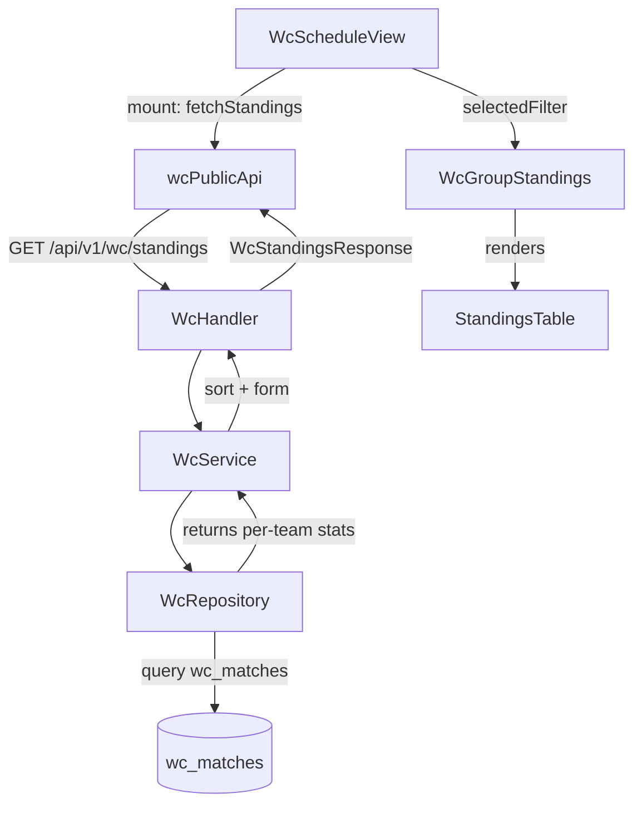

# System Design & Architecture

## Architecture Overview



**No new DB tables.** All data is derived from the existing `wc_matches` table.

## Data Models

### New Go models in `backend/internal/model/wc_match.go`

```go
// WcTeamStanding holds computed standing stats for one team in one group.
type WcTeamStanding struct {
    TeamName       string   `json:"team_name"`
    TeamCode       string   `json:"team_code"`   // e.g. "ARG"
    Played         int      `json:"played"`
    Won            int      `json:"won"`
    Drawn          int      `json:"drawn"`
    Lost           int      `json:"lost"`
    GoalsFor       int      `json:"goals_for"`
    GoalsAgainst   int      `json:"goals_against"`
    GoalDifference int      `json:"goal_difference"`
    Points         int      `json:"points"`
    Form           []string `json:"form"` // e.g. ["W","D","L","W","W"] — up to 5, most recent last
}

// WcGroupStanding holds the sorted standings for one group.
type WcGroupStanding struct {
    GroupName string           `json:"group_name"` // e.g. "Group A"
    Teams     []WcTeamStanding `json:"teams"`       // sorted by rank (1st = index 0)
}

// WcStandingsResponse is returned by GET /api/v1/wc/standings.
type WcStandingsResponse struct {
    Groups []WcGroupStanding `json:"groups"`
}
```

### New TypeScript types in `frontend/src/types/wc.ts`

```ts
export interface WcTeamStanding {
  team_name: string
  team_code: string
  played: number
  won: number
  drawn: number
  lost: number
  goals_for: number
  goals_against: number
  goal_difference: number
  points: number
  form: string[]  // ["W","D","L","W","W"], up to 5, most recent last
}

export interface WcGroupStanding {
  group_name: string
  teams: WcTeamStanding[]
}

export interface WcStandingsResponse {
  groups: WcGroupStanding[]
}
```

## API Design

### New public endpoint

```
GET /api/v1/wc/standings
```

- **Auth**: None (public — same access level as `GET /wc/schedule`)
- **Query params**: None (returns all groups in one call)
- **Response**: `WcStandingsResponse` (see above)
- **HTTP codes**: `200 OK`, `500` on DB error

**Example response**:
```json
{
  "groups": [
    {
      "group_name": "Group A",
      "teams": [
        {
          "team_name": "Argentina",
          "team_code": "ARG",
          "played": 2,
          "won": 2,
          "drawn": 0,
          "lost": 0,
          "goals_for": 5,
          "goals_against": 1,
          "goal_difference": 4,
          "points": 6,
          "form": ["W", "W"]
        }
      ]
    }
  ]
}
```

## Component Breakdown

### Backend

| File | Change |
|------|--------|
| `model/wc_match.go` | Add `WcTeamStanding`, `WcGroupStanding`, `WcStandingsResponse` structs |
| `repository/wc_repository.go` | Add `GetGroupStandings()` — query ALL group-stage matches (any status) for team roster; stats from completed only |
| `service/wc_service.go` | Add `GetGroupStandings()` — delegates to repo, handles computation |
| `api/wc_handler.go` | Add `GetGroupStandings(c *gin.Context)` handler |
| `api/router.go` | Wire `GET /wc/standings` in the always-accessible group (bypasses `WcFeatureMiddleware`, same as `/matches`) |

### Frontend

| File | Change |
|------|--------|
| `types/wc.ts` | Add `WcTeamStanding`, `WcGroupStanding`, `WcStandingsResponse` |
| `services/wcPublicApi.ts` | Add `getStandings(): Promise<WcStandingsResponse>` |
| `components/wc/WcGroupStandings.vue` | **New component** — renders standings table for one group |
| `views/WcScheduleView.vue` | Fetch standings on mount; pass matching group to `WcGroupStandings` when group filter active |
| `locales/vi.json` | Add `wc.standings.*` keys |
| `locales/en.json` | Add `wc.standings.*` keys |

## Component: WcGroupStandings.vue

**Props**:
```ts
defineProps<{
  standing: WcGroupStanding   // single group's data
}>()
```

**Columns** (same in both grid and single-group views):
`# | Team (flag + code + name) | T (Played) | W | D | L | GD | Pts | Form`

Note: `goals_for` and `goals_against` are in the API response (needed for tiebreaker sorting) but are **not shown as separate columns** in the UI — only `goal_difference` is displayed.

**Visual details**:
- Row 1–2: green tint (`background: rgba(22,163,74,0.08)`) — direct qualification
- Row 3: yellow tint (`background: rgba(234,179,8,0.08)`) — potential best-3rd qualification (WC2026 rule)
- Row 4: no highlight
- Form badges: `W` = green pill, `D` = grey pill, `L` = red pill
- Team column: flag emoji + 3-letter code + team name
- `goal_difference`: prefix `+` for positive, `-` already present for negative, `0` as-is

**Flag emoji lookup**: Frontend utility `teamCodeToFlag(code: string): string` maps 3-letter team codes (TLA from football-data.org) to emoji flags via ISO 3166-1 alpha-2 regional indicator offset.

## Integration in WcScheduleView.vue

```
onMounted:
  1. store.fetchMatches()             (existing)
  2. standingsData = await getStandings()   (new — fails silently if error)

Template (below WcGroupFilter, above match list):

  <!-- All groups: default view when no filter OR when filter is not a specific group -->
  <div v-if="!selectedFilter || showAllGroupsStandings" class="wc-standings-grid">
    <WcGroupStandings
      v-for="group in standingsData?.groups"
      :key="group.group_name"
      :standing="group"
    />
  </div>

  <!-- Single group: when a specific group filter is active -->
  <WcGroupStandings
    v-else-if="selectedGroupStanding"
    :standing="selectedGroupStanding"
  />

computed showAllGroupsStandings:
  // true when filter is '' (all matches) or a knockout stage filter
  // false only when filter = 'group_X' (specific group)
  return !selectedFilter.value.startsWith('group_')

computed selectedGroupStanding:
  if selectedFilter starts with 'group_':
    groupName = selectedFilter.replace('group_', 'Group ')
    return standingsData?.groups.find(g => g.group_name === groupName) ?? null
  return null
```

**2-column grid CSS** (for all-groups view):
```css
.wc-standings-grid {
  display: grid;
  grid-template-columns: 1fr 1fr;
  gap: 16px;
  margin-bottom: 24px;
}

@media (max-width: 640px) {
  .wc-standings-grid {
    grid-template-columns: 1fr;
  }
}
```

## Design Decisions

### Decision 1: Backend endpoint vs. frontend computation

**Chosen**: Backend endpoint `GET /api/v1/wc/standings`.

**Why**: The schedule page already filters `store.matches` when a group filter is active, so the frontend doesn't have a complete set of all group matches. Computing standings in the frontend would require fetching all group-stage matches separately anyway — so a dedicated backend endpoint is cleaner and avoids double-fetching.

**Alternative rejected**: Frontend computation from `store.matches`. Rejected because the store only holds the currently-filtered subset of matches.

### Decision 2: Computation in repository vs. service

**Chosen**: Repository does a single query of ALL group-stage matches (any status) ordered by `match_date ASC`. The repository loop then builds the team roster from all matches, and accumulates stats only from `completed` matches with non-nil scores. Service layer handles sorting + form list assembly.

**Why**: The sort + form logic is business logic, not data access. Keeps the repository thin. Single query (not two separate queries) avoids a round-trip — filtering by `status='completed'` happens in Go, not SQL.

**Query**: `SELECT * FROM wc_matches WHERE stage = 'group' ORDER BY match_date ASC`  
All matches are fetched; the Go loop skips stat accumulation when `status != 'completed'` or scores are nil.

### Decision 3: Form calculation

Form = last 5 **completed** matches, ordered chronologically (oldest → newest), presented as `["W","D","L","W","W"]` (most recent is last). Frontend renders them left-to-right so the rightmost badge is the latest result.

### Decision 4: Tiebreaker ordering

Sort key: `(points DESC, goal_difference DESC, goals_for DESC, team_name ASC)`.  
Full FIFA tiebreaker (H2H) is intentionally omitted to keep implementation simple — this is a friend group tracker, not an official tool.

### Decision 5: All groups in one call

Return all groups in a single response (no per-group query param). There are only 12 groups × 4 teams = 48 standings rows — negligible payload. The frontend re-uses the single fetched response in-memory for all filter changes. Avoids multiple round trips.

### Decision 6: Route placement — bypass WcFeatureMiddleware

`GET /wc/standings` is wired in the always-accessible route group alongside `GET /wc/matches`, not inside `wcFeature` (which requires `is_enabled = true`). Standings are derived purely from match data — the same data available regardless of feature flag state. This ensures the schedule page can always show standings even when betting/predictions are disabled.

```go
// In router.go, alongside wc.GET("/matches", ...):
wc.GET("/standings", wcHandler.GetGroupStandings)
```

## Non-Functional Requirements

- **Performance**: Query hits only `wc_matches` (72 group-stage matches max for WC2026: 12 groups × 6 matches each). No joins needed. Response time < 100ms.
- **Caching**: No server-side caching needed at this scale. Frontend can re-use the fetched data in-memory for the session (no re-fetch on filter change).
- **Security**: Public endpoint — no auth token required, consistent with `/wc/schedule`.
- **Mobile**: The standings table must be horizontally scrollable or use a reduced-column layout on small screens.
