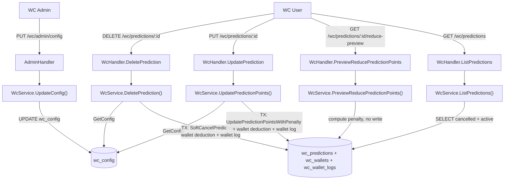

# System Design & Architecture

## Architecture Overview



---

## Data Models

### `wc_predictions` — columns liên quan

| Column | Type | Mô tả |
|--------|------|-------|
| `points` | INT | Điểm cược hiện tại |
| `original_points` | INT NULL | Điểm đặt ban đầu (set 1 lần khi tạo, không thay đổi) |
| `cancelled_at` | TIMESTAMPTZ NULL | NULL = active; NOT NULL = đã huỷ |
| `cancel_penalty` | NUMERIC(10,2) NULL | Điểm bị phạt khi huỷ (float) |
| `reduce_penalty` | NUMERIC(10,2) NOT NULL DEFAULT 0 | Tổng điểm bị phạt do giảm (tích luỹ) |

### `wc_config` — penalty fields

| Column | Type | Default | Mô tả |
|--------|------|---------|-------|
| `cancel_penalty_enabled` | BOOLEAN | false | Bật/tắt toàn bộ penalty feature |
| `cancel_penalty_percent` | INT | 20 | % phạt khi huỷ |
| `bet_reduce_max_percent` | INT | 50 | % giảm tối đa cho phép (0 = không giới hạn) |
| `bet_reduce_penalty_percent` | INT | 20 | % phạt trên phần giảm vượt ngưỡng |

### `wc_wallet_logs` — audit

| Column | Mô tả |
|--------|-------|
| `admin_id` | NULL = system/user-initiated (penalty), NOT NULL = admin manual |
| `note` | Mô tả lý do, ví dụ: `"prediction cancel penalty — 20%"` |

---

## API Design

### `DELETE /api/v1/wc/predictions/:id` — huỷ prediction

**Guards:** ownership, `result IS NULL`, `cancelled_at IS NULL`, match not locked.

**Logic:**
1. Load `wc_config`
2. `penalty = points × cancel_penalty_percent / 100` (float, không floor)
3. DB transaction:
   - `SoftCancelPrediction`: set `cancelled_at = NOW()`, `cancel_penalty = penalty`
   - Nếu `cancel_penalty_enabled AND penalty > 0`: deduct wallet + wallet log
4. Response: `{ "ok": true, "penalty_applied": penalty }`

---

### `GET /api/v1/wc/predictions/:id/reduce-preview` — dry-run preview

**Query param:** `new_points=N`

**Logic:**
1. Verify ownership + pending + not locked
2. `allowed_min = original_points × (1 - bet_reduce_max_percent/100)`
3. `excess = max(0, (original_points - new_points) - (original_points - allowed_min))`
4. `penalty = excess × bet_reduce_penalty_percent / 100`
5. Response: `{ "penalty": N, "excess": N, "allowed_min_stake": N }`

---

### `PUT /api/v1/wc/predictions/:id` — cập nhật điểm cược

**Body:** `{ "points": N }`

**Logic:**
1. Verify ownership + pending + not locked
2. Nếu `new_points >= current_points` → update tự do (không penalty)
3. Nếu `new_points < current_points`:
   - Tính penalty theo công thức reduce
   - Nếu `penalty > 0`: TX: update points + update `reduce_penalty += penalty` + deduct wallet + wallet log
4. Response: `{ "ok": true, "penalty_applied": N }`

**Note:** Đổi pick (prediction_choice thay đổi) → delete cũ + submit mới, không qua endpoint này.

---

### `GET /api/v1/wc/predictions` — list predictions (bao gồm đã huỷ)

**Thay đổi so với hiện tại:** Bỏ filter `cancelled_at IS NULL` → trả về cả active lẫn cancelled.

**Response shape** mỗi item có thêm:
```json
{
  "cancelled_at": "2026-07-01T10:00:00Z",
  "cancel_penalty": 2.5,
  "original_points": 10,
  "reduce_penalty": 1.2
}
```

Frontend phân biệt: `cancelled_at != null` → hiện badge "Đã huỷ".

---

### `GET /api/v1/wc/config` — public config (dùng cho frontend)

**Auth:** không cần JWT (public endpoint).

**Response:**
```json
{
  "is_enabled": true,
  "min_points": 1,
  "max_points": 100,
  "cancel_penalty_enabled": true,
  "cancel_penalty_percent": 20,
  "bet_reduce_max_percent": 50,
  "bet_reduce_penalty_percent": 20
}
```

Frontend `wcStore` fetch endpoint này khi init và expose `cancelPenaltyEnabled`, `cancelPenaltyPercent`, `betReduceMaxPercent`, `betReducePenaltyPercent`.

---

### `PUT /api/v1/wc/admin/config` — cập nhật config

```json
{
  "cancel_penalty_enabled": true,
  "cancel_penalty_percent": 20,
  "bet_reduce_max_percent": 50,
  "bet_reduce_penalty_percent": 20
}
```

**Validation:** tất cả % trong range 0–100.

---

## Component Breakdown

### Backend

**`internal/model/wc_match.go` — `WcPrediction`:**
- `CancelPenalty *float64` (numeric 10,2)
- `ReducePenalty float64` (numeric 10,2, default 0)
- `OriginalPoints *int`
- `CancelledAt *time.Time`

**`internal/repository/wc_repository.go`:**
- `ListPredictions`: bỏ filter `cancelled_at IS NULL` để trả cả active + cancelled
- `SoftCancelPrediction(tx, id, userID, penalty float64)`
- `UpdatePredictionPointsWithPenalty(tx, id, points, penalty float64)`: update points + `reduce_penalty += penalty`

**`internal/service/wc_service.go`:**
- `SubmitPrediction`: set `OriginalPoints = &req.Points` khi insert (required for reduce penalty to work)
- `DeletePrediction`: soft-cancel + wallet deduction
- `UpdatePredictionPoints` → returns `(penaltyApplied float64, err error)`
- `PreviewReducePredictionPoints` → dry-run, no write

**`internal/service/wc_penalty.go`:**
- `computeCancelPenalty(stake, percent, enabled) float64` — không floor
- `computeReducePenalty(original, new, maxPercent, penaltyPercent) (float64, int, int)` — penalty là float

**`internal/database/database.go`:**
- Migration: `reduce_penalty NUMERIC(10,2) NOT NULL DEFAULT 0`
- Migration: cancel_penalty columns đổi sang `NUMERIC(10,2)`
- Migration: partial unique index `WHERE cancelled_at IS NULL`

### Frontend

**`frontend/src/types/wc.ts` — `WcPredictionWithMatch`:**
```ts
cancelled_at?: string | null
cancel_penalty?: number | null
reduce_penalty: number
original_points?: number | null
```

**`frontend/src/components/wc/WcPredictionHistoryList.vue`:**
- Hiện prediction đã huỷ (badge "Đã huỷ")
- Hiện `cancel_penalty` hoặc `reduce_penalty` nếu > 0: *"Bị phạt: -N điểm"*
- Confirm popup trước khi huỷ (nếu `cancel_penalty_enabled && penalty > 0`)
- Predictions grouped by date of action: dùng `cancelled_at` cho cancelled, `updated_at` (hoặc `created_at`) cho active

**`frontend/src/components/wc/WcPredictionForm.vue`:**
- Trước khi gọi `updatePredictionPoints`: gọi preview → nếu `penalty > 0` → confirm popup
- Helper `confirmReduceIfNeeded(id, existingPoints, newPoints): Promise<boolean>`

**`frontend/src/components/wc/WcAdminPanel.vue`:**
- Switch: Cancel Penalty Enabled
- Input: Cancel Penalty %
- Input: Reduce Max %
- Input: Reduce Penalty %

---

## Design Decisions

| Quyết định | Lý do |
|-----------|-------|
| Soft-delete thay vì hard-delete | Giữ record trong Lịch sử, audit trail |
| Partial unique index `WHERE cancelled_at IS NULL` | User có thể đặt lại sau khi huỷ |
| Penalty là `float64`, không floor | Điểm trong game không phải tiền thật, không cần làm tròn |
| `reduce_penalty` tích luỹ trên prediction | Frontend đọc trực tiếp, không cần query wallet logs |
| `cancel_penalty` chỉ set khi huỷ | Khác với reduce_penalty — hai loại phạt tách biệt |
| Popup chỉ hiện khi `cancel_penalty_enabled = true` | Admin tắt feature → UX mượt, không cản user |
| Cancel popup tính penalty local (`points × cancelPenaltyPercent / 100`) | Công thức cố định, không cần API round-trip. Reduce popup dùng preview API vì cần tính excess/allowedMin |
| `GET /predictions` trả cả cancelled | Lịch sử cần thấy prediction đã huỷ (Option 3) |

---

## Non-Functional Requirements

- **Atomicity:** Mọi write (soft-cancel + wallet deduction + wallet log) trong 1 DB transaction
- **No negative wallet:** penalty cap tại `min(penalty, current_balance)`
- **Analytics integrity:** Tất cả query analytics/leaderboard phải filter `cancelled_at IS NULL`
- **Settlement:** `ListPredictionsForMatch` filter `cancelled_at IS NULL` — không settle prediction đã huỷ
- **Re-prediction:** Partial unique index đảm bảo user có thể đặt lại sau khi huỷ
