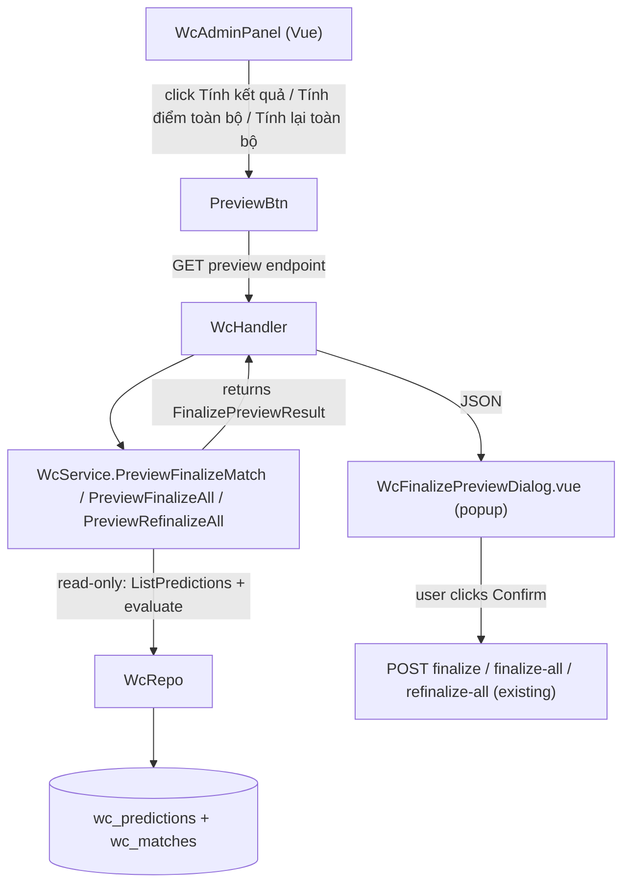

# System Design & Architecture

## Architecture Overview



Không thêm bảng mới. Preview là pure read-only — dùng lại evaluate logic hiện tại không ghi DB.

---

## Data Models

### Go Response DTO (mới)

Scope: chỉ cover **WcPrediction** (hệ thống điểm dự đoán). WcBet (tiền thật) settle riêng, không trong preview này.

```go
// FinalizePreviewResult là response của tất cả preview endpoints
type FinalizePreviewResult struct {
    Matches      []FinalizePreviewMatch `json:"matches"`       // breakdown per match
    HouseSummary FinalizePreviewHouse   `json:"house_summary"` // tổng hợp admin
}

type FinalizePreviewMatch struct {
    MatchID        string                   `json:"match_id"`
    HomeTeam       string                   `json:"home_team"`
    AwayTeam       string                   `json:"away_team"`
    HomeScore      int                      `json:"home_score"`
    AwayScore      int                      `json:"away_score"`
    Stage          string                   `json:"stage"`
    AlreadySettled bool                     `json:"already_settled"` // true nếu settled_at != nil
    Predictions    []FinalizePreviewRow     `json:"predictions"`
}

type FinalizePreviewRow struct {
    WcUserID       string  `json:"wc_user_id"`
    UserName       string  `json:"user_name"`
    PredictionType string  `json:"prediction_type"`   // handicap | exact_score | over_under
    Points         int     `json:"points"`            // điểm stake
    Multiplier     float64 `json:"multiplier"`        // MultiplierSnapshot
    NewResult      string  `json:"new_result"`        // correct | incorrect | void | win_half | lose_half
    NewPointsEarned float64 `json:"new_points_earned"` // điểm nhận được (0 nếu thua)
    NetDelta       float64 `json:"net_delta"`         // new_points_earned - points (net wallet change)
}

// OldResult/OldPointsEarned bị loại bỏ — refinalize preview không cần hiển thị diff.

type FinalizePreviewHouse struct {
    TotalStaked     float64 `json:"total_staked"`      // sum(points) — tổng điểm thu vào
    TotalPaidOut    float64 `json:"total_paid_out"`    // sum(new_points_earned) — tổng điểm trả ra
    HouseNet        float64 `json:"house_net"`         // total_staked - total_paid_out
    PredictionCount int     `json:"prediction_count"`
    MatchCount      int     `json:"match_count"`
}
```

---

## API Design

### `GET /api/v1/wc/admin/matches/:id/finalize-preview`
Preview single-match finalize.

**Auth:** WcAdminMiddleware  
**Params:** `:id` — match UUID  
**Behavior:** Compute kết quả dự đoán cho trận đó (read-only). Trả lỗi nếu match không có điểm số.  
**Response:** `FinalizePreviewResult` (1 match trong `matches[]`)

### `GET /api/v1/wc/admin/matches/finalize-all-preview`
Preview bulk finalize (chỉ các trận chưa settle có điểm số).

**Auth:** WcAdminMiddleware  
**Response:** `FinalizePreviewResult` (nhiều match)

### `GET /api/v1/wc/admin/matches/refinalize-all-preview`
Preview bulk re-finalize (tất cả trận có điểm số, kể cả đã settle).

**Auth:** WcAdminMiddleware  
**Response:** `FinalizePreviewResult` — `already_settled=true` cho trận đã finalize, không có diff (chỉ hiện giá trị mới)

**Lưu ý route order:** `finalize-all-preview` và `refinalize-all-preview` phải đăng ký TRƯỚC `:id` route để tránh Gin parse chúng như match ID.

---

## Component Breakdown

### Backend

#### `internal/service/wc_service.go` — thêm 3 methods

```go
func (s *WcService) PreviewFinalizeMatch(matchID uuid.UUID) (*model.FinalizePreviewResult, error)
func (s *WcService) PreviewFinalizeAll() (*model.FinalizePreviewResult, error)
func (s *WcService) PreviewRefinalizeAll() (*model.FinalizePreviewResult, error)
```

Mỗi method:
1. Fetch match(es) từ repo
2. Fetch predictions qua `ListPredictionsForMatch(matchID)`
3. Gọi lại `evaluateHandicapPrediction` / `evaluateExactScorePrediction` / `evaluateOverUnderPrediction` (reuse, no DB write)
4. Build `FinalizePreviewResult` — KHÔNG ghi DB

`PreviewFinalizeAll` dùng `ListUnfinalizedScoredMatches()`.  
`PreviewRefinalizeAll` dùng `ListAllScoredMatches()` — `AlreadySettled = m.SettledAt != nil`. Không populate old values.

#### `internal/api/wc_handler.go` — thêm 3 handlers

```go
func (h *WcHandler) PreviewFinalizeMatch(c *gin.Context)
func (h *WcHandler) PreviewFinalizeAll(c *gin.Context)
func (h *WcHandler) PreviewRefinalizeAll(c *gin.Context)
```

Thin handlers: parse params → call service → `c.JSON(200, result)`.

#### `internal/api/router.go` — thêm routes (thứ tự quan trọng)

```go
adminGroup.GET("/matches/finalize-all-preview", wcHandler.PreviewFinalizeAll)
adminGroup.GET("/matches/refinalize-all-preview", wcHandler.PreviewRefinalizeAll)
adminGroup.GET("/matches/:id/finalize-preview", wcHandler.PreviewFinalizeMatch)
```

### Frontend

#### `frontend/src/types/wc.ts` — thêm types

```ts
interface FinalizePreviewRow {
  wc_user_id: string
  user_name: string
  prediction_type: string   // handicap | exact_score | over_under
  points: number            // stake
  multiplier: number        // MultiplierSnapshot
  new_result: string        // correct | incorrect | void | win_half | lose_half
  new_points_earned: number
  net_delta: number         // new_points_earned - points
}

interface FinalizePreviewMatch {
  match_id: string
  home_team: string
  away_team: string
  home_score: number
  away_score: number
  stage: string
  already_settled: boolean
  predictions: FinalizePreviewRow[]
}

interface FinalizePreviewHouse {
  total_staked: number      // tổng điểm thu vào
  total_paid_out: number    // tổng điểm trả ra
  house_net: number         // total_staked - total_paid_out
  prediction_count: number
  match_count: number
}

interface FinalizePreviewResult {
  matches: FinalizePreviewMatch[]
  house_summary: FinalizePreviewHouse
}
```

#### `frontend/src/services/wcService.ts` — thêm methods

```ts
previewFinalizeMatch(matchId: string): Promise<FinalizePreviewResult>
previewFinalizeAll(): Promise<FinalizePreviewResult>
previewRefinalizeAll(): Promise<FinalizePreviewResult>
```

#### `frontend/src/components/wc/WcFinalizePreviewDialog.vue` *(mới)*

Props:
```ts
{
  modelValue: boolean        // v-model open/close
  title: string              // dialog title
  preview: FinalizePreviewResult | null
  loading: boolean           // loading state when fetching preview
  confirming: boolean        // loading state when executing
}
```

Emits: `confirm`, `cancel`, `update:modelValue`

Layout (table style — confirmed):
```
┌─────────────────────────────────────────────────────┐
│  Preview: Tính kết quả                         [✕]  │
│  Brazil 🇧🇷 3 – 1 🇫🇷 France  ·  Group B             │
├──────────────┬─────────────────┬──────────┬─────────┤
│ Tên          │ Loại kèo        │ Kết quả  │    Δ    │
├──────────────┼─────────────────┼──────────┼─────────┤
│ Duy          │ Chấp +1  ×1.90  │ ✅ Đúng  │   +90  │
│ Duy          │ Tài Xỉu >2.5×1.85│ ❌ Sai  │   -50  │
│ Duy          │ Hệ số ×3   50đ  │ ✅ Đúng  │  +150  │
│ An           │ Chấp +1  ×1.90  │ ❌ Sai   │   -40  │
│ An           │ Tài Xỉu >2.5×1.85│ ✅ Đúng │   +74  │
│ Minh         │ Tỉ số 3-1  ×4.50│ ✅ Đúng  │  +135  │
├──────────────┴─────────────────┴──────────┴─────────┤
│  Thu vào: 170 đ    Trả ra: 449 đ    Lỗ: 🔴 -279 đ  │
├─────────────────────────────────────────────────────┤
│                    [Hủy]  [Xác nhận & Tính điểm]   │
└─────────────────────────────────────────────────────┘
```

Bulk (Tính điểm toàn bộ / Tính lại toàn bộ): wrap mỗi match trong `el-collapse-item`. Table bên trong giống y single match.

- `already_settled=true` → header match hiện chip "đã tính" (chỉ refinalize)
- `preview === null` (đang load) → hiển thị skeleton
- `preview.matches.length === 0` → "Không có dự đoán nào cần tính."
- Delta dương → màu xanh, âm → màu đỏ
- Result badge: `✅ Đúng / Thắng`, `❌ Sai / Thua`, `➡️ Hòa` (push), `⬇️ Thua nửa` (lose_half)

#### `WcAdminPanel.vue` — sửa 3 button handlers

Thay vì gọi service trực tiếp, flow mới:
1. Click button → gọi preview API → set `previewData` + `previewTitle` + `pendingAction`
2. `WcFinalizePreviewDialog` hiện lên với `previewData`
3. User nhấn Confirm → gọi actual action từ `pendingAction`
4. Success → close dialog + reload P&L

```ts
const previewDialogVisible = ref(false)
const previewData = ref<FinalizePreviewResult | null>(null)
const previewTitle = ref('')
const previewLoading = ref(false)
const previewConfirming = ref(false)
type PendingAction = 'finalize-match' | 'finalize-all' | 'refinalize-all'
const pendingAction = ref<PendingAction | null>(null)
const pendingMatchId = ref<string | null>(null)

async function handleSettle(matchId: string) {
  previewTitle.value = t('wc.finalizeMatch')
  pendingAction.value = 'finalize-match'
  pendingMatchId.value = matchId
  previewLoading.value = true
  previewDialogVisible.value = true
  try {
    previewData.value = await wcService.previewFinalizeMatch(matchId)
  } finally {
    previewLoading.value = false
  }
}

async function handleConfirmPreview() {
  previewConfirming.value = true
  try {
    if (pendingAction.value === 'finalize-match' && pendingMatchId.value) {
      await store.finalizeMatch(pendingMatchId.value)
    } else if (pendingAction.value === 'finalize-all') {
      await store.finalizeAll()
    } else if (pendingAction.value === 'refinalize-all') {
      await store.refinalizeAll()
    }
    previewDialogVisible.value = false
    pnlRef.value?.load()
  } finally {
    previewConfirming.value = false
  }
}
```

---

## Design Decisions

| Decision | Choice | Rationale |
|---|---|---|
| Preview endpoints | GET (không POST) | Không có side effects — GET là đúng |
| Route order | bulk trước `:id` | Gin sẽ match "finalize-all-preview" như một param ID nếu thứ tự sai |
| Reuse evaluate functions | Gọi lại `evaluateHandicapPrediction` etc | Single source of truth — không drift logic |
| Single dialog component | 1 `WcFinalizePreviewDialog` cho cả 3 actions | DRY — content giống nhau, chỉ title và action khác |
| house_net | `total_stake - total_points_out` | Admin cần biết điểm system lời hay lỗ sau đợt settle |

---

## Non-Functional Requirements

- **Read-only:** Preview không ghi bất kỳ row nào vào DB
- **Performance:** < 500ms với 100 predictions (đơn giản in-memory compute)
- **Security:** Chỉ admin (WcAdminMiddleware) gọi được preview endpoints
