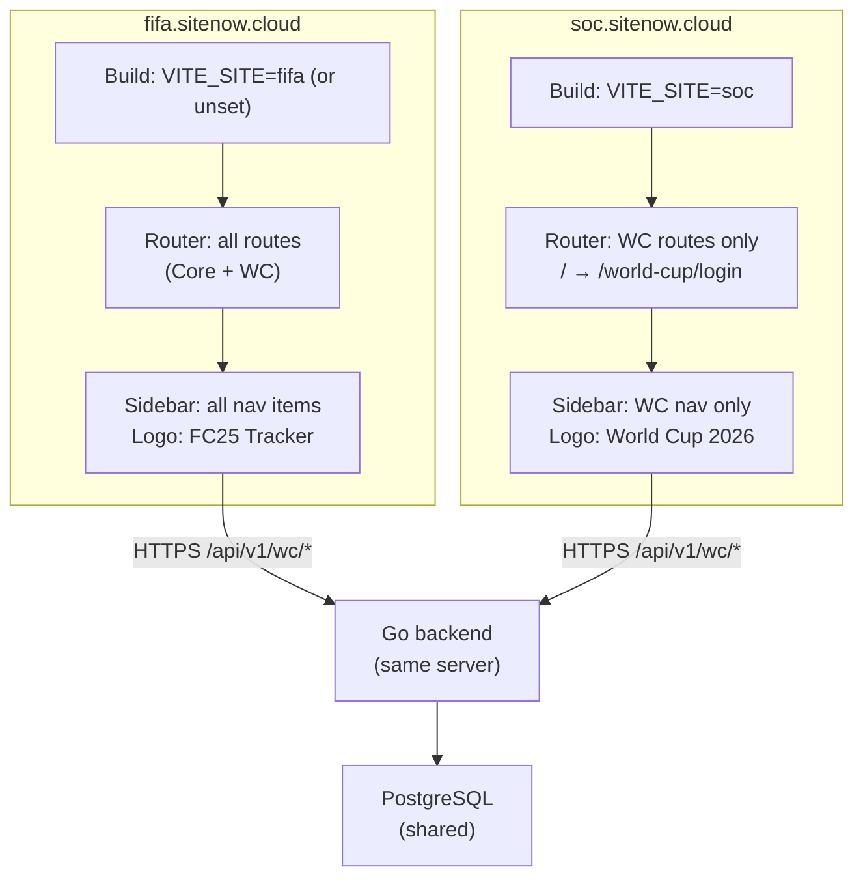

# System Design & Architecture

## Architecture Overview



**Key principle:** Only the frontend build differs. Backend, DB, and all WC API endpoints are shared and unchanged. The `VITE_SITE=soc` flag is resolved at build time — no runtime branch on hostname.

## Data Models

No new data models. This feature is purely frontend routing and build config. The shared `wc_users`, `wc_wallets`, `wc_bets`, `wc_predictions` tables serve both sites.

## API Design

No backend changes. All WC endpoints (`/api/v1/wc/...`) remain identical. Both builds use the same `VITE_API_BASE_URL`.

## Component Breakdown

### 1. `frontend/.env.soc` (new file — commit to git, not sensitive)
```
VITE_SITE=soc
VITE_SITE_TITLE=WC Prediction 2026
VITE_API_BASE_URL=https://fifa.sitenow.cloud/api/v1
```
Used by `npm run build:soc`. `VITE_API_BASE_URL` still points to the shared backend.

### 2. `frontend/.env` (or `.env.fifa`) — add matching key so both builds are symmetric
```
VITE_SITE=fifa
VITE_SITE_TITLE=FC25 Tracker
VITE_API_BASE_URL=https://fifa.sitenow.cloud/api/v1
```

### 3. `frontend/package.json` — add build script
```json
"build:soc": "vite build --mode soc"
```

### 4. `frontend/index.html` — inject page title via env var
```html
<title>%VITE_SITE_TITLE%</title>
```
Vite replaces `%VITE_SITE_TITLE%` with the value from the active `.env.[mode]` file at build time. No plugin needed — this is a built-in Vite feature.

### 5. `frontend/src/vite-env.d.ts` (new file)
Extend `ImportMetaEnv` so TypeScript doesn't error on `import.meta.env.VITE_SITE`:
```ts
/// <reference types="vite/client" />

interface ImportMetaEnv {
  readonly VITE_SITE?: string
  readonly VITE_SITE_TITLE?: string
  readonly VITE_API_BASE_URL?: string
}

interface ImportMeta {
  readonly env: ImportMetaEnv
}
```

### 6. `frontend/vite.config.ts` — no changes needed
Vite automatically loads `.env.[mode]` when `--mode soc` is passed.

### 7. `frontend/src/router/index.ts` — inline conditional route array

**Critical:** The entire route array must be defined inline inside the ternary — **not** extracted into named module-level consts. If `allRoutes` is defined at module scope, Rollup analyses both branches and includes all `() => import(...)` references regardless of the VITE_SITE value, defeating tree-shaking.

```ts
const isSocSite = import.meta.env.VITE_SITE === 'soc'

const router = createRouter({
  history: createWebHistory(import.meta.env.BASE_URL),
  routes: isSocSite
    ? [
        { path: '/', redirect: '/world-cup/login' },
        { path: '/world-cup', name: 'wc-schedule', component: () => import('../views/WcScheduleView.vue') },
        { path: '/world-cup/login', name: 'wc-login', component: () => import('../views/WcLoginView.vue') },
        { path: '/world-cup/register', redirect: '/world-cup/login' },
        { path: '/world-cup/link-google', name: 'wc-link-google', component: () => import('../views/WcLinkGoogleView.vue'), meta: { requiresWcAuth: true, skipGoogleLinkCheck: true } },
        { path: '/world-cup/profile', name: 'wc-profile', component: () => import('../views/WcProfileView.vue'), meta: { requiresWcAuth: true, requiresGoogleLink: true } },
        { path: '/world-cup/predict', name: 'wc-predict', component: () => import('../views/WcPredictView.vue'), meta: { requiresWcAuth: true, requiresGoogleLink: true, requiresWcFeature: true } },
        { path: '/world-cup/bet', name: 'wc-bet', component: () => import('../views/WcBettingView.vue'), meta: { requiresWcAuth: true, requiresGoogleLink: true, requiresWcFeature: true } },
        { path: '/world-cup/admin', name: 'wc-admin', component: () => import('../views/WcAdminView.vue'), meta: { requiresWcAuth: true, requiresWcAdmin: true } },
        { path: '/:pathMatch(.*)*', name: 'not-found', component: () => import('../views/NotFoundView.vue') },
      ]
    : [
        // existing full route list — unchanged
        { path: '/', name: 'dashboard', component: () => import('../views/DashboardView.vue') },
        // ... (all current routes preserved verbatim)
      ]
})
```

`VITE_SITE` is a compile-time constant evaluated by esbuild. When `VITE_SITE=soc`, the `false` (fifa) branch is dead-code-eliminated and its `() => import(...)` references are never emitted into the bundle.

### 8. `frontend/src/layouts/MainLayout.vue` — WC-only navigation + logo title

```ts
const isSocSite = import.meta.env.VITE_SITE === 'soc'

// Logo title — overridden for soc build
const appTitle = isSocSite ? t('common.appNameSoc') : t('common.appName')
const appSubtitle = isSocSite ? t('layout.sidebarSubtitleSoc') : t('layout.sidebarSubtitle')

// Navigation items — WC-only for soc build
const navigation = isSocSite
  ? [
      { navKey: 'nav.worldCup', href: '/world-cup', icon: Promotion, highlight: 'wc' }
    ]
  : [
      { navKey: 'nav.dashboard', href: '/', icon: HomeFilled },
      { navKey: 'nav.players', href: '/users', icon: UserFilled },
      { navKey: 'nav.matches', href: '/matches', icon: TrendCharts },
      { navKey: 'nav.tournaments', href: '/tournaments', icon: Grid },
      { navKey: 'nav.settlements', href: '/settlements', icon: DocumentCopy },
      { navKey: 'nav.fund', href: '/fund', icon: Wallet },
      { navKey: 'nav.worldCup', href: '/world-cup', icon: Promotion, highlight: 'wc' },
      { navKey: 'nav.settings', href: '/settings', icon: Setting },
    ]
```

Template: replace hardcoded `t('common.appName')` and `t('layout.sidebarSubtitle')` with `appTitle` and `appSubtitle`.

**New i18n keys** (add to `en.json` and `vi.json`):
```json
"common": {
  "appNameSoc": "WC Prediction",
  ...
},
"layout": {
  "sidebarSubtitleSoc": "World Cup 2026",
  ...
}
```

### 9. `frontend/src/App.vue` — skip FC25 user fetch in soc mode

```ts
const userStore = useUserStore()
const isSocSite = import.meta.env.VITE_SITE === 'soc'

// Global FC25 club theme — not needed on soc (no FC25 players displayed)
if (!isSocSite) {
  useGlobalTheme(computed(() => userStore.users))
  onMounted(() => userStore.fetchUsers())
}
```

This prevents a pointless `GET /users` API call on every soc page load and avoids initialising the FC25 club CSS theme.

## Design Decisions

| Decision | Rationale |
|----------|-----------|
| **Build-time flag over runtime hostname detection** | Core route components fully excluded from JS bundle — smaller payload, no dead code shipped to WC-only users |
| **Inline ternary route array (not extracted consts)** | Ensures Rollup dead-code-eliminates the unused branch's `() => import(...)` references at build time |
| **Vite `--mode soc` + `.env.soc`** | Standard Vite pattern; no custom plugin. `%VITE_SITE_TITLE%` HTML injection is built-in |
| **Keep one codebase** | WC components are already isolated under `components/wc/`, `WcXxxView.vue`, `wcXxxService.ts`. No duplication benefit from splitting |
| **Only sidebar/nav changes — not a separate layout** | WC views already render fine within MainLayout. A separate WcLayout would duplicate ~300 lines of CSS for no benefit |
| **Same Umami analytics** | Single friend-group deployment; split analytics adds complexity for no gain |
| **Root redirect to /world-cup/login** | Consistent with existing WC login guard; 404 "Back Home" button works via the same redirect chain |

## Non-Functional Requirements

- **Bundle size** — soc build must not include DashboardView, MatchesView, SettlementsView, FundView, ConfigView, TournamentsView, CreateTournamentView, TournamentDetailView, UsersView. Verified by inspecting Rollup chunk output after `npm run build:soc`.
- **No runtime branching** — `VITE_SITE` is a compile-time constant. `if (false)` branches are dead-code-eliminated by esbuild.
- **Backward compatibility** — Omitting `VITE_SITE` (or setting it to `fifa`) produces the full existing build. Zero regression risk for current deployment.
- **TypeScript clean** — `npm run type-check` must pass on both build configurations.
