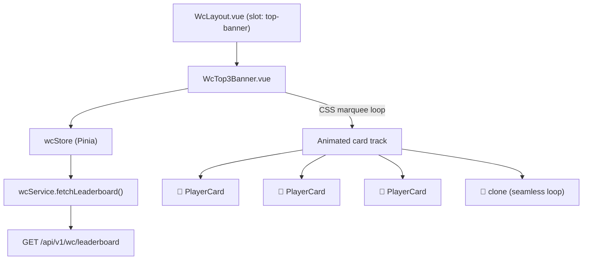

# System Design & Architecture

## Architecture Overview

Pure frontend change — no new backend endpoints required. The banner slots into the existing WC layout shell.



**Key components:**
- `WcTop3Banner.vue` — the marquee banner; self-contained, fetches/refreshes data via Pinia action
- `wcStore` — gains a `top3` getter (slice of first 3 leaderboard entries) and `fetchLeaderboard` action (already exists); banner calls this action on mount and on a 5-minute interval
- No new Pinia store or service method needed — `wcStore.leaderboard` already populated from `wcService.fetchLeaderboard()`

## Data Models

Reuses existing `WcLeaderboardEntry` type:

```typescript
interface WcLeaderboardEntry {
  wc_user_id: number
  name: string
  avatar_url: string | null
  net_points: number
  correct: number
  incorrect: number
  win_half: number
  lose_half: number
  total_predictions: number
}
```

No schema changes. No new types.

## API Design

No new endpoints. Banner consumes:

```
GET /api/v1/wc/leaderboard
```

Already returns entries sorted by `net_points` DESC. Banner reads `leaderboard[0..2]`.

## Component Breakdown

### `WcTop3Banner.vue`

**Location:** `frontend/src/components/wc/WcTop3Banner.vue`

**Responsibilities:**
- Slice `wcStore.leaderboard` to first 3 entries
- Duplicate the 3 cards in the DOM for a seamless CSS loop (6 cards total: original 3 + clone 3)
- Pause animation on hover (`animation-play-state: paused`)
- Highlight the current user's card with a subtle ring (`wcAuthStore.user.id === entry.wc_user_id`)
- Auto-refresh: call `wcStore.fetchLeaderboard()` every 5 minutes via `setInterval` (cleared on `onUnmounted`)
- Show skeleton/placeholder when data is loading
- Show nothing (height: 0, `v-if`) when leaderboard has fewer than 3 entries (still loading or empty)

**Template structure:**
```html
<div class="wc-top3-banner" v-if="top3.length >= 1">
  <div class="banner-label">{{ t('wc.top3Banner.label') }}</div>
  <div class="banner-track-wrapper">
    <div class="banner-track" ref="trackRef">
      <!-- rendered twice for seamless loop -->
      <WcTop3BannerCard v-for="entry in displayEntries" ... />
    </div>
  </div>
</div>
```

### `WcTop3BannerCard.vue` (sub-component)

**Location:** `frontend/src/components/wc/WcTop3BannerCard.vue`

**Props:**
```typescript
defineProps<{
  entry: WcLeaderboardEntry
  rank: 1 | 2 | 3           // medal emoji + glow color
  isCurrentUser: boolean
}>()
```

**Renders:** medal emoji, avatar (28px circle), truncated name, net points with +/- sign and color

### Layout integration

**Where the banner mounts:** At the top of every WC authenticated view, inside a shared layout wrapper.

Check existing WC layout — likely `WcBettingView.vue`, `WcPredictView.vue` each have their own outer `<div>`. Two options:

**Option A — App-shell slot (recommended):** Add banner to `App.vue` or a WC-specific layout component that wraps all WC routes. This renders once and persists across WC route transitions.

**Option B — Per-view:** Import `WcTop3Banner` into each WC view. Simpler but duplicates state refresh logic.

→ **Decision: Option A.** Find or create a `WcLayout.vue` wrapper used by all WC authenticated routes, and place the banner there. Avoids multiple intervals and re-mounts.

If no shared layout exists yet, add one:
- `frontend/src/layouts/WcLayout.vue` — renders `<WcTop3Banner />` then `<router-view />`
- WC routes in `router/index.ts` use `meta: { layout: 'WcLayout' }` (same pattern used for other layout-aware routes in this project)

## Design Decisions

| Decision | Choice | Reason |
|----------|--------|--------|
| Animation engine | CSS `@keyframes` translateX | Zero JS overhead, GPU-composited, no frame drops |
| Seamless loop | Clone cards in DOM (×2) | Simpler than JS-reset; no visual jump |
| Data refresh | `setInterval` in `onMounted` | Matches existing widget pattern (upcoming matches); no new infrastructure |
| Store reuse | `wcStore.leaderboard` | Already fetched on WC pages; banner piggybacks — no extra network call on initial load |
| Hover pause | CSS `animation-play-state` toggled via class | Pure CSS, accessible (users can read without racing text) |
| User highlight | Subtle gold ring (`box-shadow: 0 0 0 2px #d97706`) | Non-distracting but noticeable |
| Min entries to show | 1+ entries | Show partial podium rather than hiding entirely |

## Non-Functional Requirements

- **Performance:** CSS animation only; no `requestAnimationFrame` loop. Component mounts one `setInterval` (5 min) that is always cleaned up.
- **Accessibility:** `aria-label` on the banner region. Pause-on-hover helps users with motion sensitivity. Consider `prefers-reduced-motion` — set `animation: none` in media query.
- **Responsive:** Banner fixed height `56px` on all breakpoints. Cards scale text down on mobile (name max-width clamps).
- **i18n:** Banner label, aria-label, point suffix all via `vue-i18n` keys under `wc.top3Banner.*`.
- **Theme:** Uses CSS custom properties (`--surface-card`, `--border-default`, `--text-primary`) — works with existing light/dark themes.
