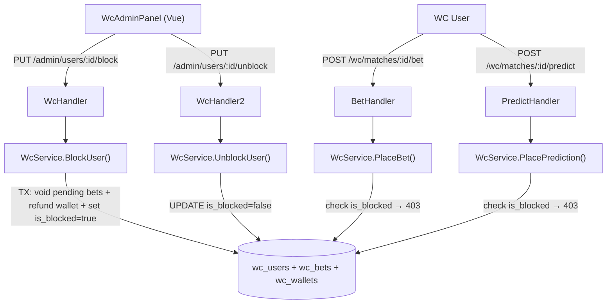

# System Design & Architecture

## Architecture Overview



---

## Data Models

### DB Migration

```sql
ALTER TABLE wc_users ADD COLUMN is_blocked BOOLEAN NOT NULL DEFAULT FALSE;
```

Thêm vào `backend/internal/database/migrations/` hoặc `AutoMigrate` trong `database.go`.

### Go Model

Thêm field vào `WcUser` struct trong `internal/model/wc_user.go`:

```go
IsBlocked bool `gorm:"not null;default:false" json:"is_blocked"`
```

---

## API Design

### `PUT /api/v1/wc/admin/users/:id/block`

**Auth:** WcAdminMiddleware  
**Request body:** none  
**Behavior (trong 1 DB transaction):**
1. Trả lỗi 400 nếu admin cố block chính mình
2. Fetch tất cả pending bets của user (result IS NULL)
3. Void từng bet: set `result = 'void'`, `payout = stake`
4. Refund stake về wallet cho mỗi bet đã void
5. Set `is_blocked = true`

**Response:** `{"ok": true, "voided_bets": N}` — N = số bets bị void

### `PUT /api/v1/wc/admin/users/:id/unblock`

**Auth:** WcAdminMiddleware  
**Request body:** none  
**Behavior:** Set `is_blocked = false`.  
**Response:** `{"ok": true}`

### `POST /api/v1/wc/matches/:id/bet` — sửa guard

Thêm check trong `WcService.PlaceBet()` TRƯỚC khi xử lý:

```go
user, err := s.userRepo.GetByID(betterID)
if err != nil {
    return nil, fmt.Errorf("user not found")
}
if user.IsBlocked {
    return nil, fmt.Errorf("user is blocked from placing bets")
}
```

Handler trả `http.StatusForbidden` (403) khi gặp lỗi này.

### `POST /api/v1/wc/matches/:id/predict` — sửa guard

Thêm check tương tự trong `WcService.PlacePrediction()`:

```go
user, err := s.userRepo.GetByID(userID)
if err != nil {
    return nil, fmt.Errorf("user not found")
}
if user.IsBlocked {
    return nil, fmt.Errorf("user is blocked from placing predictions")
}
```

Handler trả `http.StatusForbidden` (403).

---

## Component Breakdown

### Backend

#### `internal/model/wc_user.go`
Thêm `IsBlocked bool` vào `WcUser` struct.

#### `internal/repository/wc_user_repository.go` — thêm methods
```go
func (r *WcUserRepository) SetBlocked(userID uuid.UUID, blocked bool) error {
    return r.db.Model(&model.WcUser{}).Where("id = ?", userID).Update("is_blocked", blocked).Error
}

// SetBlockedTx is the transaction-aware variant used inside BlockUser.
func (r *WcUserRepository) SetBlockedTx(tx *gorm.DB, userID uuid.UUID, blocked bool) error {
    return tx.Model(&model.WcUser{}).Where("id = ?", userID).Update("is_blocked", blocked).Error
}
```

#### `internal/repository/wc_repository.go` — thêm 2 methods
```go
// ListPendingBetsForUser trả về tất cả WcBet chưa settle của user.
func (r *WcRepository) ListPendingBetsForUser(tx *gorm.DB, userID uuid.UUID) ([]*model.WcBet, error)

// VoidBet set result='void', payout=stake cho một bet.
func (r *WcRepository) VoidBet(tx *gorm.DB, betID uuid.UUID) error
```

#### `internal/service/wc_service.go` — thêm methods và guards

```go
// BlockUser blocks the target user: voids pending bets + refunds wallet + sets is_blocked=true (1 transaction).
func (s *WcService) BlockUser(adminID, targetID uuid.UUID) (int, error) {
    if adminID == targetID {
        return 0, fmt.Errorf("cannot block yourself")
    }
    db := s.repo.DB()
    voidedCount := 0
    err := db.Transaction(func(tx *gorm.DB) error {
        // 1. Fetch pending bets
        pendingBets, err := s.repo.ListPendingBetsForUser(tx, targetID)
        if err != nil {
            return err
        }
        // 2. Void each bet + refund
        for _, bet := range pendingBets {
            if err := s.repo.VoidBet(tx, bet.ID); err != nil {
                return err
            }
            if err := s.repo.UpdateWalletBalance(tx, targetID, float64(bet.Stake)); err != nil {
                return err
            }
            voidedCount++
        }
        // 3. Set is_blocked
        return s.userRepo.SetBlockedTx(tx, targetID, true)
    })
    return voidedCount, err
}

func (s *WcService) UnblockUser(targetID uuid.UUID) error {
    return s.userRepo.SetBlocked(targetID, false)
}
```

Sửa `PlaceBet()`: fetch user → check `IsBlocked` → return error nếu blocked.  
Sửa `PlacePrediction()`: fetch user → check `IsBlocked` → return error nếu blocked.

#### `internal/api/wc_handler.go` — thêm 2 handlers
```go
// BlockUser handles PUT /api/v1/wc/admin/users/:id/block
func (h *WcHandler) BlockUser(c *gin.Context) {
    adminID := getWcUserID(c)    // từ JWT context
    targetID, err := uuid.Parse(c.Param("id"))
    if err != nil { ... }
    voidedCount, err := h.svc.BlockUser(adminID, targetID)
    if err != nil {
        c.JSON(http.StatusBadRequest, gin.H{"error": err.Error()})
        return
    }
    c.JSON(http.StatusOK, gin.H{"ok": true, "voided_bets": voidedCount})
}

// UnblockUser handles PUT /api/v1/wc/admin/users/:id/unblock
func (h *WcHandler) UnblockUser(c *gin.Context) {
    targetID, err := uuid.Parse(c.Param("id"))
    if err != nil { ... }
    if err := h.svc.UnblockUser(targetID); err != nil {
        c.JSON(http.StatusInternalServerError, gin.H{"error": err.Error()})
        return
    }
    c.JSON(http.StatusOK, gin.H{"ok": true})
}
```

Sửa `PlaceBet` handler: đổi error code từ 422 → 403 khi `user is blocked`.

#### `internal/api/router.go` — thêm routes
```go
adminGroup.PUT("/users/:id/block", wcHandler.BlockUser)
adminGroup.PUT("/users/:id/unblock", wcHandler.UnblockUser)
```

### Frontend

#### `frontend/src/types/wc.ts` — sửa `WcUser`
```ts
interface WcUser {
  // ...existing fields...
  is_blocked: boolean
}
```

#### `frontend/src/services/wcService.ts` — thêm methods
```ts
blockUser(userId: string): Promise<void>
unblockUser(userId: string): Promise<void>
```

#### `WcAdminPanel.vue` — sửa user table

Trong user row, thêm badge và button block/unblock:

```html
<!-- Badge blocked -->
<span v-if="user.is_blocked" class="wc-blocked-tag">Bị khóa</span>

<!-- Block/Unblock button -->
<el-button
  size="small"
  :type="user.is_blocked ? 'success' : 'danger'"
  text
  @click="handleToggleBlock(user)"
  :disabled="user.id === currentUser?.id"
>
  {{ user.is_blocked ? 'Mở khóa' : 'Khóa' }}
</el-button>
```

Handler:
```ts
async function handleToggleBlock(user: WcUser) {
  if (user.is_blocked) {
    await wcService.unblockUser(user.id)
  } else {
    await wcService.blockUser(user.id)
  }
  await store.fetchAllUsers()
}
```

---

## Design Decisions

| Decision | Choice | Rationale |
|---|---|---|
| 2 endpoints (block + unblock) | Thay vì 1 toggle | Idempotent, rõ ràng intent, tránh race condition |
| Block cả Bet + Prediction | Xác nhận từ requirements | User bị block không làm gì được trong WC system |
| Auto void pending bets khi block | Xác nhận từ requirements | Không để bet treo khi user bị disable; hoàn tiền ngay lập tức |
| BlockUser = DB transaction | void bets + refund + set is_blocked atomically | Tránh trạng thái nửa vời nếu DB fail giữa chừng |
| 403 Forbidden | Thay vì 422 | Semantics đúng hơn: user tồn tại nhưng không có quyền |
| Admin không tự block | Guard ở service | Tránh admin tự lock mình ra |
| Không cần audit log | Phase 1 scope | Có thể thêm wc_audit_logs table sau |

---

## Non-Functional Requirements

- **Security:** Block check ở service layer — không thể bypass qua API
- **Atomicity:** BlockUser là 1 DB transaction — void bets + refund + set blocked không thể partial fail
- **Data integrity:** Pending bets được void (không xóa) — audit trail vẫn còn. Settled bets/predictions giữ nguyên.
- **UX:** Button bị disable nếu user là chính admin đang đăng nhập; hiện số bets bị void trong toast sau khi block
