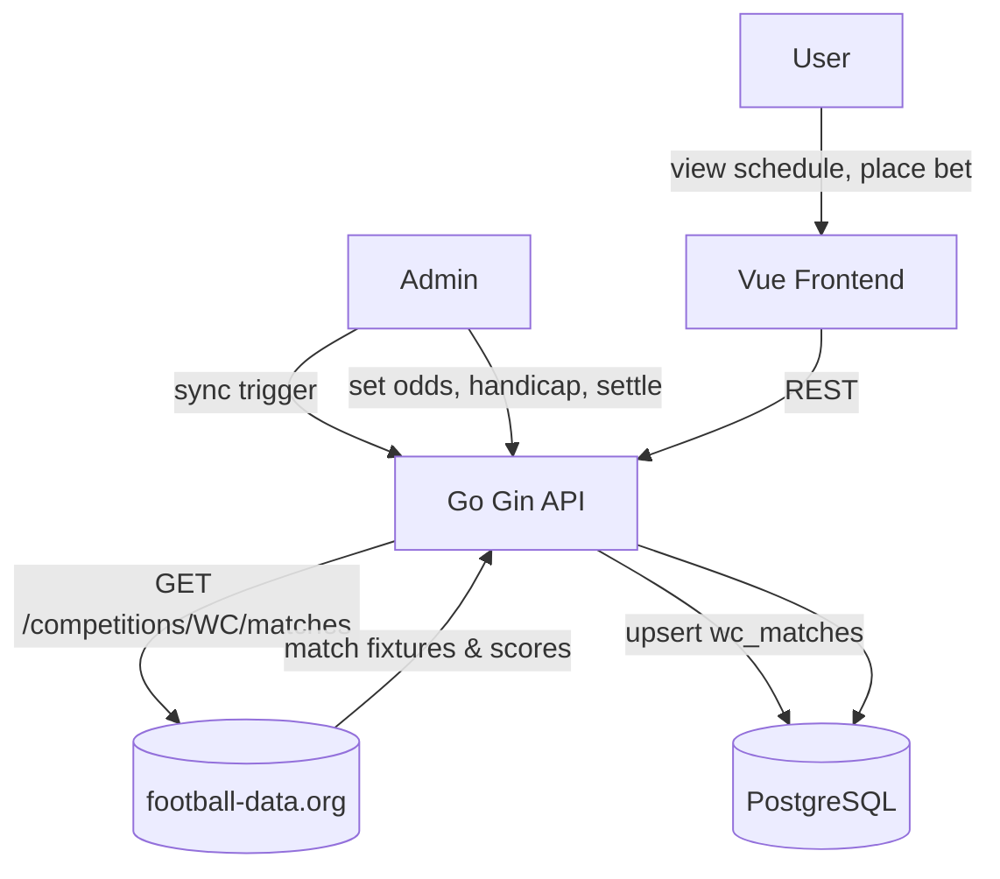

# System Design & Architecture

## Architecture Overview



**Two new pages in the Vue frontend:**
1. `WcScheduleView` — public match tracker (no auth required)
2. `WcBettingView` — wallet, bet placement, history, leaderboard; admin panel (admin only); requires WC login

**Auth scope:** Login/register is WC-only. All existing pages (dashboard, ranking, etc.) remain untouched and public. A separate `user_credentials` table stores WC passwords and the `is_admin` flag — no changes to the existing `users` table.

---

## Data Models

### `wc_users`

Standalone WC user table — **completely independent of the existing `users` / FC25 system**. No foreign keys to any existing table. No changes to existing tables.

```sql
CREATE TABLE wc_users (
  id            UUID PRIMARY KEY DEFAULT gen_random_uuid(),
  name          VARCHAR(100) NOT NULL UNIQUE,    -- display name chosen at registration
  password_hash VARCHAR(255) NOT NULL,           -- bcrypt hash
  is_admin      BOOLEAN NOT NULL DEFAULT false,
  created_at    TIMESTAMPTZ NOT NULL DEFAULT NOW(),
  updated_at    TIMESTAMPTZ NOT NULL DEFAULT NOW()
);
```

- Any person can register with any display name + password — no link to FC25 player list
- `name` is unique (case-insensitive check enforced at app level)
- `is_admin = true` for the first admin is seeded via a migration script; after that, admins can promote others via `PUT /admin/users/:id/role`

**Auth flow:**
```
Register: POST /api/v1/wc/auth/register
  body: { "name": "Dennis", "password": "..." }
  → check name not already taken
  → bcrypt hash password → INSERT wc_users
  → INSERT wc_wallets (wc_user_id, balance=0)   ← wallet created here, not on first bet
  → return JWT { wc_user_id, name, is_admin, exp }

Login: POST /api/v1/wc/auth/login
  body: { "name": "Dennis", "password": "..." }
  → lookup wc_users by name → bcrypt compare
  → return JWT { wc_user_id, name, is_admin, exp }

Reset password: POST /api/v1/wc/auth/reset-password
  body: { "name": "Dennis" }
  → verify name exists in wc_users
  → reset password to "{name}_@123"  (e.g. "Dennis_@123")
  → return 200; user logs in with new temp password
  (no old-password check — simple internal tool flow)
```

JWT is signed with `WC_JWT_SECRET` env var, expiry 7 days. All `/api/v1/wc/*` betting and admin endpoints require `Authorization: Bearer <token>` (except `/auth/register`, `/auth/login`, `/auth/reset-password`, and `GET /matches*` which are public).

---

### `wc_matches`
```sql
CREATE TABLE wc_matches (
  id              UUID PRIMARY KEY DEFAULT gen_random_uuid(),
  external_id     VARCHAR(64) UNIQUE,          -- football-data.org match ID
  home_team       VARCHAR(100) NOT NULL,
  away_team       VARCHAR(100) NOT NULL,
  home_team_code  CHAR(3),                      -- e.g. BRA, FRA
  away_team_code  CHAR(3),
  match_date      TIMESTAMPTZ NOT NULL,
  group_name      VARCHAR(30),                  -- "Group A", "Quarter-final", etc.
  stage           VARCHAR(30) NOT NULL,         -- group | r32 | r16 | qf | sf | final | third_place
  venue           VARCHAR(100),
  home_score      INT,                          -- null until completed
  away_score      INT,
  status          VARCHAR(20) NOT NULL DEFAULT 'scheduled',
                                                -- scheduled | live | completed | cancelled
  -- Handicap kèo (admin-set before kickoff)
  handicap_team        VARCHAR(5),              -- 'home' or 'away' (which team gives the handicap)
  handicap_value       NUMERIC(4,1),            -- e.g. 1.5 (home gives 1.5 goals)
  odds_handicap_home   NUMERIC(5,2),            -- odds for picking home team with handicap (e.g. 1.90)
  odds_handicap_away   NUMERIC(5,2),            -- odds for picking away team with handicap (e.g. 1.95)
  -- NOTE: exact score odds are in wc_score_odds table (per-scoreline)
  bets_locked_at       TIMESTAMPTZ,             -- = match_date; bets rejected after this
  settled_at      TIMESTAMPTZ,
  created_at      TIMESTAMPTZ NOT NULL DEFAULT NOW(),
  updated_at      TIMESTAMPTZ NOT NULL DEFAULT NOW()
);
```

### `wc_score_odds`

Admin defines which exact scorelines are bettable for each match, each with its own multiplier.

```sql
CREATE TABLE wc_score_odds (
  id          UUID PRIMARY KEY DEFAULT gen_random_uuid(),
  match_id    UUID NOT NULL REFERENCES wc_matches(id) ON DELETE CASCADE,
  home_score  INT NOT NULL CHECK (home_score >= 0),
  away_score  INT NOT NULL CHECK (away_score >= 0),
  odds        NUMERIC(5,2) NOT NULL CHECK (odds > 0),
  created_at  TIMESTAMPTZ NOT NULL DEFAULT NOW(),
  updated_at  TIMESTAMPTZ NOT NULL DEFAULT NOW(),

  UNIQUE (match_id, home_score, away_score)   -- one odds entry per scoreline per match
);
```

**Example rows for France vs Morocco:**
| home_score | away_score | odds | Ý nghĩa |
|---|---|---|---|
| 1 | 0 | 5.00 | France thắng 1-0 |
| 2 | 0 | 8.00 | France thắng 2-0 |
| 2 | 1 | 6.00 | France thắng 2-1 |
| 0 | 0 | 3.50 | Hoà 0-0 |
| 1 | 1 | 4.00 | Hoà 1-1 |
| 0 | 1 | 7.00 | Morocco thắng 0-1 |

User only sees and bets on scorelines admin has added. Free-form score input is **not allowed** — user picks from admin's list.

### `wc_wallets`

Starts at 0 for every user. No lower bound — balance goes negative when the user's losses exceed wins. No balance check on bet placement.

```sql
CREATE TABLE wc_wallets (
  id           UUID PRIMARY KEY DEFAULT gen_random_uuid(),
  wc_user_id   UUID NOT NULL UNIQUE REFERENCES wc_users(id),
  balance      INT NOT NULL DEFAULT 0,   -- can be negative; no CHECK constraint
  created_at   TIMESTAMPTZ NOT NULL DEFAULT NOW(),
  updated_at   TIMESTAMPTZ NOT NULL DEFAULT NOW()
);
```

### `wc_bets`
```sql
CREATE TABLE wc_bets (
  id               UUID PRIMARY KEY DEFAULT gen_random_uuid(),
  wc_user_id       UUID NOT NULL REFERENCES wc_users(id),
  match_id         UUID NOT NULL REFERENCES wc_matches(id),
  bet_type              VARCHAR(15) NOT NULL,  -- 'handicap' | 'exact_score'

  -- Handicap bet fields (bet_type = 'handicap')
  bet_choice            VARCHAR(5),            -- 'home' | 'away'

  -- Exact score bet fields (bet_type = 'exact_score')
  predicted_home_score  INT,                   -- must exist in wc_score_odds for this match
  predicted_away_score  INT,

  stake                 INT NOT NULL CHECK (stake > 0),
  odds_snapshot         NUMERIC(5,2) NOT NULL, -- snapshotted from wc_score_odds.odds at bet time
  handicap_snapshot     NUMERIC(4,1),          -- handicap value at bet time (handicap only)
  handicap_team_snapshot VARCHAR(5),           -- 'home'|'away' at bet time (handicap only)

  result                VARCHAR(10),           -- null | 'win' | 'lose' | 'push'
  payout                INT,                   -- null until settled; push = stake returned
  created_at            TIMESTAMPTZ NOT NULL DEFAULT NOW(),

  -- Handicap: can't bet the same side twice on the same match
  -- Exact score: can't bet the exact same scoreline twice on the same match
  -- (but user CAN place handicap + multiple exact score bets on the same match)
  UNIQUE (wc_user_id, match_id, bet_type, bet_choice),                               -- handicap dedup
  UNIQUE (wc_user_id, match_id, predicted_home_score, predicted_away_score)          -- exact score dedup
);
```

### `wc_settlements`

One row per tournament settlement event. Admin creates this to snapshot wallet state, calculate who owes/is owed money, and reset all wallets to 0.

```sql
CREATE TABLE wc_settlements (
  id          UUID PRIMARY KEY DEFAULT gen_random_uuid(),
  name        VARCHAR(100) NOT NULL,    -- e.g. "World Cup 2026 - Tất toán cuối giải"
  point_rate  NUMERIC(10,2) NOT NULL,   -- VND per point (e.g. 1000 = 1 point → 1,000 VND)
  settled_by  UUID NOT NULL REFERENCES wc_users(id),
  note        VARCHAR(255),
  created_at  TIMESTAMPTZ NOT NULL DEFAULT NOW()
);
```

### `wc_settlement_details`

One row per user per settlement event. Snapshot of balance at settlement time; never modified after insert except `status` and `completed_at`.

```sql
CREATE TABLE wc_settlement_details (
  id             UUID PRIMARY KEY DEFAULT gen_random_uuid(),
  settlement_id  UUID NOT NULL REFERENCES wc_settlements(id) ON DELETE CASCADE,
  wc_user_id     UUID NOT NULL REFERENCES wc_users(id),
  final_balance  INT NOT NULL,           -- wallet balance at settlement time (= net P&L, can be negative)
  amount         NUMERIC(12,2) NOT NULL, -- abs(final_balance) * point_rate
  direction      VARCHAR(10) NOT NULL,   -- 'pay' (admin pays user) | 'collect' (admin collects from user) | 'even'
  status         VARCHAR(20) NOT NULL DEFAULT 'pending', -- pending | done
  completed_at   TIMESTAMPTZ,
  done_note      VARCHAR(255),
  created_at     TIMESTAMPTZ NOT NULL DEFAULT NOW(),
  UNIQUE (settlement_id, wc_user_id)
);
```

**Direction logic:**
- `final_balance > 0` → user won overall → `direction = 'pay'` (admin pays user)
- `final_balance < 0` → user lost overall → `direction = 'collect'` (admin collects from user)
- `final_balance = 0` → `direction = 'even'`

**After settlement:** all `wc_wallets.balance` reset to `0`.

### `wc_wallet_logs`

Audit trail for every admin top-up or deduction. Never modified after insert.

```sql
CREATE TABLE wc_wallet_logs (
  id             UUID PRIMARY KEY DEFAULT gen_random_uuid(),
  wc_user_id     UUID NOT NULL REFERENCES wc_users(id),
  admin_id       UUID NOT NULL REFERENCES wc_users(id),  -- who performed the action
  delta          INT NOT NULL,                        -- positive = top-up, negative = deduction
  balance_before INT NOT NULL,
  balance_after  INT NOT NULL,
  note           VARCHAR(255),                        -- optional admin note
  created_at     TIMESTAMPTZ NOT NULL DEFAULT NOW()
);
```

**Indexes:**
```sql
CREATE INDEX ON wc_matches (match_date);
CREATE INDEX ON wc_matches (status);
CREATE INDEX ON wc_score_odds (match_id);
CREATE INDEX ON wc_bets (wc_user_id);
CREATE INDEX ON wc_bets (match_id);
CREATE INDEX ON wc_wallet_logs (wc_user_id);
```

---

### `wc_config`

Single-row table storing feature-level configuration. Seeded with one row at migration time.

```sql
CREATE TABLE wc_config (
  id          INT PRIMARY KEY DEFAULT 1,         -- enforces single row
  is_enabled  BOOLEAN NOT NULL DEFAULT false,    -- feature off by default until admin turns on
  updated_at  TIMESTAMPTZ NOT NULL DEFAULT NOW(),
  updated_by  UUID REFERENCES wc_users(id),      -- last admin who toggled

  CONSTRAINT single_row CHECK (id = 1)
);

-- Seed the single config row
INSERT INTO wc_config (id, is_enabled) VALUES (1, false);
```

**Toggle behavior:**
- `is_enabled = false` → backend `WcFeatureMiddleware` intercepts **all** `/api/v1/wc/*` requests and returns `503 Service Unavailable` — **except** `GET /admin/config` and `PUT /admin/config` so the admin can always turn it back on
- `is_enabled = false` → frontend hides the WC nav link entirely and redirects any direct `/world-cup/*` navigation to the home page
- Config row is read on every request (single PK lookup, negligible overhead); no caching needed at this scale

---

## Betting Rules (Settlement Logic)

### Handicap bet
- Effective home score = `home_score + (handicap_value if handicap_team = 'home' else -handicap_value)`
  - Actually: home_score_adj = home_score + (handicap if team = 'home' else -handicap for home)
- Simpler: `adjusted_home = home_score + handicap_value_for_home`
  - If `handicap_team = 'home'`: `adjusted_home = home_score - handicap_value` (home gives goals)
  - If `handicap_team = 'away'`: `adjusted_home = home_score + handicap_value` (away gives goals)
- Result:
  - `adjusted_home > away_score` → home wins handicap
  - `adjusted_home < away_score` → away wins handicap
  - `adjusted_home = away_score` → push (stake returned, only possible with whole-number handicap)
- Payout for win = `floor(stake × odds_snapshot)`; for push = `stake`; for lose = `0`

### Exact Score bet
- User must pick a scoreline that exists in `wc_score_odds` for that match; `odds_snapshot` is snapshotted from `wc_score_odds.odds` at bet placement time
- On settlement: compare `predicted_home_score` and `predicted_away_score` against actual `home_score` and `away_score`
  - Both match → **win**, payout = `floor(stake × odds_snapshot)`
  - Either differs → **lose**, payout = `0`
- No push possible
- Bet placement validation: reject if `(predicted_home_score, predicted_away_score)` not found in `wc_score_odds` for the match

---

## API Design

### Base path: `/api/v1/wc`

#### No auth required
| Method | Path | Description |
|---|---|---|
| `POST` | `/auth/register` | Register: choose display name + set password → returns JWT |
| `POST` | `/auth/login` | Login: name + password → returns JWT |
| `POST` | `/auth/reset-password` | Reset to `{name}_@123` — body: `{ "name": "..." }` |
| `GET` | `/matches` | List matches with handicap kèo + odds visible. Query: `status`, `stage`, `group`, `date` |
| `GET` | `/matches/:id` | Match detail with handicap kèo + scoreline options (visible without login) |
| `GET` | `/matches/:id/score-odds` | All available scorelines + odds for a match |
| `GET` | `/matches/:id/bets` | All bets placed on this match by all users — always visible |
| `GET` | `/leaderboard` | All users ranked by net betting profit (`SUM(payout - stake)` from settled bets) |

#### Requires valid JWT (`Authorization: Bearer <token>`)
| Method | Path | Description |
|---|---|---|
| `GET` | `/wallet` | Caller's WC wallet balance |
| `POST` | `/bets` | Place a bet (handicap or exact score) |
| `GET` | `/bets` | Caller's own full bet history (with match info joined) |

#### Admin only (valid JWT + `is_admin = true`)
| Method | Path | Description |
|---|---|---|
| `GET` | `/admin/config` | Get current feature config (`{ "is_enabled": true/false }`) — always accessible even when feature is off |
| `PUT` | `/admin/config` | Toggle feature on/off — body: `{ "is_enabled": true/false }`; records `updated_by` from JWT; always accessible even when feature is off |
| `POST` | `/admin/sync` | Fetch & upsert all WC2026 fixtures from football-data.org |
| `PUT` | `/admin/matches/:id` | Update score, status, handicap kèo |
| `POST` | `/admin/matches/:id/lock` | Manually lock bets for a match (sets `bets_locked_at = NOW()`) |
| `POST` | `/admin/matches/:id/score-odds` | Add a scoreline with odds (e.g., `{home:1, away:0, odds:5.00}`) |
| `PUT` | `/admin/score-odds/:id` | Update odds for an existing scoreline |
| `DELETE` | `/admin/score-odds/:id` | Remove a scoreline — blocked if match is locked or completed; allowed otherwise even if bets exist (bets retain snapshotted odds) |
| `POST` | `/admin/matches/:id/settle` | Evaluate all bets, credit/debit wallets, mark settled_at |
| `PUT` | `/admin/wallets/:wc_user_id` | Top-up or deduct balance — body: `{ "delta": 500, "note": "..." }`; logs to `wc_wallet_logs` |
| `GET` | `/admin/wallets/:wc_user_id/logs` | Full top-up/deduction history for a user |
| `PUT` | `/admin/users/:wc_user_id/role` | Promote or demote a registered user (`{ "is_admin": true/false }`) |
| `GET` | `/admin/settlements/preview` | Preview current settlement state — per-user balance, direction, amount at a given `point_rate` (query param); does **not** commit anything |
| `POST` | `/admin/settlements` | Create settlement: snapshot all wallets → insert `wc_settlements` + `wc_settlement_details` → reset all `wc_wallets.balance = 0`; body: `{ "name": "...", "point_rate": 1000, "note": "..." }` |
| `GET` | `/admin/settlements` | List all past settlement events (summary) |
| `GET` | `/admin/settlements/:id` | Full detail of one settlement: event info + per-user breakdown |
| `PUT` | `/admin/settlements/:id/details/:wc_user_id` | Mark one user as done — body: `{ "status": "done", "done_note": "..." }` |

#### Key request/response shapes

**POST `/bets`** — Handicap bet
```json
{ "match_id": "uuid", "bet_type": "handicap", "bet_choice": "home", "stake": 100 }
```

**POST `/bets`** — Exact score bet
```json
{ "match_id": "uuid", "bet_type": "exact_score", "predicted_home_score": 2, "predicted_away_score": 1, "stake": 100 }
```
Service validates `(2, 1)` exists in `wc_score_odds` for this match; rejects with `422` if not.

**POST `/admin/matches/:id/score-odds`**
```json
{ "home_score": 1, "away_score": 0, "odds": 5.00 }
```

**GET `/matches/:id`** response includes:
```json
{
  "id": "...", "home_team": "France", "away_team": "Morocco",
  "handicap_team": "home", "handicap_value": 1.5,
  "odds_handicap_home": 1.90, "odds_handicap_away": 1.95,
  "score_odds": [
    { "id": "...", "home_score": 1, "away_score": 0, "odds": 5.00 },
    { "id": "...", "home_score": 0, "away_score": 0, "odds": 3.50 },
    { "id": "...", "home_score": 0, "away_score": 1, "odds": 7.00 }
  ]
}
```

All bets: `201` on success, `422` with reason (match locked, duplicate type, scoreline not found). No balance check — users may bet freely regardless of wallet balance.

**GET `/leaderboard`** response:
```json
[
  {
    "rank": 1,
    "user_id": "...",
    "name": "Dennis",
    "net_profit": 740,
    "total_bets": 18,
    "wins": 11
  },
  {
    "rank": 2,
    "user_id": "...",
    "name": "Minh",
    "net_profit": -80,
    "total_bets": 5,
    "wins": 2
  }
]
```
`net_profit` = `SUM(payout - stake) WHERE result IS NOT NULL` from **settled `wc_bets` only** for that user across the entire tournament — never reset, not affected by admin top-ups/deductions or tất toán giải. Pending bets (result = NULL) are excluded. Negative means net betting loss. Users with no settled bets appear at the bottom with `net_profit = 0`.

**Leaderboard vs wallet balance — two separate concepts:**
- **Leaderboard** (`wc_bets`): pure betting P&L for the full tournament; survives wallet resets; shows who predicts best.
- **Settlement** (`wc_wallets.balance`): current wallet balance used for tất toán giải; includes admin adjustments; resets to 0 after each tất toán.

**POST `/admin/matches/:id/settle`**
- No body; idempotent (re-settle a match re-evaluates all bets and corrects wallets).
- Response: `{ "bets_processed": N, "total_paid_out": M }`

---

## Component Breakdown

### Backend (Go)

```
internal/
  model/
    wc_match.go           -- WcMatch, WcWallet, WcBet, WcScoreOdds structs + constants
    wc_user.go            -- WcUser struct (standalone, no FK to users table)
  repository/
    wc_repository.go      -- CRUD for wc_matches, wc_score_odds, wc_wallets, wc_bets
    wc_user_repository.go -- CreateUser, GetByName, GetByID
  service/
    wc_service.go         -- sync logic, settlement logic, bet validation
    wc_auth_service.go    -- Register, Login, bcrypt compare, JWT sign/verify
    wc_football_client.go -- HTTP client for football-data.org
  middleware/
    wc_auth.go            -- WcJWTMiddleware (validates Bearer token, sets wc_user_id in ctx)
    wc_admin.go           -- WcAdminMiddleware (requires is_admin = true from JWT claims)
    wc_feature.go         -- WcFeatureMiddleware (reads wc_config.is_enabled; returns 503 if false; skipped for GET/PUT /admin/config)
  api/
    wc_handler.go         -- all WC HTTP handlers including GET/PUT /admin/config
    wc_auth_handler.go    -- Register, Login, ResetPassword handlers
    router.go             -- register /api/v1/wc/* routes with middleware groups
  migration/
    XXXX_create_wc_tables.sql  -- all 9 WC tables including wc_config; seeds wc_config row with is_enabled=false
```

### Frontend (Vue)

```
src/
  views/
    WcLoginView.vue          -- login form: name text input + password input
    WcRegisterView.vue       -- register form: free-text name + password + confirm (independent of FC25)
    WcScheduleView.vue       -- match list with filters, group cards, score badges (public)
    WcBettingView.vue        -- wallet header, bet tabs, history, leaderboard (requires auth)
  components/wc/
    WcMatchCard.vue          -- single match row/card: teams, score, status badge
    WcGroupFilter.vue        -- filter bar: All | Group A-L | R32 | R16 | QF | SF | Final
    WcBetForm.vue            -- modal: two tabs (Handicap | Tỉ số); Handicap = pick home/away button (one per side); Tỉ số = grid of score cards with odds — multiple cards selectable, each gets its own stake input + payout preview; submit all selected bets in sequence
    WcBetHistoryList.vue     -- table of past bets with result badges
    WcLeaderboard.vue        -- rank table: avatar, name, net_profit (+/-), wins, total_bets settled
    WcSettlementPreview.vue  -- admin: table of all users with current balance, direction badge (Thu/Chi/Hoà), money amount; point_rate input with live recalculation
    WcSettlementHistory.vue  -- admin: list of past settlement events; click → detail view with per-user status and mark-done action
  services/
    wcService.ts             -- all API calls (attaches Authorization header from wcAuthStore)
    wcAuthService.ts         -- register/login API calls
  stores/
    wcStore.ts               -- matches, wallet, bets Pinia store
    wcAuthStore.ts           -- token (localStorage), currentUser, isAdmin; logout action
  types/
    wc.ts                    -- WcMatch, WcBet, WcWallet, WcScoreOdds, WcLeaderboardEntry, WcAuthUser
  router/
    index.ts                 -- /world-cup/login, /world-cup/register (public)
                             -- /world-cup/* route guard: redirect to /world-cup/login if no token
```

---

## Design Decisions

| Decision | Choice | Rationale |
|---|---|---|
| Auth scope | WC section only | Existing app (dashboard, ranking) stays public and untouched |
| User storage | Standalone `wc_users` table (no FK to existing `users`) | Registration is independent of FC25 system; any name can register; feature is time-limited |
| Password hashing | bcrypt (cost 12) | Industry standard; Go `golang.org/x/crypto/bcrypt` |
| Token type | JWT (HS256), 7-day expiry | Simple, stateless; can be upgraded to refresh-token pair later |
| Admin promotion | `PUT /admin/users/:id/role` endpoint | Admin can promote/demote via UI; first admin seeded in DB once at setup |
| Password reset | Reset to `{name}_@123` via `/auth/reset-password` (no old password required) | Internal tool only — no auth needed for reset is intentional; anyone knowing a user_id can reset that user's password, which is acceptable in a closed team context |
| Bet visibility | All bets on a match are always visible to everyone | Transparent and fun — team can see each other's picks in real time |
| Wallet top-up log | `wc_wallet_logs` table | Audit trail: who topped up whom, by how much, with optional note |
| Default wallet | Always 0 at registration | Balance is net P&L; admin can top-up individuals at any time via `PUT /admin/wallets/:wc_user_id` |
| Match data source | football-data.org free tier | No cost, reliable, simple REST API, WC coverage |
| Sync trigger | Admin on-demand | Avoids cron job complexity; admin syncs before checking bets |
| Wallet isolation | Separate `wc_wallets` table | BXH (current_score) untouched; tournament can be reset independently |
| Leaderboard source | `SUM(payout-stake)` from `wc_bets` | Survives tất toán giải resets; not polluted by admin top-ups; reflects full-tournament betting performance |
| Handicap precision | Half-integers only (0.5, 1.0, 1.5 …) | No push ambiguity with 0.25/0.75 splits |
| Exact score odds | Separate `wc_score_odds` table, one row per scoreline | Admin defines which scores are bettable and at what multiplier; realistic betting card UX |
| Score selection UX | User picks from admin's card list, not free text | Prevents bets on unlisted scores; mirrors real sportsbook experience |
| Settlement idempotency | Re-running settle is safe | Admin can correct a wrong score and re-settle |
| Multiple bets per match allowed | No global unique on (user_id, match_id, bet_type) | User can bet handicap + multiple different exact scorelines on the same match |
| Handicap dedup | UNIQUE (user_id, match_id, bet_type, bet_choice) | Can't bet the same side (home/away) twice on the same match |
| Exact score dedup | UNIQUE (user_id, match_id, predicted_home_score, predicted_away_score) | Can't bet the same scoreline twice; can bet any number of distinct scorelines |
| Wallet starts at 0, no lower bound | No `CHECK (balance >= 0)` | Balance IS the net P&L — simplifies settlement to just reading the balance; no initial_balance concept needed |
| No balance check on bet placement | Users bet freely even at 0 or negative | Internal fun tool on credit — no real money changes hands until admin does tất toán |
| Settlement resets wallets to 0 | After snapshot, all balances → 0 | Clean slate for next settlement period; history preserved in wc_settlement_details |
| Settlement direction logic | `balance > 0` → pay; `< 0` → collect | Balance equals net P&L since initial is always 0 |
| Bet locking | Auto at `match_date` (utcDate from API) or admin manual via `POST /admin/matches/:id/lock` | Two paths: time-based auto-lock + explicit admin override |
| Score odds deletion | Allowed before lockout; blocked once match is locked or completed | Bets retain snapshotted odds so deletion doesn't affect existing bets |
| Feature flag storage | `wc_config` table (single row, `id=1`) | DB-backed toggle survives restarts; admin can flip without redeploy |
| Feature flag off behavior | `WcFeatureMiddleware` returns 503 on all WC endpoints | Blanket block at middleware layer; except `GET/PUT /admin/config` always pass through |
| Feature flag default | `is_enabled = false` | Feature starts hidden; admin explicitly turns on when ready |

---

## Non-Functional Requirements

- **Performance**: Match list with 100+ rows should render in < 200ms (single query, no N+1).
- **Consistency**: Wallet deduction and bet creation are in a single DB transaction.
- **API rate limit**: football-data.org free tier = 10 req/min; single sync call fetches all WC fixtures in one or two paginated requests.
- **Security**: All betting endpoints require a valid JWT (`WcJWTMiddleware`). Admin endpoints additionally require `is_admin = true` in JWT claims (`WcAdminMiddleware`). Bet placement reads `user_id` from JWT claims — users cannot bet on behalf of others. `GET /matches*` and `/leaderboard` are intentionally public so the schedule page works without login.
